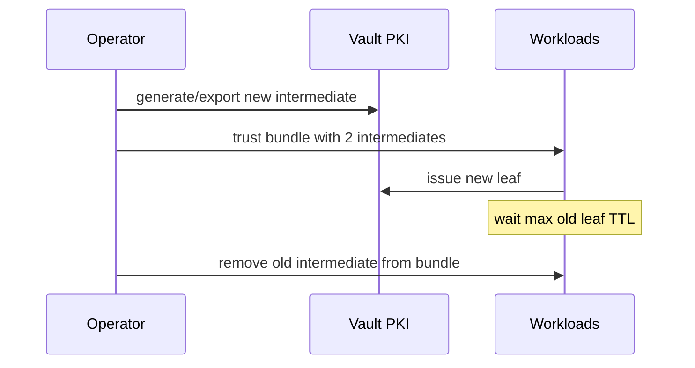

# 03. Rotation, renewal, and the certificate lifecycle

## Intro: "Renewal didn't fire — but only in prod"

In staging, **cert-manager** renewed the cert every 60 days. In production they forgot to sync the **Issuer** after switching the intermediate CA — pods accepted the new cert, while a **legacy Java client** still trusted the old chain. Rotation isn't one button, it's a **process**: TTL, monitoring, trust store, revocation, communication.

## What you'll learn

- **Renewal** vs **reissue** vs **CA rotation**.
- The **⅔ TTL** rule and alerts.
- CRL, `vault lease revoke`, cross-signing an intermediate.
- Checklist: [`examples/rotation-checklist.md`](examples/rotation-checklist.md).

---

## Rotation layers

| Level | Frequency | Risk on failure |
|---------|---------|-----------------|
| **Leaf** | Days–weeks | A single service |
| **Intermediate** | Months–years | A cluster / region |
| **Root** | Years | The whole organization |

Vault PKI lets you:

```bash
# renew before expiry (same mount/role)
vault write pki/issue/lab-server common_name="api.lab.mock-exams.local" ttl=24h

# revoke a specific lease
vault lease revoke <lease_id>
```

**Renewal** in the ACME sense (`vault write pki/renew`) — for certs issued through the same engine, with the same serial policy (depends on version and configuration). In practice a **new issue** with the same CN is more common — it's easier to automate.

---

## The ⅔ TTL rule

If TTL = 90 days, **renew no later than day 30** before expiry. Reasons:

- Clock skew, deployment time zones.
- A rolling restart of pods takes time.
- A deploy rollback shouldn't leave you without margin.

```text
alert: cert_expiry_days < 14  → warning
alert: cert_expiry_days < 7   → page
```

Metrics: an exporter with `openssl x509 -enddate`, or Vault lease metadata, or Kubernetes `cert-manager_certificate_expiration_timestamp_seconds`.

---

## Rotating the intermediate without downtime

The **dual chain** scheme:

1. Generate a new intermediate, sign it with the root.
2. Publish **both** issuing CAs to clients (bundle).
3. Issue new leaf certs from the new intermediate.
4. After the max old-leaf TTL — remove the old intermediate from the bundle.



On the dev sandbox we don't deploy a full dual-chain — it's enough to understand the **order of operations** ([04-lab](04-lab-cert-rotation.md)).

---

## CRL and revocation

After a key compromise:

```bash
vault write pki/revoke serial_number=<hex>
# or
vault lease revoke <lease_id>
```

CRL: `GET /v1/pki/crl` (DER/PEM). TLS clients **must** check the CRL/OCSP, otherwise revocation is meaningless.

**At the interview:** "Which is faster — revoking a cert or changing DNS?" — revocation for mTLS; for public HTTP, rotation + a short TTL is often better.

---

## Platform integration

| Platform | Pattern |
|-----------|---------|
| Kubernetes | cert-manager + Vault issuer / CSI |
| VM | Vault Agent Template → reload nginx |
| AWS | ACM for ALB, PCA for private; Vault — hybrid on-prem |
| CI | Short-TTL client cert for a deploy job |

Link to [aws-intermediate/11-secrets-kms](../aws-intermediate/11-secrets-kms.md): Secrets Manager stores the PEM **string**; Vault PKI **issues** it and **tracks** the lease.

---

## Static secrets in KV vs PKI

Storing `tls.crt` + `tls.key` in `secret/` is an anti-pattern for **frequent** rotation: no CRL discipline, easy to forget a version. KV is appropriate for **bootstrap** or **external** certs imported with `vault write pki/config/ca pem_bundle=...`.

---

## Anti-patterns

| Bad | Better |
|-------|-------|
| TTL 3650d on every leaf | TTL 30–90d + automation |
| Rotation only in a runbook, no alerts | Prometheus + runbook |
| Revoke without checking that clients read the CRL | Test revocation on staging |
| One PEM in Git "forever" | [07-secrets-disk](../linux-security/07-secrets-disk.md) |

---

## Summary

- Rotation is multi-layered: leaf often, root rarely.
- Automate it **before ⅔ of the TTL**; use [`rotation-checklist.md`](examples/rotation-checklist.md).
- Revoke through a **lease** or **revoke** + CRL.
- Next step: [04. Lab: rotation](04-lab-cert-rotation.md).
