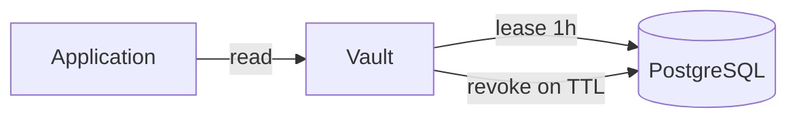

# 01. Why a secrets manager: static, dynamic, and the ecosystem

## Intro: a password in `config.yaml` in Git

Checkout release: a developer puts the **RDS password** in `values.yaml`, the MR passes review, and the password lives in **Git history** forever. Rotation means “find every copy across 40 repositories.” Security opens an **incident**: a GitLab CI token with deploy rights leaked into a job log because of `set -x`. Platform introduces a **single source of truth** for secrets — HashiCorp Vault, AWS Secrets Manager, or built-in mechanisms (GitLab Variables, K8s Secret). This chapter covers **why secrets deserve their own store**, how **static** differs from **dynamic**, and how the course connects to **GitLab**, **AWS**, **Kubernetes**, and **Kafka**.

## What you'll learn

- Why a **secret in a repository** or **in an image** is an anti-pattern.
- **Static secrets** (password, API key) vs **dynamic** (temporary DB user, short-lived cert).
- Tool map in mock-exams: Vault, AWS SM, GitLab masked, K8s Secret.
- Training stand: `VAULT_ADDR`, token `course` — lab only.

## What counts as a secret

| Type | Examples | Risk if leaked |
|-----|---------|-----------------|
| Credentials | DB password, API keys | data access |
| Tokens | JWT signing key, CI token | impersonation |
| Crypto material | TLS private key, KMS DEK | decrypt traffic/data |
| Connection strings | `postgres://user:pass@…` | lateral movement |

**Not secrets** (but often confused): public URLs, hostnames without auth, feature flags with no business risk.

## Static secrets

**Static** — a value **set by a human or Terraform** that lives until someone changes it manually:

- application password to PostgreSQL;
- Stripe test/prod API key;
- kubeconfig with a long-lived token.

Storage: Vault **KV**, AWS **Secrets Manager**, GitLab **masked variable**, `.env` file (bad in Git).

Pros: simple, predictable. Cons: **painful rotation**, one key for all environments, copies in logs and backups.

## Dynamic secrets

**Dynamic** — Vault (or the cloud) **issues** a credential for a lease period:

- **database** engine: `CREATE USER … VALID UNTIL` + auto revoke;
- **AWS** engine: temporary `AKIA…` with an IAM policy;
- **PKI** engine: certificate for 24h (advanced course).

Pros: **short TTL**, audit of “who requested”, smaller blast radius. Cons: harder ops; the app must **refresh** the secret before expiry.



In **secrets-basic** the focus is **static KV**; dynamic is in [secrets-advanced](../secrets-advanced/README.md).

## Where secrets were “hidden” before Vault

| Place | Problem |
|-------|----------|
| Git / Terraform state | history, fork, CI artifact |
| ConfigMap / env in Pod | etcd, describe pod, screenshots |
| Shared wiki | no audit, no TTL |
| One `.env` on a server | no per-service RBAC |

## mock-exams ecosystem

| Course / lesson | Role |
|-------------|------|
| [gitlab-basic/07](../gitlab-basic/07-variables-secrets.md) | masked/protected CI variables |
| [gitlab-advanced/07](../gitlab-advanced/07-oidc-cloud.md) | OIDC → cloud without a long-lived key |
| [aws-intermediate/11](../aws-intermediate/11-secrets-kms.md) | Secrets Manager + KMS |
| [kuber-basic/12](../kuber-basic/12-config-and-secret.md) | ConfigMap vs Secret (base64 ≠ encrypt) |
| [kafka-intermediate/19](../kafka-intermediate/19-security-basics.md) | SASL passwords, ACL — separate boundary |
| **secrets-basic** (this course) | Vault: policy, auth, KV, CI/K8s integration |

Vault does **not replace** every system: in AWS you often use SM + IAM; in K8s — Secret + an external operator; in GitLab — Variables for **access to Vault**, not for every app secret.

## HashiCorp Vault in one paragraph

**Vault** is a centralized store with **ACL policies**, **auth methods** (who you are), **secrets engines** (what to store/issue), and an **audit log**. A client authenticates → gets a **token** → reads path `secret/data/...` if the policy allows it.

Training stand: [`deploy/vault`](../../deploy/vault/README.md) — dev mode, `http://localhost:8200`, root token **`course`** (forbidden in prod).

## On the stand: first touch

```bash
cd deploy/vault
docker compose up -d
export VAULT_ADDR=http://localhost:8200
export VAULT_TOKEN=course
bash scripts/smoke.sh
```

```bash
docker exec -e VAULT_TOKEN=course mock-vault vault status
docker exec -e VAULT_TOKEN=course mock-vault vault secrets list
```

| URL | Purpose |
|-----|------------|
| [localhost:8200/ui](http://localhost:8200/ui) | UI: Secrets, Policies, Access |
| `VAULT_ADDR` | API for CLI and applications |

## Common mistakes

| Mistake | Why it’s bad | How to do it right |
|--------|--------------|---------------|
| Root token in the application | full access, no TTL | policy + role + short token |
| One password for dev/stage/prod | laptop leak = prod | path `secret/course/dev/…` vs `prod/…` |
| “Masked in GitLab — so it’s safe” | `set -x`, artifacts | Vault KV + minimal CI vars |
| Secret in ConfigMap | weaker RBAC, logs | Secret or Vault Agent |
| Dev-mode Vault in prod | root in env, no seal | Raft, auto-unseal, audit |

## In production

- **Rotation**: calendar + automation (SM rotation, Vault dynamic).
- **Least privilege**: policy on a path prefix, not a `sudo` token.
- **Audit**: who read `secret/data/prod/db` — compliance.
- **Break-glass**: emergency root procedure, not daily ops.
- **Hybrid**: app secrets in Vault; CI OIDC to AWS without a static AWS key ([gitlab-advanced/08](../gitlab-advanced/08-lab-oidc-aws.md)).

## Interview notes

- **Static vs dynamic**: who creates the credential and what is the TTL?
- Vault does **not encrypt the application disk** — it **centralizes issuance** and policy.
- A K8s Secret is **base64** — not encryption at rest without KMS/etcd encryption.
- GitLab **masked** does not protect against echo and a malicious job.

## Summary

Secrets must not live in Git or shared configs. **Static** KV covers most starter cases; **dynamic** reduces risk for DB/cloud. Vault is a hub with ACL and auth; alongside it — AWS SM, GitLab Variables, K8s Secret. The basic course builds the model on `mock-vault`; tool comparison is in [chapter 12](12-comparison-managers.md).

## Checklist

- One sentence: static vs dynamic?
- Three places secrets “leak” without Vault being breached?
- Links to GitLab variables and K8s Secret in the course?
- Why is token `course` for labs only?

Next lesson: [02. Vault architecture](02-vault-architecture.md).
