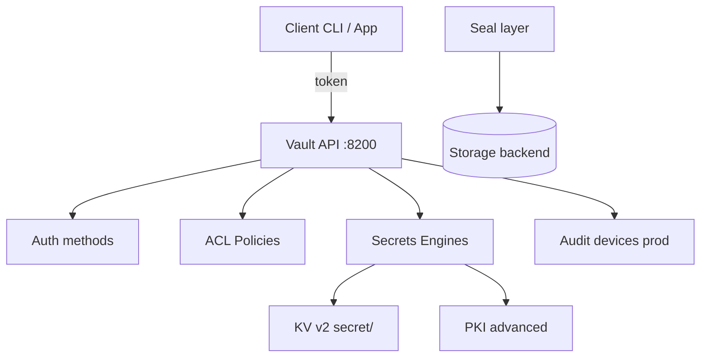

# 02. Vault architecture: seal, storage, engines, paths

## Intro: “Vault sealed” at 3 a.m.

On-call: deploy fails with `503`, UI shows **Sealed**. After a node restart without **unseal keys** (or auto-unseal), the API will not serve secrets — by design. On the training stand, **dev mode** Vault is always unsealed and the root token is in env — that is **not** production. This chapter is the **mental model**: storage, seal, **secrets engines**, **auth**, **policies**, and **KV v2** paths.

## What you'll learn

- Lifecycle: **init → unseal → configure → use**.
- Difference between a **secrets engine** and an **auth method**.
- **KV v2** paths: `secret/data/...` vs `secret/metadata/...`.
- CLI: `vault status`, `secrets list`, `kv` via `mock-vault`.

## Vault components



| Component | Role |
|-----------|------|
| **Storage** | encrypted data at rest (Raft, Consul; dev — in-memory) |
| **Seal** | master key protected; without unseal — status only |
| **Auth** | prove identity → **token** |
| **Policy** | what the token may do on a `path` |
| **Secrets engine** | mount: `secret/`, `pki/`, `database/` |

## Seal and unseal (prod vs lab)

**Sealed** — Vault does not decrypt storage. **Unseal** — Shamir shares or **auto-unseal** (KMS, HSM).

On the stand:

```bash
docker exec -e VAULT_TOKEN=course mock-vault vault status
```

Expect `Sealed: false`, `Storage Type: inmem` (dev).

## Secrets engines (mounts)

An engine is **mounted** on a path prefix:

```bash
docker exec -e VAULT_TOKEN=course mock-vault vault secrets list
```

After smoke / init:

```bash
docker exec -e VAULT_TOKEN=course mock-vault vault secrets enable -path=secret kv-v2
```

| Engine | Path (example) | Purpose |
|--------|---------------|------------|
| **kv** (v2) | `secret/` | key-value, versions |
| **pki** | `pki/` | CA, certs (advanced) |
| **transit** | `transit/` | encrypt-as-a-service |
| **database** | `database/` | dynamic SQL users |

`vault secrets enable` is an admin operation; in labs `smoke.sh` does it, or you do it manually.

## KV v2: two path layers

KV **version 2** stores versions and soft-delete.

| Operation | API path (CLI shorthand) |
|----------|---------------------------|
| Write / read data | `secret/data/course/app` → `vault kv put secret/course/app` |
| Metadata, versions | `secret/metadata/course/app` |
| Delete version | `secret/delete/...` |
| Undelete | `secret/undelete/...` |

CLI `vault kv put secret/foo` automatically writes to `secret/data/foo`.

```bash
docker exec -e VAULT_TOKEN=course mock-vault vault kv put secret/course/demo key=value
docker exec -e VAULT_TOKEN=course mock-vault vault kv get secret/course/demo
```

## Auth methods (overview)

An **auth method** issues a **client token** after verifying identity:

| Method | Who uses it |
|--------|----------------|
| **token** | bootstrap, root (lab) |
| **userpass** | people (UI login) |
| **approle** | CI / VM without a human |
| **kubernetes** | Pod SA JWT → Vault role |
| **JWT/OIDC** | GitLab, GitHub Actions |

A token carries **policies** (directly or via an entity). Later chapters: [04](04-policies-acl.md), [06](06-auth-methods.md).

## Policies (preview)

A policy is HCL with `path` and `capabilities`: `create`, `read`, `update`, `delete`, `list`, `sudo`.

Repo example: [`policy-readonly.hcl`](../../deploy/vault/examples/policy-readonly.hcl) — read/list on `secret/data/course/*`.

## Identity: token, entity (brief)

- **Token**: ID, TTL, renewable, policies.
- **Entity** (prod): links an LDAP/OIDC user to policies.
- **Namespace** (Enterprise): multi-tenant; not used in basic.

## UI

[http://localhost:8200/ui](http://localhost:8200/ui) → Login **Token** `course` → **Secrets** → `secret/` → browse `course/…`.

Useful for labs: visually see **versions** after a repeated `kv put`.

## On the stand: overview

```bash
cd deploy/vault && docker compose up -d
export VAULT_ADDR=http://localhost:8200 VAULT_TOKEN=course
docker exec -e VAULT_TOKEN=course mock-vault vault auth list
docker exec -e VAULT_TOKEN=course mock-vault vault policy list
```

Optional PKI/Transit for advanced:

```bash
bash scripts/init-engines.sh
```

## Common mistakes

| Mistake | Symptom | Fix |
|--------|---------|-------------|
| `vault kv get secret/foo` on a v1 path | 404 / wrong API | enable **kv-v2**, use `data/` in policy |
| Policy on `secret/course/*` without `data/` | permission denied | `secret/data/course/*` |
| Confusing mount and key | put to a non-existent mount | `vault secrets list` |
| Root for the application | full access | separate token + policy |
| Forgetting `VAULT_ADDR` | connection refused | export or `-address` |

## In production

- **Raft integrated storage** (3+ nodes), backup snapshots.
- **Auto-unseal**, **audit** device to file/SIEM.
- Separate mounts: `kv-prod/`, `kv-nonprod/` or namespaces.
- **Rate limits**, **IP allowlist** (firewall), TLS termination.
- **Disaster recovery**: replication (Enterprise) or restore runbook.

## Interview notes

- **Seal** protects the master key; data **encryption** is storage + seal wrap.
- KV v2 = **versioning** + check-and-set (`cas`).
- Auth and secrets are **different mounts** in the API tree (`auth/`, `secret/`).
- Dev mode: in-memory, does **not survive** `docker compose down -v`.

## Summary

Vault = storage + seal + API, through which a client with a **token** talks to **engines** under a **policy**. KV v2 is the main static store in basic; paths use `data/` and `metadata/`. The lab locks it in by hand: [03. KV v2](03-lab-kv-v2.md).

## Checklist

- What happens when Vault is sealed?
- How does `secret/data/x` differ from `secret/metadata/x`?
- Command to list secrets engines in `mock-vault`?
- Why a separate auth method for Kubernetes?

Next lesson: [03. Lab: KV v2](03-lab-kv-v2.md).
