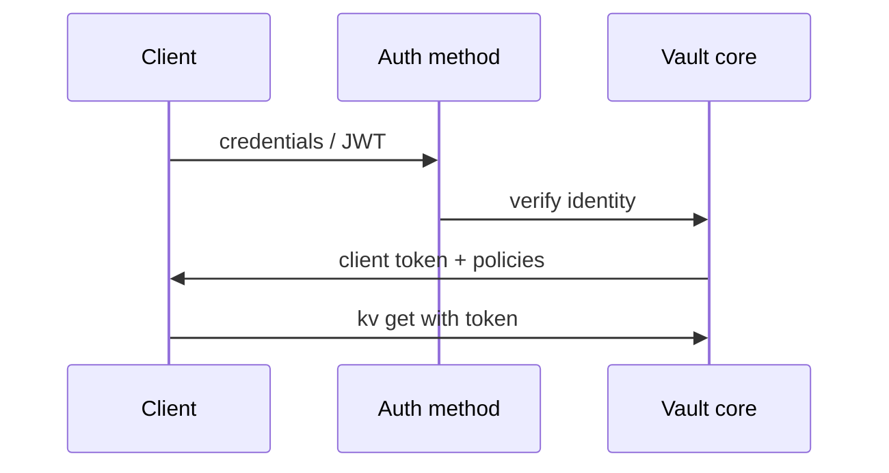

# 06. Auth methods: who gets a token and how

## Intro: “where does the Pod get a Vault token?”

A microservice in Kubernetes must not store **root** in `env`. The Pod mounts a **service account JWT**; Vault’s **kubernetes** auth method verifies the API server signature and issues a token with policy `checkout-app`. In GitLab — **AppRole** or OIDC. This chapter maps **auth methods**, the **token** lifecycle, and ties into the TTL lab.

## What you'll learn

- Why the auth method is separate from the secrets engine.
- **Token**, **AppRole**, **Kubernetes**, **JWT/OIDC** — when to use which.
- TTL, **renew**, **revoke**, orphan tokens.
- Prep for [lab 07](07-lab-token-ttl.md) and [K8s auth](10-kubernetes-vault.md).

## Auth flow



Auth mounts: `auth/token/`, `auth/kubernetes/`, `auth/approle/`.

```bash
docker exec -e VAULT_TOKEN=course mock-vault vault auth list
```

## Token auth (bootstrap)

**Token auth** is the built-in method: you present a token; Vault checks whether it has expired and which policies it has.

- Root token `course` on the stand — bootstrap only.
- `vault token create` — issue a child token (lab 05).

| Parameter | Meaning |
|----------|--------|
| `ttl` | lifetime |
| `renewable` | can extend up to `max_ttl` |
| `explicit_max_ttl` | ceiling |
| `no_default_policy` | without `default` |

## Userpass (people)

Login/password for admins in the UI. In prod — LDAP/OIDC instead of local passwords.

## AppRole (machines, CI)

**Role ID** (not a secret) + **Secret ID** (secret, often one-time) → token.

Fits VMs and CI **without** Kubernetes. Rotate Secret ID; store it in a GitLab masked variable.

```bash
# tabletop (do not run against prod root without need)
vault auth enable approle
vault write auth/approle/role/ci-checkout token_policies=course-readonly token_ttl=15m
```

## Kubernetes auth

1. Enable `vault auth enable kubernetes`.
2. Configure `kubernetes_host`, CA, reviewer JWT.
3. Create a **role** with `bound_service_account_names`, `policies` — see [`examples/k8s-auth-role.json`](examples/k8s-auth-role.json).
4. The Pod calls `vault write auth/kubernetes/login role=... jwt=@/var/run/secrets/...`.

Related to [kuber-basic/12](../kuber-basic/12-config-and-secret.md): K8s Secret is static in etcd; Vault is the center + short-lived token.

## JWT / OIDC (GitLab, cloud)

GitLab CI can authenticate with a **JWT** ([gitlab-advanced/07](../gitlab-advanced/07-oidc-cloud.md)) — without a static `VAULT_TOKEN` in a long-lived variable. The basic course in [08](08-ci-gitlab-vault.md) uses a **token** for tabletop.

## Token lifecycle

| Event | Command / effect |
|---------|------------------|
| Create | `token create` |
| Renew | `token renew` (if renewable) |
| Revoke | `token revoke` — immediate invalidation |
| TTL expired | 403 on all APIs |

**Batch token** (lightweight, no renew) — for high-volume CI (advanced).

## Entity and groups (brief)

In prod a person → **entity** → several policies. An auth method alias links an LDAP user to an entity. In basic it is enough to know that a token can inherit policies from a role.

## On the stand

```bash
docker exec -e VAULT_TOKEN=course mock-vault vault auth list
docker exec -e VAULT_TOKEN=course mock-vault vault token lookup
```

`lookup` shows `policies`, `ttl`, `renewable`.

## Common mistakes

| Mistake | Why it’s bad | How to do it right |
|--------|--------------|---------------|
| Non-expiring token | leak = everlasting access | ttl 15m–1h + renew automation |
| One AppRole for all services | lateral movement | role per service |
| K8s auth without audience/namespace bound | any SA in the cluster | bound SA name + namespace |
| Renew without monitoring | silent expiry | alert on 403 rate |
| No revoke on compromise | old token lives until TTL | revoke + rotate |

## In production

- **Periodic tokens** with automatic renew sidecar (Vault Agent).
- **OIDC** for humans; **K8s/AppRole** for workloads.
- Disable **root** after bootstrap; keep shares offline.
- Audit log: `auth`, `token`, `kv` access.

## Interview notes

- An auth method does **not store** application secrets — it only issues a token.
- K8s auth trusts the **API server JWT**, not an arbitrary file in the Pod.
- `vault token revoke -self` — logout pattern for CI job end.

## Summary

Auth answers “who are you”; policy answers “what is allowed.” For CI/K8s avoid root; use a role with a short TTL and revoke. Lab [07](07-lab-token-ttl.md) practices TTL and revocation.

## Checklist

- Name three auth methods for machine identity.
- How does role ID differ from secret ID in AppRole?
- What does `token revoke` do?
- Where in the repo is the K8s role JSON example?

Next lesson: [07. Lab: token TTL](07-lab-token-ttl.md).
