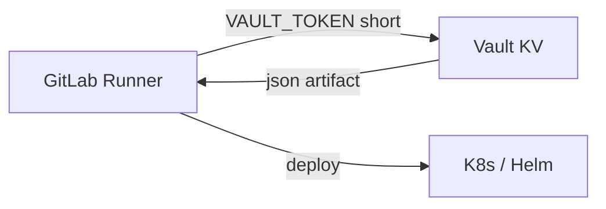

# 08. GitLab CI and Vault: variables, KV, and deploy secrets

## Intro: deploy key only for the job duration

A staging pipeline pulls an **API key** for the Helm registry from Vault path `secret/course/checkout/deploy`, while GitLab stores only **access to Vault** (`VAULT_ADDR` + short-lived token or AppRole). A masked `DEPLOY_KEY` variable in YAML is no longer needed — rotation happens in one place. This chapter is the **tabletop pattern** linking [gitlab-basic/07](../gitlab-basic/07-variables-secrets.md) and KV from [lab 03](03-lab-kv-v2.md).

## What you'll learn

- What to store in **GitLab Variables** vs **Vault KV**.
- Pipeline stages: fetch secret → deploy.
- Limits of masked variables and why `set -x` is dangerous.
- Snippet [`examples/gitlab-vault-snippet.yml`](examples/gitlab-vault-snippet.yml).

## Separation of duties

| Store | What to put |
|-----------|------------|
| **Vault KV** | deploy API keys, DB passwords, TLS keys |
| **GitLab CI Variables** | `VAULT_ADDR`, role/secret for **logging into** Vault (masked, protected) |
| **Git repo** | only non-secret `VAULT_ADDR` for lab, never tokens |

Root `course` in a variable — **training stand only**. In prod: AppRole or [OIDC JWT](../gitlab-advanced/07-oidc-cloud.md).

## Pipeline flow



1. Job `fetch-secrets`: `vault kv get -format=json secret/course/checkout/deploy` → artifact.
2. Job `deploy`: reads JSON, applies the manifest (no `echo` of the secret).

## GitLab Variables (reminder)

From [gitlab-basic/07](../gitlab-basic/07-variables-secrets.md):

| Flag | Why |
|------|--------|
| **Masked** | hide in logs (≥8 characters, single line) |
| **Protected** | protected branches only |
| **File** | kubeconfig, CA bundle |

`VAULT_TOKEN` — masked + protected. **Do not** put the application deploy key here if you already have Vault.

## Example secret in KV

Prep on the stand (root):

```bash
docker exec -e VAULT_TOKEN=course mock-vault vault kv put \
  secret/course/checkout/deploy api_key=deploy-lab-key-rotate-me env=staging
```

Policy `course-readonly` from [05](05-lab-policies.md) is enough for read.

## `.gitlab-ci.yml` fragment

Full example: [`examples/gitlab-vault-snippet.yml`](examples/gitlab-vault-snippet.yml).

Key points:

- image `hashicorp/vault:1.16` in the fetch job;
- artifact `deploy-secret.json` with `expire_in: 1 hour`;
- deploy job uses `jq`, does not print the key.

## Authenticating CI to Vault (levels)

| Level | Mechanism | Basic course |
|---------|----------|------------|
| Lab | `VAULT_TOKEN` variable | yes (tabletop) |
| Better | **AppRole** role_id + secret_id | mentioned |
| Best | **GitLab OIDC JWT** → Vault | [gitlab-advanced/08](../gitlab-advanced/08-lab-oidc-aws.md) |

## Log safety

```yaml
# BAD
script:
  - set -x
  - vault kv get secret/course/checkout/deploy
```

Masked does not save you from a trace. Use `-field` to a file, `set +x`, [mask helpers](https://docs.gitlab.com/ee/ci/yaml/#log-redaction).

## Link to AWS deploy

If deploying to AWS without Vault app secrets: [aws-intermediate/11](../aws-intermediate/11-secrets-kms.md) + OIDC ([08-lab-oidc-aws](../gitlab-advanced/08-lab-oidc-aws.md)). Vault remains the hub for **on-prem** and **multi-cloud**.

## On the stand: manual CI emulation

```bash
export VAULT_ADDR=http://localhost:8200
export VAULT_TOKEN=course   # replace with readonly token from lab 05
vault kv get -format=json secret/course/checkout/deploy > deploy-secret.json
jq -r '.data.data.api_key' deploy-secret.json | wc -c
rm -f deploy-secret.json
```

## Common mistakes

| Mistake | Consequence | Fix |
|--------|-------------|-------------|
| Artifact with secret and no expire | leak in GitLab storage | `expire_in: 1h` |
| Root token in a group variable | any project reads everything | project-scoped AppRole |
| Echo JSON to the log | key in SIEM | jq to file, redaction |
| One secret for prod/stage | wrong env deploy | path `.../staging/deploy` |
| No token revoke | window after the job | `after_script` revoke |

## In production

- Separate **Vault namespaces** or mounts per env.
- **Branch protection** + protected variables for prod.
- **Separate runners** for prod (tags).
- CI policy: read-only on the needed prefix; write only for a rotation job.
- Monitoring: spike of `secret/data` reads from unusual IPs.

## Interview notes

- GitLab masked ≠ encryption at rest in the GitLab DB.
- Vault KV **versioning** helps roll back an accidental overwrite in CI.
- Artifact secrets are a trade-off; better a short-lived token straight to the deploy tool.

## Summary

GitLab stores **access**, Vault stores **values**. Tabletop pipeline: fetch JSON artifact → deploy without printing. Lab [09](09-lab-ci.md) walks the steps on `mock-vault` without requiring a GitLab Runner.

## Checklist

- What goes in Variables vs KV?
- Why `expire_in` on an artifact?
- Where is the `.gitlab-ci.yml` snippet in the course?
- Next step after basic for OIDC?

Next lesson: [09. Lab: CI tabletop](09-lab-ci.md).
