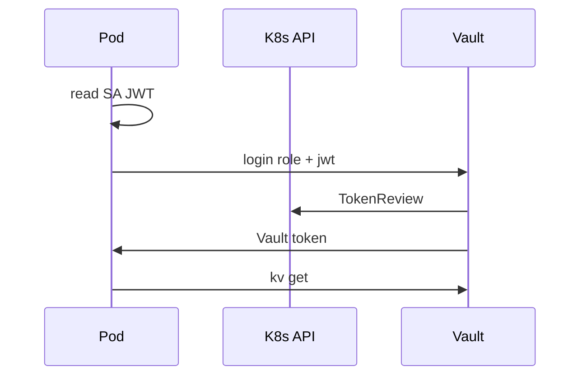

# 10. Vault and Kubernetes: Secret, sidecar, Kubernetes auth

## Intro: a Secret in etcd is not “vault”

Platform reads [kuber-basic/12](../kuber-basic/12-config-and-secret.md): `kubectl get secret` shows **base64**, not encryption. Compliance requires **rotation** and an audit of “who read the DB password.” Options: **External Secrets Operator** (sync Vault → K8s Secret), **Vault Agent Injector** (file in the Pod), or a **direct** Vault API with **Kubernetes auth**. Basic is the **concept** of auth and roles; a full cluster is optional with `mockctl`.

## What you'll learn

- Why a K8s Secret ≠ an enterprise secret manager.
- How **Kubernetes auth** links a ServiceAccount to a Vault policy.
- Patterns: init container, sidecar, CSI driver (overview).
- Link to lab [11](11-lab-k8s-auth.md) and [`k8s-auth-role.json`](examples/k8s-auth-role.json).

## K8s Secret vs Vault

| Aspect | K8s Secret | Vault |
|--------|------------|-------|
| Storage | etcd (encrypt at rest optional) | dedicated storage |
| RBAC | K8s RBAC | Vault policy |
| Rotation | manual / ESO | KV versions / dynamic |
| Audit | K8s audit logs | Vault audit device |
| Format in Pod | env / volume | API / agent file |

Recommendation: do **not** duplicate a long-lived prod password in Git and in a ConfigMap; the source is Vault; in the Pod — a short-lived file or env from the Agent.

## Kubernetes auth — trust model



1. Vault enables `kubernetes` auth.
2. API address, CA, and **token reviewer** SA are configured.
3. A **role** constrains: namespace, service account name, audience.
4. The Pod (or Agent) calls `auth/kubernetes/login`.

Example role spec: [`examples/k8s-auth-role.json`](examples/k8s-auth-role.json):

- `bound_service_account_names`: `checkout-app`
- `bound_service_account_namespaces`: `checkout`
- `policies`: `course-readonly`
- `ttl`: `1h`

## Setup on the stand (overview)

On a full cluster (`mockctl up`):

```bash
vault auth enable kubernetes
vault write auth/kubernetes/config \
  kubernetes_host="https://kubernetes.default.svc:443" \
  # token_reviewer_jwt, kubernetes_ca_cert — from SA vault-reviewer
vault write auth/kubernetes/role/checkout-app @examples/k8s-auth-role.json
```

With **dev Vault** and no real cluster — **tabletop**: dissect the JSON role and map it to a Deployment SA in [kuber-basic/12](../kuber-basic/12-config-and-secret.md).

## Patterns for delivering a secret into a Pod

| Pattern | Pros | Cons |
|---------|--------|--------|
| **Vault Agent Injector** | automatic renew, file in volume | sidecar, ops |
| **External Secrets** | familiar K8s Secret | sync lag, two CRDs |
| **CSI Secret Store** | mount as volume | driver setup |
| **SDK in the application** | control | code + renew |

Basic: understand **injector** as “init/sidecar talks to Vault, app reads a file.”

## Link to ConfigMap

ConfigMap — non-secret URLs, feature flags. See [kuber-basic/12](../kuber-basic/12-config-and-secret.md): do not put a password in a ConfigMap “because it’s easier.”

## mockctl (optional)

[`mockctl`](../../mockctl/README.md) brings up a local cluster for [kuber-intermediate](../kuber-intermediate/README.md). Lab [11](11-lab-k8s-auth.md) gives a tabletop without a cluster and steps **if** `mockctl up` is available.

## On the Vault-only stand

```bash
docker exec -e VAULT_TOKEN=course mock-vault vault auth list
# kubernetes appears after enable on a cluster
docker exec -e VAULT_TOKEN=course mock-vault vault policy read course-readonly
```

## Common mistakes

| Mistake | Risk | Fix |
|--------|------|-------------|
| Role without bound namespace | any SA | bound SA + namespace |
| Vault token in a Secret manifest | etcd leak | K8s auth + short TTL |
| Long Vault token TTL in Pod | stolen volume | 1h + Agent renew |
| Root for injector config | cluster-wide breach | separate config token |
| Syncing all of KV into one K8s Secret | overexposure | path per app |

## In production

- **Dedicated** Vault cluster or cloud HCP.
- Network: Vault only from the mesh / private link.
- **IRSA** (AWS) / workload identity — see [aws-advanced/15](../aws-advanced/15-irsa.md) for the cloud trust analogue.
- Rotate the **token reviewer** JWT per runbook.
- Prefer **dynamic DB** credentials for stateful apps (advanced).

## Interview notes

- K8s auth uses the **TokenReview** API — Vault does not trust a JWT without verification.
- The Secret resource remains in the K8s model; Vault is the **source of truth** with ESO/injector.
- Differs from **Sealed Secrets** (encrypt in Git) — different threat model.

## Summary

A Kubernetes Secret is convenient for mounting but weak for rotation/audit. Vault **Kubernetes auth** issues a policy-bound token to the Pod. Basic locks in the role JSON and tabletop; with a cluster available — enable auth in [lab 11](11-lab-k8s-auth.md).

## Checklist

- Why is base64 in a Secret not encryption?
- What does Vault check via TokenReview?
- `bound_service_account_*` fields in the example JSON?
- Three ways to deliver a secret into a Pod?

Next lesson: [11. Lab: K8s auth](11-lab-k8s-auth.md).
