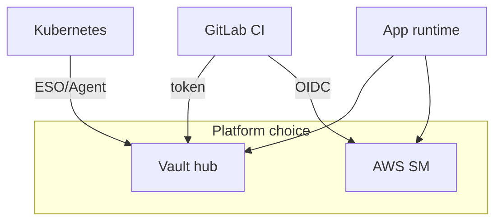

# 12. Comparing secrets managers (interview)

## Intro: “we’re on AWS — why Vault?”

Architect review: the team keeps passwords in **SSM Parameter Store**, CI in **GitLab masked**, K8s in **Secret**, legacy in **`.env` on the server**. A new service needs **rotation** and a single audit trail. You need a trade-off table without “put everything in Vault.” This chapter systematizes [01](01-why-secrets.md) for interviews and tool choice.

## What you'll learn

- Compare **Vault**, **AWS Secrets Manager + KMS**, **GitLab Variables**, **env files**, **K8s Secret**.
- When a **hybrid** is normal.
- Answer phrasing and traps.

## Summary table

| Criterion | **HashiCorp Vault** | **AWS SM + KMS** | **GitLab masked** | **`.env` / config** | **K8s Secret** |
|----------|---------------------|------------------|-------------------|---------------------|----------------|
| Scope | multi-cloud, on-prem | AWS | CI/CD | single host | cluster |
| Rotation | KV versions, dynamic engines | native rotation Lambda | manual | manual | manual / ESO |
| Access control | Vault policy | IAM + resource policy | project/group RBAC | file perms | K8s RBAC |
| Audit | Vault audit | CloudTrail | job logs (limited) | none | K8s audit |
| Dynamic creds | DB, AWS, PKI engines | SM rotation | no | no | no |
| Ops burden | Vault cluster | managed | low | low | built into K8s |
| Typical case | platform hub | AWS-native apps | CI bootstrap | local dev only | mount in Pod |

## HashiCorp Vault — when yes

- **Multiple** environments and clouds, one policy model.
- **Dynamic** credentials (DB, certs) — [secrets-advanced](../secrets-advanced/README.md).
- **Kubernetes auth**, **PKI**, **Transit** encryption.
- Strict **audit** and path-based ACL.

## Vault — when no

- Startup **only on AWS**, team without Vault ops → **Secrets Manager**.
- Need only a **masked CI var** for one key → GitLab is enough (with risks).
- Nobody to own **unseal**, backup, upgrade.

## AWS Secrets Manager and KMS

Lesson: [aws-intermediate/11](../aws-intermediate/11-secrets-kms.md).

- **SM** — store secret strings, rotation hooks.
- **KMS** — encryption keys for SM, S3, RDS.
- **IAM** `GetSecretValue` + `kms:Decrypt` on the runtime role ([ECS/Lambda](../aws-intermediate/11-secrets-kms.md)).

**Pros:** managed, AWS integration. **Cons:** AWS lock-in; cross-cloud is harder.

**SSM Parameter Store** — cheaper for non-rotating config; SecureString with KMS.

## GitLab CI Variables

Lesson: [gitlab-basic/07](../gitlab-basic/07-variables-secrets.md).

| Pros | Cons |
|-------|--------|
| fast, UI | not an app runtime store |
| masked/protected | leak via logs, artifacts |
| OIDC in advanced | no dynamic DB users |

Pattern: Variables → **access to Vault**; app secret values → **KV**.

## `.env` files and config in the repo

| Pros | Cons |
|-------|--------|
| convenient for dev | Git history forever |
| | no central audit |
| | drift across machines |

Allowed: `.env.example` **without** secrets; real `.env` in `.gitignore` for local only.

## Kubernetes Secret

Lesson: [kuber-basic/12](../kuber-basic/12-config-and-secret.md).

- **Opaque** Secret in etcd; base64 in YAML.
- Encryption at rest for etcd — a **separate** cluster setting.
- **External Secrets** / Vault Agent — sync from Vault.

**Do not confuse:** Secret resource — transport into the Pod; **Vault** — source of truth.

## Kafka and messaging (adjacent)

[SASL passwords / ACL](../kafka-intermediate/19-security-basics.md) — a separate boundary; not replaced by Vault, but broker user passwords can be **stored** in Vault KV.

## Interview Q&A pairs

**Q: Vault vs AWS SM?**  
A: SM is a managed AWS store; Vault is platform-agnostic with dynamic engines and K8s auth. In pure AWS often SM; in hybrid — Vault.

**Q: Why Vault if we have GitLab masked?**  
A: Masked is for CI bootstrap; not rotation/audit for runtime; not dynamic DB.

**Q: Is a K8s Secret enough?**  
A: For lab — yes; prod — encryption at rest + RBAC + an external manager for rotation.

**Q: Where to store Terraform state secrets?**  
A: remote state encrypted; secrets in SM/Vault; not in plain tfvars in Git ([aws-intermediate/11](../aws-intermediate/11-secrets-kms.md)).

## Common interview mistakes

| Claim | Correction |
|-------------|--------|
| “Vault encrypts EC2 disks” | Vault stores secrets; disk — KMS/EBS |
| “Masked = encrypted” | redaction in UI/logs |
| “One tool for everything” | hybrid SM + Vault Agent is normal |
| “K8s Secret is safe by default” | RBAC + etcd encryption |

## Summary

Choose by **scope**, **cloud**, **rotation**, **audit**. Vault — hub; AWS SM — AWS-native; GitLab — CI gate; K8s Secret — delivery; `.env` — local dev only. The course finale ties Vault end-to-end: [13](13-final-project.md).

## Checklist

- Name three criteria for choosing SM vs Vault.
- Where do GitLab Variables sit in an architecture with Vault?
- Why is a K8s Secret ≠ Vault?
- Link to the AWS KMS lesson in the repo?

Next lesson: [13. Final project](13-final-project.md).
