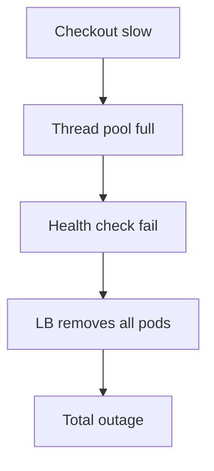

# 02. Reliability, risk, and failures

## Intro: one bug, three disasters

The API v2.1 release passed canary "successfully": no errors in the logs, CPU normal. An hour later the **payment gateway** starts timing out — it turned out the new connection pool **exhausted** the limit on the Postgres side, and checkout **retries** without jitter and **amplifies** the storm. At the same time the **Redis cache** evicts session keys — checkout latency grows, users hit F5, the **Ingress** chokes. One "small" PR; three levels of the system reacted in a **chain**.

SRE starts not with "who's to blame" but with a **failure model**: what breaks first, what amplifies the damage, where the **blast radius boundary** is. This chapter is the foundation before SLIs: without understanding risk, an SLO becomes a pretty number on a slide.

---

## Reliability as a probability

**Reliability** is the probability that a system will perform its function under given conditions over a time interval. In practice you measure **availability**, **latency**, **correctness**, and sometimes data **durability**.

| Property | User's question | Example of failure |
|----------|---------------------|----------------|
| Availability | "Does the service respond at all?" | 503, DNS fail |
| Latency | "Does it respond fast enough?" | p95 8 s |
| Correctness | "Is the answer correct?" | double charge |
| Durability | "Won't the data be lost?" | order lost after "success" |

**Important:** 100% on all axes simultaneously is **unattainable and unnecessary**. The product chooses what is **more critical** — payments more often require correctness + durability, a news feed — availability + latency.

---

## Risk = likelihood × impact

Reliability engineering is **risk management**, not risk elimination.

```text
Risk = Likelihood × Impact
```

| Action | Reduces likelihood | Reduces impact |
|----------|-------------------|----------------|
| Code review | ✓ | |
| Canary deploy | ✓ | ✓ |
| Multi-AZ | | ✓ |
| Rate limiting | ✓ | ✓ |
| Backup + restore drill | | ✓ |
| Feature flag kill switch | | ✓ |

**Residual risk** — what remains after controls; it goes **into the error budget** and insurance (DR, support).

---

## Failure domain and blast radius

A **failure domain** is the minimal zone within which a failure is **correlated** (a single root cause).

| Domain | Typical failure | How to isolate |
|--------|----------------|-----------------|
| AZ / rack | power loss | multi-AZ, anti-affinity |
| Kubernetes node | kubelet dead | PDB, spread pods |
| Namespace | misconfigured NetworkPolicy | separate NS per team |
| Dependency | Redis down | cache aside, degrade mode |
| Region | cloud unavailable | multi-region (expensive) |

**Blast radius** — how many **users / services** are affected by a single event.

Anti-pattern: **one cluster, one etcd, all products** — blast radius = the whole company.

In mock-exams: [`kuber-intermediate`](../kuber-intermediate/README.md) (PDB, spread), [`aws-intermediate`](../aws-intermediate/README.md) (multi-AZ VPC).

---

## Types of failures

### Component failure

Disk, NIC, Pod OOMKilled. **Expected** — we design **N+1**, replicas, health checks.

### Dependency failure

Database, broker, SaaS. The contract: **timeouts**, **circuit breaker**, **fallback** (read-only mode), a **queue** for deferred processing ([kafka-basic](../kafka-basic/README.md), [rabbitmq-basic](../rabbitmq-basic/README.md)).

### Deployment failure

Bad image, schema migration. **Canary**, **automatic rollback**, **backward-compatible migrations**.

### Configuration failure

Wrong feature flag, ACL. **Git review**, **GitOps** ([gitops-basic](../gitops-basic/README.md)), **config validation** in CI.

### "Human failure"

A wrong command in prod. **Guardrails**: dry-run, approval, break-glass audit. A **blameless** postmortem — the system allowed the action ([chapter 09](09-postmortems.md)).

### Cascading failure

System A slowed down → B accumulated a queue → C ran out of memory. The cure: **backpressure**, **timeouts**, **bulkheads** (limiting concurrency on a dependency).



---

## RED and USE (a bridge to observability)

For a **service** you often use **RED**:

| Letter | Metric | Meaning |
|--------|---------|-------|
| R | Rate | requests/s |
| E | Errors | share of 5xx / failed |
| D | Duration | latency distribution |

For a **resource** (CPU, disk, node) — **USE**:

| Letter | Metric |
|--------|---------|
| U | Utilization |
| S | Saturation |
| E | Errors |

SRE connects the RED of the **user journey** with the USE of the **bottleneck** during an incident. More detail — [chapter 06](06-observability-for-sre.md), the [observability-basic](../observability-basic/README.md) course.

---

## Deliberate degradation

The goal is not always "everything green". Sometimes you **deliberately** degrade the experience to **preserve the core**:

| Mode | Example |
|-------|--------|
| Read-only | catalog visible, ordering disabled |
| Stale cache | old prices are better than a 503 |
| Shed load | 429 for the non-paying API tier |
| Queue | "order accepted, we'll process it later" |

Degradation must be **documented** in the runbook and **tested** (Game Day), otherwise the team "turns off" the wrong thing.

---

## HA, FT, and "how many nines"

| Term | Meaning |
|--------|-------|
| **HA** (High Availability) | the architecture survives a component failure |
| **FT** (Fault Tolerance) | continues **without** interruption (expensive: RAID, dual controller) |
| **Nines** | 99.9% ≈ 8.76 h downtime/year; 99.99% ≈ 52.6 min |

A table for **planning** (simplified, not accounting for parallel maintenance):

| Availability | Downtime / year | Typical context |
|--------------|----------------|-------------------|
| 99% | ~3.65 days | internal tools |
| 99.9% | ~8.8 h | B2B API |
| 99.95% | ~4.4 h | ecommerce checkout |
| 99.99% | ~52 min | payments, core auth |

Each "nine" is **more expensive** than the previous one — [chapter 15](15-economics-of-reliability.md).

---

## Reliability testing

| Practice | What it checks |
|----------|----------------|
| Unit / integration | logic |
| Load test | saturation, latency under RPS |
| Chaos engineering | dependency / node failure |
| DR drill | restore from backup |
| Failure injection | network timeout, DNS |

**Chaos** without SLO is a show; with SLO it is a test of **hypotheses** ("will we survive the loss of an AZ").

---

## In mock-exams

| Scenario | Where to practice |
|----------|-----------------|
| Pod crash, probes | [kuber-basic/08-probes](../kuber-basic/README.md) |
| HPA under load | [kuber-intermediate/17-hpa](../kuber-intermediate/17-hpa.md) |
| Kafka lag cascade | [kafka-intermediate](../kafka-intermediate/README.md) |
| nginx 502 upstream | [nginx-basic/06](../nginx-basic/06-logs-502.md) |
| Vault unavailable | [secrets-basic](../secrets-basic/README.md) |

---

## Interview notes

- Name the **failure domain** of your last incident.
- How does a **cascade** differ from a **root cause**?
- RED vs USE — when to use which?
- Why is **99.99% for everything** a bad strategy?

---

## Summary

Reliability is not the absence of failures but **controlled risk**: small blast radii, clear degradation modes, metrics tied to the user. The SLI/SLO in the next chapter **quantify** how much risk we have accepted.

---

## Checklist

- [ ] Draw a cascade chain for your service (3 levels).
- [ ] Identify a failure domain and one way to reduce blast radius.
- [ ] Pick RED metrics for one API.
- [ ] Do you have a documented degrade mode?

**Next:** [03. SLI, SLO, SLA](03-sli-slo-sla.md).
