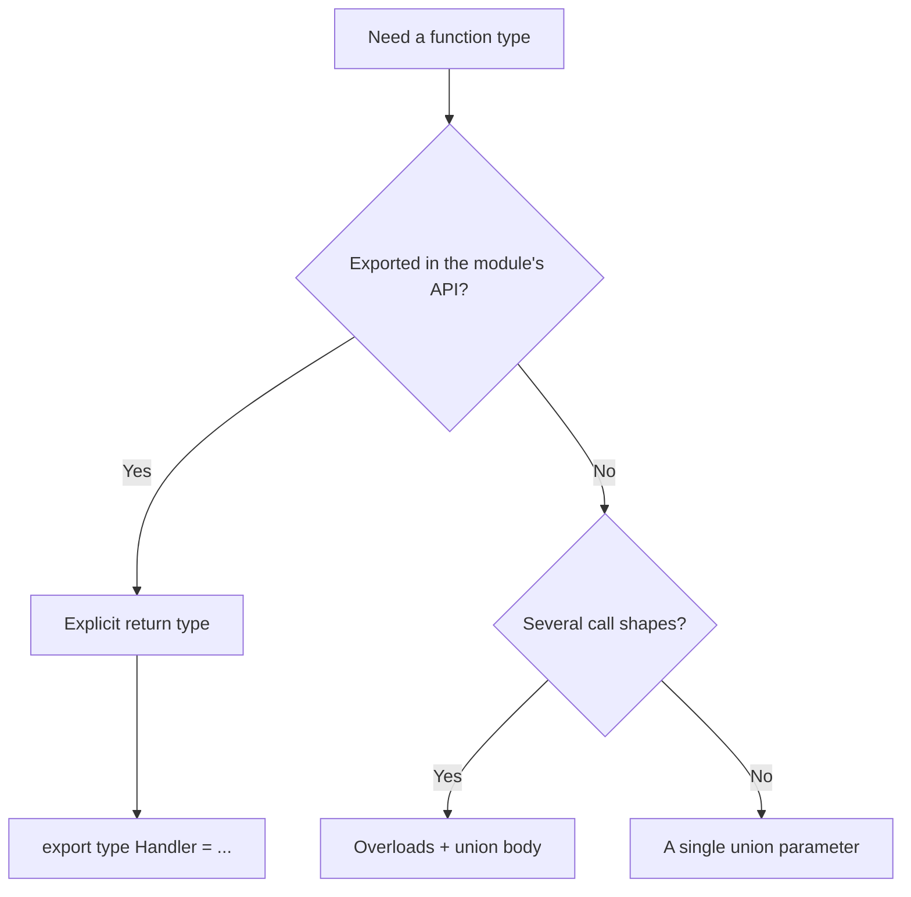

# 10. Function types: signatures, overloads, rest

## A scenario from work

In a BFF to FastAPI `:8090`, a colleague wrote a `formatPrice` utility and passed it to `items.map(formatPrice)`. After `tsc` everything is green, but at runtime — `Cannot read properties of undefined`. It turned out that `map` passes **three** arguments `(element, index, array)`, while the function expected only `price: number`. In JavaScript extra arguments are ignored; TypeScript **doesn't save you** if the signature is too wide or the callback isn't typed.

A parallel case: an Express middleware receives `(req, res, next)`, but a junior typed the handler as `(req: Request) => void` — `next` «exists» at runtime, but TypeScript didn't remind about calling it. In code review they ask for: explicit parameter and return types, a type for `(...ids: number[])`, an overload for `parseQuery` — a string **or** an array of strings from the shop's query API.

In [javascript-basic/10-functions](../javascript-basic/10-functions.md) you covered declaration, arrow and rest **at runtime**. Here — a function's **contract** at compile time.

## What you'll learn

- The syntax of a **function type**: `(a: T) => R` and `interface Fn { (x: T): R }`
- Typing **parameters**, the **return** and **optional** arguments
- **Rest parameters** `...args: T[]` and tuple rest `...args: [string, ...number[]]`
- An introduction to **function overloads**
- Typing **callbacks** (`map`, `filter`, middleware)
- Typical production bugs and their root causes

---

## A function type: two equivalent ways

```typescript
type FormatPrice = (amount: number, currency?: string) => string;

interface FormatPriceFn {
  (amount: number, currency?: string): string;
}

const formatPrice: FormatPrice = (amount, currency = "USD") =>
  new Intl.NumberFormat("en-US", { style: "currency", currency }).format(amount);

formatPrice(79.99); // "$79.99"
```

**Why two syntaxes:** `type` is convenient for union and composition; `interface` — for extension and a callable object with fields:

```typescript
interface Logger {
  (msg: string): void;
  level: "info" | "error";
}
```

A type **does not create** a function — it only checks compatibility on assignment and call.

---

## Parameters and return

```typescript
function connect(host: string, port: number = 3000, tls = false): string {
  return `${tls ? "https" : "http"}://${host}:${port}`;
}

export function parseItemId(raw: string): number | null {
  const n = Number(raw);
  return Number.isInteger(n) && n > 0 ? n : null;
}
```

| Element | Why explicit |
|---------|------------|
| Parameters | Catches passing `string` instead of `number` before deploy |
| Return | Protection against an accidental `return undefined` in a branch |
| Default | TS infers the type from the literal (`tls: boolean`) |

**Shop context:** `parseItemId` for `GET /api/v1/items/{id}` — an invalid id must not travel into `fetch` as `NaN`. A default only fires for `undefined`, as in JS ([javascript-basic/10-functions](../javascript-basic/10-functions.md)).

---

## Rest parameters with a type

```typescript
function sum(...nums: number[]): number {
  return nums.reduce((acc, n) => acc + n, 0);
}

sum(1, 2, 3); // 6
// sum(1, "2"); // error TS2345
```

Rest is always an **array** (or tuple) in the type:

```typescript
function logEvent(tag: string, ...details: unknown[]): void {
  console.log(tag, ...details);
}
```

Tuple rest — a fixed prefix + tail (see [11-arrays-tuples](11-arrays-tuples.md)):

```typescript
function createOrder(customerId: number, ...lineIds: [number, ...number[]]) {
  const [first, ...rest] = lineIds;
  return { customerId, first, rest };
}

createOrder(1, 10, 20);   // OK
// createOrder(1);        // error — at least one lineId is required
```

**Why rest is better than `arguments`:** a readable signature, a real array, and it plays nicely with spread on call.

---

## Callbacks: `map`, `filter`, handlers

```typescript
type Product = { id: number; name: string; price: number };

const products: Product[] = [
  { id: 1, name: "Keyboard", price: 79.99 },
];

const names = products.map((p) => p.name); // string[]
```

**Trap:** passing a «narrow» function where a wide callback is expected:

```typescript
function onItems(items: Product[], cb: (item: Product, index: number) => void) {
  items.forEach(cb);
}

// formatPrice: (n: number) => string — incompatible: cb receives a Product
```

Rule: type the **callback parameters** the way the API calls them.

### `void` in callbacks

```typescript
type ClickHandler = () => void;

const handler: ClickHandler = () => {
  return "ignored"; // OK — the return value is ignored when assigning to () => void
};
```

TypeScript allows returning a value where `void` is expected, as long as the result isn't used.

---

## Function overloads (introduction)

One **name**, several **call signatures**. The implementation is single — with union types:

```typescript
function parseIds(input: string): number[];
function parseIds(input: string[]): number[];
function parseIds(input: string | string[]): number[] {
  const parts = Array.isArray(input) ? input : input.split(",");
  return parts.map((s) => Number(s.trim())).filter((n) => !Number.isNaN(n));
}

parseIds("1,2,3");     // number[]
parseIds(["4", "5"]);  // number[]
```

**Order of overloads:** from more specific to general. The compiler picks the **first matching** one.

When an overload **is needed:** a different **return type** depending on the argument's shape (`getConfig("db")` → `DbConfig`). When it's **not needed:** `input: string | string[]` is enough.

Different return via overload:

```typescript
function getById(id: number): Product;
function getById(sku: string): Product;
function getById(key: number | string): Product {
  // a single implementation
  return {} as Product;
}
```

---

## Types for methods and arrows in objects

```typescript
type CartService = {
  addItem(id: number, qty: number): void;
  total: () => number;
};

const cart: CartService = {
  addItem(id, qty) {},
  total: () => 0,
};
```

The `addItem()` method and the arrow property `total` have a different `this` in JS ([javascript-basic/14-this](../javascript-basic/14-this.md)).

---

## Generics for functions (a teaser)

```typescript
function first<T>(arr: T[]): T | undefined {
  return arr[0];
}

first([1, 2, 3]);   // number | undefined
first(["a", "b"]);  // string | undefined
```

In detail — [13-generics](13-generics.md).

---

## Diagram: choosing a signature



---

## Related courses

| Lesson | Relation |
|------|-------|
| [javascript-basic/10-functions](../javascript-basic/10-functions.md) | rest, default, arrow |
| [11-arrays-tuples](11-arrays-tuples.md) | `T[]`, tuple rest |
| [12-lab-functions](12-lab-functions.md) | shop helpers |
| [13-generics](13-generics.md) | `function id<T>(x: T)` |
| [`deploy/fastapi`](../../deploy/fastapi/README.md) `:8090` | query params, item ids |

---

## Common mistakes

| Mistake | Root cause | Fix |
|--------|------------------|-------------|
| `items.map(formatPrice)` fails at runtime | The map callback passes `(item, index, array)` | `(p) => formatPrice(p.price)` |
| `(): void` vs `(): string` in a handler | Confusion with the ignored return | Align with the library's interface |
| Overload without a union implementation | Only declarations without a body | A single function with `string \| string[]` |
| `...args: any[]` | Disables checking | `unknown[]` or a generic |
| Implicit `any` on a parameter | `noImplicitAny` under strict | An explicit type or a generic |
| Rest vs optional array | `nums?: number[]` — one optional array | `...nums: number[]` — variadic |

---

## In production

- **Export** callback types: `export type OnSave = (data: Product) => void` — consumers don't duplicate the signature.
- At the boundary with `:8090`, type the **parsers** (`parseItemId`), not just the DTOs.
- Document overloads in a public API with examples — the IDE shows only the overloads, not the union body.
- ESLint `@typescript-eslint/explicit-function-return-type` on boundary modules — optional, but useful for a BFF.

---

## Summary

A function type describes a **contract**: parameters (optional, rest), the return, compatibility with callbacks. Rest is typed as `T[]` or a tuple. Overloads define several legal call shapes — don't overuse them if a union is enough. For shop/BFF, explicit signatures cut off invalid ids and formats before the HTTP call.

---

## Checklist

- Write the type `(host: string, port?: number) => URL` via `type` and an interface call signature.
- How does rest `...nums: number[]` differ from optional `nums?: number[]`?
- Why is `map(formatPrice)` dangerous if `formatPrice` accepts only a `number`?
- When is an overload better than `input: string | string[]` with a single return?
- What will `parseIds("1,foo,3")` return with NaN filtering?

Next lesson: [11. Arrays and tuples](11-arrays-tuples.md).
