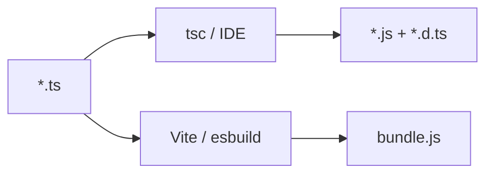

# 22. `tsconfig.json`: target, module, paths

## Scenario from work

You cloned the shop platform monorepo. The root `tsconfig.json` has `"target": "ES5"`, the `api-client` package has `"module": "CommonJS"`, and `web` has `"moduleResolution": "bundler"`. CI fails: `Cannot find module '@/lib/api'`. A colleague added a path alias in the IDE but not in `tsconfig` — it "works" locally, but in the pipeline TypeScript doesn't see the import. On code review: "why didn't `import type` end up in the `.js` after `tsc`?"

`tsconfig.json` is a **contract** between your code, the compiler, and the tools (ESLint, Vitest, IDE). Without it TypeScript doesn't know **which JS** you want as output or **how** to resolve modules.

## What you'll learn

- The structure of `tsconfig.json` and the key top-level fields
- `compilerOptions.target`, `module`, `moduleResolution`
- `rootDir`, `outDir`, `include`, `exclude`
- Path aliases: `baseUrl` and `paths`
- `extends` and project references (overview)
- The connection to `"type": "module"` in `package.json`

---

## Minimal `tsconfig.json`

```json
{
  "compilerOptions": {
    "target": "ES2022",
    "module": "NodeNext",
    "moduleResolution": "NodeNext",
    "strict": true,
    "outDir": "dist",
    "rootDir": "src",
    "skipLibCheck": true,
    "esModuleInterop": true
  },
  "include": ["src/**/*"],
  "exclude": ["node_modules", "dist"]
}
```

| Field | Purpose |
|------|------------|
| `include` | which files to compile |
| `exclude` | what to ignore (you don't always need to duplicate `node_modules`) |
| `compilerOptions` | `tsc` behavior |

Run:

```bash
npx tsc
npx tsc --noEmit   # type checking only, without emit
```

---

## `target`: what we compile to

`target` sets the **ECMAScript level** of the output `.js` files.

```json
"target": "ES2022"
```

| target | async/await in emit | typical usage |
|--------|-------------------|------------------------|
| ES5 | via generators/helpers | legacy browsers (rarely) |
| ES2017 | native async/await | Node 8+ |
| ES2022 | class fields, top-level await* | Node 18+ LTS |

\* top-level await also depends on `module`.

**Course rule:** for Node LTS and modern bundlers — `ES2022` or `ESNext`. Don't set `ES5` unless you know **why**.

TypeScript **does not polyfill** the runtime: if your code uses `structuredClone` and the target is old, the emit may break on old Node. Polyfills are separate (core-js) or above the target.

---

## `module` and `moduleResolution`

This pair of fields defines the **module format** and the **file lookup algorithm**.

### Node ESM (course recommendation)

In `package.json`:

```json
{
  "type": "module"
}
```

In `tsconfig.json`:

```json
{
  "compilerOptions": {
    "module": "NodeNext",
    "moduleResolution": "NodeNext"
  }
}
```

Imports with an **extension** in relative paths:

```typescript
import { formatPrice } from "./format.js";
// Fetch from "node-fetch";
```

TypeScript requires `.js` in imports even when the source is `.ts` — that's how it will be at runtime after compilation.

### Other combinations

| module | moduleResolution | When |
|--------|------------------|-------|
| `CommonJS` | `Node10` | old Node without ESM |
| `ESNext` | `bundler` | Vite, webpack, esbuild |
| `Preserve` | `bundler` | TS 5.4+, the bundler does the assembling |

**Mistake:** `module: ESNext` + plain `node dist/index.js` without a bundler — often breaks on extensionless imports.

---

## `rootDir` and `outDir`

```json
"rootDir": "src",
"outDir": "dist"
```

```text
src/
  index.ts
  api/client.ts
dist/
  index.js
  api/client.js
```

The directory structure in `dist` mirrors `src`. If you put a `.ts` outside `rootDir`, `tsc` may widen the inferred root or throw an error.

Useful with `"declaration": true` — generates `.d.ts` next to `.js` for libraries.

---

## Path aliases: `baseUrl` and `paths`

Scenario: import `from "@/schemas/item"` instead of `from "../../../schemas/item"`.

```json
{
  "compilerOptions": {
    "baseUrl": ".",
    "paths": {
      "@/*": ["src/*"]
    }
  }
}
```

```typescript
import { ItemSchema } from "@/schemas/item.js";
```

**Important:** `tsc` **does not rewrite** paths in the emit. For the runtime you need one of the following:

- a bundler (Vite/webpack) understands the alias from tsconfig;
- `tsc-alias` / `tsconfig-paths` after compilation;
- relative imports in libraries without a bundler.

The IDE (VS Code) reads `paths` for autocompletion — hence "it works for me, not in CI."

---

## `extends` and multiple configs

The team's base config:

```json
// tsconfig.base.json
{
  "compilerOptions": {
    "strict": true,
    "skipLibCheck": true,
    "forceConsistentCasingInFileNames": true
  }
}
```

An application package:

```json
{
  "extends": "./tsconfig.base.json",
  "compilerOptions": {
    "outDir": "dist",
    "rootDir": "src"
  },
  "include": ["src"]
}
```

**Project references** (`references: [{ "path": "../shared" }]`) — for a monorepo with incremental builds; more in nodejs-intermediate.

---

## Fields you almost always enable

| Option | Why |
|-------|-------|
| `strict: true` | see [23-strict-mode.md](23-strict-mode.md) |
| `skipLibCheck: true` | faster; doesn't check `.d.ts` in node_modules |
| `esModuleInterop: true` | convenient default import from CJS |
| `forceConsistentCasingInFileNames: true` | Linux CI vs Windows |
| `isolatedModules: true` | compatibility with esbuild/swc |
| `noEmit: true` | check only on the frontend (Vite does the build) |

---

## `tsc` vs bundler vs IDE



- **npm library** — usually `tsc` + `declaration`.
- **SPA (React)** — often `noEmit: true`, built with Vite.
- **Node CLI** — `tsc` or `tsx` for dev.

---

## Related courses

- Types and unions — lessons 01–15.
- Strict flags — [23-strict-mode.md](23-strict-mode.md).
- ESM and `.d.ts` — [25-modules-declarations.md](25-modules-declarations.md).
- JS capstone CLI — [javascript-basic/39-capstone.md](../javascript-basic/39-capstone.md) (ported to TS in [33-capstone.md](33-capstone.md)).

FastAPI test bench `:8090` — [deploy/fastapi/README.md](../../deploy/fastapi/README.md).

---

## Common mistakes

1. **Path alias only in tsconfig** — runtime `MODULE_NOT_FOUND`. Configure a bundler or `tsconfig-paths`.

2. **`module: CommonJS` + `"type": "module"`** — mixed formats, strange require/import errors.

3. **Forgot `.js` in imports with NodeNext** — TS2307 on `./utils`.

4. **`include` doesn't cover tests** — Vitest sees errors, `tsc` is silent. Add a `vitest.config.ts` or a separate `tsconfig.test.json`.

5. **Two tsconfigs with different strict** — IDE and CI diverge.

6. **target ES5 "just in case"** — a bloated build with no real benefit.

---

## Summary

`tsconfig.json` controls the JS target, the module format, and import resolution. For this course's Node ESM: `"type": "module"`, `module`/`moduleResolution`: `NodeNext`, relative imports with `.js`. `paths` — for the IDE and bundler, not magic for bare Node. `rootDir`/`outDir` set the artifact layout. Use `extends` for a single strict baseline.

---

## Checklist

- How does `target` differ from `module`?
- Why write `./file.js` in a TS import when the source is `.ts`?
- Why might the `@/` alias work in the IDE but fail in `node dist/index.js`?
- When should you set `noEmit: true`?
- What does `npx tsc --noEmit` do?

Next lesson: [23. Strict mode](23-strict-mode.md).
