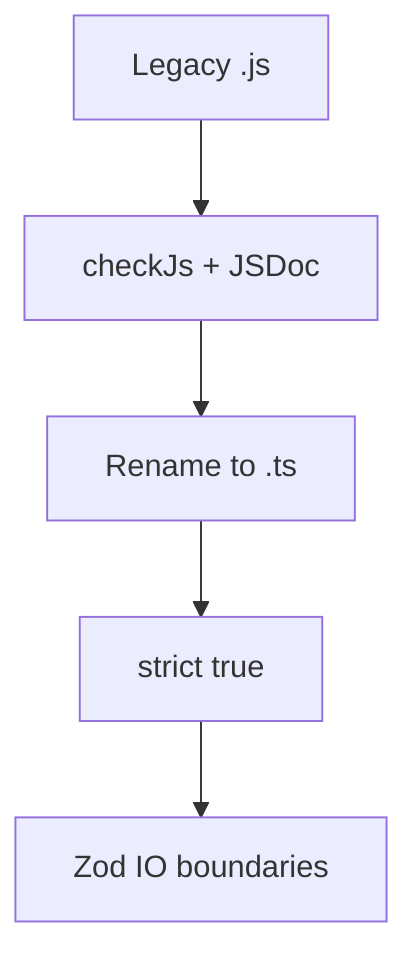

# 31. Tooling: ESLint for TypeScript and gradual JS → TS migration

## Scenario from work

The shop monorepo: 40% `.js`, 60% `.ts`. CI: `tsc --noEmit` is green, but there's no `@ts-check` in the `.js` files — bugs live on. ESLint with `@typescript-eslint` complains about `no-floating-promises` in the legacy code. The PM says: "let's migrate within a sprint without a stop-the-world." You need a **plan**: allowJs, checkJs, rename, strict per package, eslint flat config.

## What you'll learn

- ESLint 9 + typescript-eslint (flat config)
- Rules that strengthen strict
- Gradual migration: allowJs, checkJs, JSDoc
- A `.js` → `.ts` rename strategy
- `ts-node`, `tsx`, `tsc --build`
- CI: typecheck + lint in parallel

---

## Minimal ESLint for TS

```bash
npm install -D eslint @eslint/js typescript typescript-eslint
```

`eslint.config.js`:

```javascript
import eslint from "@eslint/js";
import tseslint from "typescript-eslint";

export default tseslint.config(
  eslint.configs.recommended,
  ...tseslint.configs.recommendedTypeChecked,
  {
    languageOptions: {
      parserOptions: {
        projectService: true,
        tsconfigRootDir: import.meta.dirname,
      },
    },
  },
  {
    rules: {
      "@typescript-eslint/no-explicit-any": "warn",
      "@typescript-eslint/no-floating-promises": "error",
      "@typescript-eslint/no-misused-promises": "error",
      "@typescript-eslint/consistent-type-imports": [
        "error",
        { prefer: "type-imports" },
      ],
    },
  }
);
```

`package.json`:

```json
{
  "scripts": {
    "lint": "eslint src",
    "typecheck": "tsc --noEmit"
  }
}
```

**Type-checked rules** require `parserOptions.project` — slower, but they catch floating promises.

---

## Rules worth enabling

| Rule | Why |
|------|-------|
| `no-floating-promises` | a forgotten `await save()` |
| `no-misused-promises` | async in `array.filter` |
| `no-explicit-any` | don't multiply any |
| `consistent-type-imports` | clean emit |
| `restrict-template-expressions` | no object in a template |
| `no-unused-vars` | dead code |

Don't enable the whole `strictTypeChecked` at once in legacy — raise it gradually.

---

## Gradual migration tsconfig

```json
{
  "compilerOptions": {
    "allowJs": true,
    "checkJs": true,
    "strict": true,
    "maxNodeModuleJsDepth": 1
  },
  "include": ["src/**/*"]
}
```

| Flag | Effect |
|------|--------|
| `allowJs` | the compiler sees `.js` |
| `checkJs` | checks `.js` with JSDoc / inference |
| `strict` | applies to JS too under checkJs |

### JSDoc in JS before the rename

```javascript
/**
 * @param {string} title
 * @param {{ tags?: string[] }} [options]
 * @returns {{ id: string, title: string, status: 'todo' | 'done' }}
 */
export function createTask(title, options) {
  // ...
}
```

Renaming to `.ts` — you remove the JSDoc and add native types.

---

## Migration strategy (step by step)

### Phase 0. Baseline

- `tsconfig` with `strict: false` → enable `noImplicitAny` only
- ESLint without type-aware rules
- CI: `tsc --noEmit` optional

### Phase 1. Leaf modules

Migrate the **leaves** of the graph (utils, format) — no dependent `.js`.

```bash
git mv src/format.js src/format.ts
# fix types, run tsc
```

### Phase 2. Core domain

`task.js` → `task.ts`, `store.js` → `store.ts` ([javascript-basic/39-capstone](../javascript-basic/39-capstone.md)).

### Phase 3. Strict per package

Monorepo: `"strict": true` in `packages/shared`, then `packages/api-client`.

### Phase 4. Zod at the boundaries

HTTP and file I/O — [26-zod-basics.md](26-zod-basics.md).



---

## `// @ts-expect-error` and suppressions

Acceptable **temporarily** with a comment and a ticket:

```typescript
// @ts-expect-error legacy cart until TASK-1234
legacyCart.add(item);
```

Forbidden: mass `@ts-ignore` before enabling strict ([24-lab-strict.md](24-lab-strict.md)).

---

## Running TS in dev

| Tool | When |
|------|-------|
| `tsx src/cli.ts` | fast dev without emit |
| `tsc -w` | watch compile |
| `node --import tsx` | Node 20+ |

The production CLI capstone — `tsc` → `node dist/cli.js`.

---

## CI pipeline (example)

```yaml
- run: npm ci
- run: npm run typecheck
- run: npm run lint
- run: npm test
```

Typecheck and lint **both** — ESLint doesn't replace `tsc`.

---

## Prettier

Formatting separate from ESLint:

```bash
npm install -D prettier eslint-config-prettier
```

Don't argue about semicolons in review — Prettier decides.

---

## Migrating the capstone JS → TS

From [javascript-basic/39-capstone.md](../javascript-basic/39-capstone.md):

1. Copy `examples/capstone/` → `typescript-basic/examples/capstone/`
2. Rename `.js` → `.ts`, add a `tsconfig` ([22-tsconfig.md](22-tsconfig.md))
3. Enable strict, go through [24-lab-strict.md](24-lab-strict.md)
4. `TaskFileSchema` for load ([26-zod-basics.md](26-zod-basics.md))
5. Extension B: HTTP client ([30-lab-fetch.md](30-lab-fetch.md))

The result — [33-capstone.md](33-capstone.md).

---

## Related courses

- tsconfig: [22-tsconfig.md](22-tsconfig.md)
- strict: [23-strict-mode.md](23-strict-mode.md)
- modules: [25-modules-declarations.md](25-modules-declarations.md)

---

## Common mistakes

1. **Strict at once on 100k LOC** — the team rolls TS back.

2. **ESLint without project** — type-aware rules stay silent.

3. **`allowJs` without a removal plan** — an eternal hybrid.

4. **Only lint in CI** — types aren't checked.

5. **Duplicating Prettier and ESLint stylistic rules** — conflicts.

6. **Migrating the entry point first** — maximum errors; start with the leaves.

---

## Summary

typescript-eslint with type-aware rules complements `tsc`. JS→TS migration: allowJs/checkJs, JSDoc, rename leaf-first, strict per package, Zod on I/O. CI: typecheck + lint. Dev: tsx or tsc -w. The capstone Task Tracker is the reference migration path in this course.

---

## Checklist

- Why `no-floating-promises` if you have strict?
- How does `allowJs` differ from `checkJs`?
- Where to start the migration — cli.js or format.js?
- Does ESLint replace tsc?
- When to use `@ts-expect-error`?

Next lesson: [32. Interview Q&A](32-interview-qa.md).
