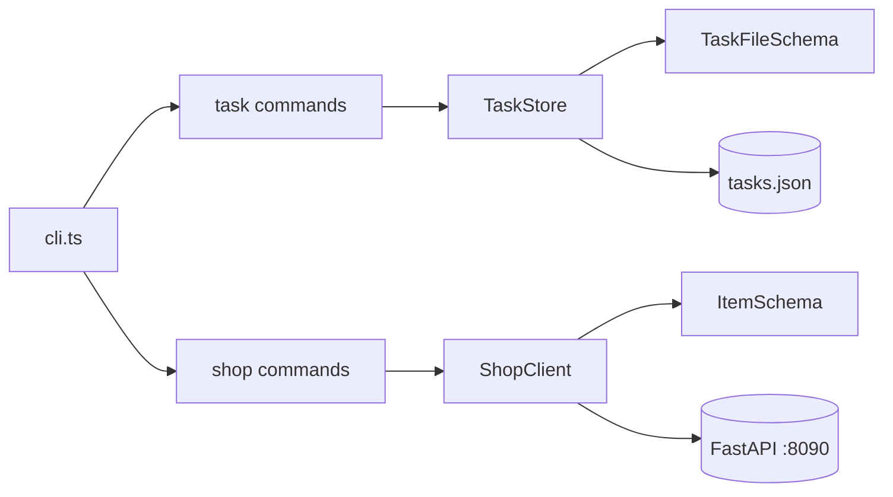

# 33. Capstone: Typed Shop CLI + API client (4–6 hours)

## Intro: why the capstone

Up to this chapter you learned **fragments**: tsconfig in 22, strict in 23, Zod in 26, typed fetch in 29. The capstone forces you to **put together** a production-shaped CLI: types, runtime validation, ESM modules, and optionally HTTP to `:8090`. It's a **direct continuation** of [javascript-basic/39-capstone.md](../javascript-basic/39-capstone.md) — the same tasks domain, but TypeScript + Zod + a shop API client.

If you get stuck — go back to the lessons from the "When to check" table, don't copy a ready-made repository.

**Time estimate:** 4–6 hours of focused work (2–3 sessions of 2 hours).

---

## The task

Two related modules in one project:

1. **Task Tracker CLI** — a port of the JS capstone to TS with strict and Zod for `tasks.json`.
2. **Shop API client** — a typed client for the FastAPI catalog at `http://localhost:8090`.

The CLI combines the `task …` and `shop …` commands (or two entry points — document it).

Later in **nodejs-basic** TaskStore becomes HTTP-only; in **react-basic** — a UI on top of the same client.

---

## Functional requirements

### The `Task` model (Zod + infer)

| Field | Type | Rules |
|------|-----|---------|
| `id` | string (uuid) | unique |
| `title` | string | 1–200, non-empty |
| `status` | `"todo"` \| `"done"` | default `todo` |
| `createdAt` | string ISO 8601 | on creation |
| `tags` | string[] | default `[]` |
| `dueDate` | string ISO \| null | optional |

```typescript
export const TaskSchema = z.object({ ... });
export type Task = z.infer<typeof TaskSchema>;
export const TaskFileSchema = z.array(TaskSchema);
```

### `TaskStore`

- `add(title, options?)` → `Task`
- `list({ status?, tag?, search? })` → `Task[]` (a copy)
- `markDone(id)` → `Task`
- `remove(id)` → `void`
- `load()` / `save()` — `data/tasks.json`, parse via `TaskFileSchema`
- On broken JSON — stderr + exit 1 (optionally `.bak`)

### Shop client

- `health()` → validated health object
- `listItems()` → `Item[]`
- `getItem(id)` → `Item`
- All responses via Zod ([27-lab-zod.md](27-lab-zod.md), [30-lab-fetch.md](30-lab-fetch.md))

### CLI

```bash
npm run start -- task add "Buy milk" --tags home,food
npm run start -- task list --status todo
npm run start -- task done <uuid>
npm run start -- shop health
npm run start -- shop list
npm run start -- shop item 1
```

Exit codes: `0` success, `1` validation/not found/HTTP/Zod error. Messages go to **stderr**.

---

## Non-functional requirements

| Requirement | Why |
|------------|-------|
| `"strict": true`, `noUncheckedIndexedAccess` | [23-strict-mode.md](23-strict-mode.md) |
| ESM, NodeNext, import `.js` | [22-tsconfig.md](22-tsconfig.md), [25-modules-declarations.md](25-modules-declarations.md) |
| No `@ts-ignore`; minimal `as` | [24-lab-strict.md](24-lab-strict.md) |
| Task/Item types — `z.infer` | [26-zod-basics.md](26-zod-basics.md) |
| `main().catch` + typed unknown | [28-async-types.md](28-async-types.md) |
| ESLint recommended + no-floating-promises | [31-tooling-migration.md](31-tooling-migration.md) |
| README with commands and Docker `:8090` | for the reviewer |

---

## Target structure

```text
examples/capstone/
├── README.md
├── package.json              # "type": "module"
├── tsconfig.json
├── eslint.config.js
├── data/
│   └── tasks.json
└── src/
    ├── cli.ts                # argv router
    ├── commands/
    │   ├── task.ts
    │   └── shop.ts
    ├── domain/
    │   ├── task.ts           # createTask, ValidationError
    │   ├── store.ts          # TaskStore
    │   └── errors.ts
    ├── schemas/
    │   ├── task.ts
    │   └── item.ts
    ├── api/
    │   ├── http.ts
    │   └── shop-client.ts
    ├── parse-args.ts
    └── format.ts
```



---

## Step-by-step plan (recommended)

### Session 1 (~2 h): port the JS capstone → TS strict

1. Copy the logic from [javascript-basic/39-capstone.md](../javascript-basic/39-capstone.md) or the JS version of `examples/capstone/`.
2. Rename to `.ts`, set up tsconfig ([22-tsconfig.md](22-tsconfig.md)).
3. Describe `TaskSchema`, replace manual validation with Zod where appropriate.
4. Work through the strict errors ([24-lab-strict.md](24-lab-strict.md)).
5. **Criterion:** `task add` + `task list` + a restart — the tasks are in place; `npm run typecheck` — 0 errors.

**Lessons:** 22–24, 26, JS capstone 39.

### Session 2 (~2 h): Shop client + shop commands

1. Bring up [deploy/fastapi](../../deploy/fastapi/README.md).
2. Port the schemas/client from [30-lab-fetch.md](30-lab-fetch.md).
3. Commands `shop health`, `shop list`, `shop item <id>`.
4. **Criterion:** an items table from the real API; a 404 on a bad id — exit 1.

**Lessons:** 27–30, [javascript-basic/29-fetch.md](../javascript-basic/29-fetch.md).

### Session 3 (~1–2 h): CLI polish, ESLint, README

1. A discriminated union for the parsed argv ([24-lab-strict.md](24-lab-strict.md)).
2. `format.ts`: table output, truncate uuid.
3. ESLint flat config ([31-tooling-migration.md](31-tooling-migration.md)).
4. README: setup, Docker, examples, the idempotency limitations of `done`.

---

## Implementation hints

### createTask with Zod

```typescript
const CreateTaskInputSchema = z.object({
  title: z.string().trim().min(1).max(200),
  tags: z.array(z.string()).default([]),
  dueDate: z.string().datetime().nullable().optional(),
});

export function createTask(input: z.input<typeof CreateTaskInputSchema>): Task {
  const data = CreateTaskInputSchema.parse(input);
  return TaskSchema.parse({
    id: randomUUID(),
    title: data.title,
    status: "todo",
    createdAt: new Date().toISOString(),
    tags: data.tags,
    dueDate: data.dueDate ?? null,
  });
}
```

### load with safeParse

```typescript
async load(path: string): Promise<void> {
  const raw = await readFile(path, "utf-8").catch((e) => {
    if (isEnoent(e)) return null;
    throw e;
  });
  if (raw === null) {
    this.tasks = [];
    return;
  }
  const parsed: unknown = JSON.parse(raw);
  const result = TaskFileSchema.safeParse(parsed);
  if (!result.success) {
    throw new Error(`Invalid tasks.json: ${result.error.message}`);
  }
  this.tasks = result.data;
}
```

### Shop list in the CLI

```typescript
const items = await shopClient.listItems();
console.table(
  items.map((i) => ({ id: i.id, name: i.name, price: i.price }))
);
```

### Path to data/tasks.json

```typescript
import { fileURLToPath } from "node:url";
import path from "node:path";

const __dirname = path.dirname(fileURLToPath(import.meta.url));
const TASKS_PATH = path.join(__dirname, "..", "data", "tasks.json");
```

---

## Extensions (optional)

| Level | Task | Hours |
|---------|--------|------|
| A | `task export --format json` via a `TaskFileSchema` round-trip | +0.5 |
| B | `task sync` — pull/push tasks with `:8090` if the endpoint exists | +1.5 |
| C | `shop search <q>` — client-side filter + highlight | +0.5 |
| D | Vitest: unit tests for `createTask` and `TaskFileSchema` | +1 |
| E | `task add` with `--due` ISO date + sort list by dueDate | +1 |

Test bench: `docker compose up -d --build` in `deploy/fastapi`.

---

## Success criteria (self-check)

- [ ] `npm run typecheck` and `npm run lint` — no errors
- [ ] `task add` → `task list` → restart → the task is in place
- [ ] A broken `tasks.json` — a clear error, exit 1
- [ ] `shop list` with the API up — data with Zod validation
- [ ] No file > 250 lines without justification in the README
- [ ] No duplicate `interface Task` and `TaskSchema` — only infer
- [ ] `capstone/README.md` with commands

---

## Common mistakes

1. **`as Task[]` on load** — strict is OK, runtime isn't. Only `TaskFileSchema.parse`.

2. **Two sources of Item types** — interface + Zod. One infer.

3. **Forgot `.js` in imports** — NodeNext ERR_MODULE_NOT_FOUND in dist.

4. **Shop commands without a Docker check** — a cryptic ECONNREFUSED; wrap it with the message "start deploy/fastapi".

5. **Mutating `list()` from outside** — return a copy.

6. **A floating promise in cli** — `void main()` or await + catch.

7. **any from res.json()** — the first assign into `unknown`.

---

## When to check the lessons

| Problem | Lesson |
|---------|------|
| tsconfig / paths | 22 |
| null / find / index | 23, 24 |
| import type / .d.ts | 25 |
| Zod refine / default | 26, 27 |
| async save | 28 |
| fetch + unknown | 29, 30 |
| ESLint CI | 31 |
| JS source of the capstone | [javascript-basic/39](../javascript-basic/39-capstone.md) |

---

## Connection to the mock-exams ecosystem

```text
javascript-basic/39-capstone (JS + JSON file)
        ↓
typescript-basic/33-capstone (TS + Zod + shop API)
        ↓
nodejs-basic (Express BFF → :8090)
        ↓
react-basic (UI + TanStack Query + shared schemas)
```

Shop items and tasks are the same entities as in [fastapi](../fastapi/README.md) and [api-design](../api-design/README.md).

---

## After the capstone

1. Go through [interview-cheatsheet.md](interview-cheatsheet.md) and [32-interview-qa.md](32-interview-qa.md).
2. Mark in [javascript-path.md](../javascript-path.md): **nodejs-basic** or **react-basic**.
3. Publish `examples/capstone/` in a branch — an artifact for your resume.

Congratulations — **typescript-basic** is complete.

---

[← 32-interview-qa](32-interview-qa.md) · [interview-cheatsheet](interview-cheatsheet.md)
