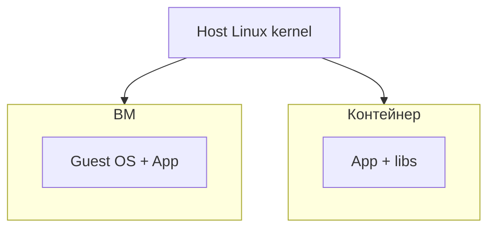

# 01. Зачем контейнеры: VM, изоляция и путь к Kubernetes

## Введение: «поднимите ещё одну ВМ»

Команда деплоит микросервис: для каждого релиза — **новая ВМ**, 20 минут provisioning, разные версии glibc, «на staging работало». SRE предлагает **контейнер**: один образ с зависимостями, старт за секунды, одинаковое поведение на ноутбуке и в CI. Kubernetes приходит **после** того, как вы умеете **собрать образ**, **запустить compose** и **понять сеть** — иначе Pod и Service кажутся магией. Эта глава — **зачем контейнер до оркестратора**.

## Что вы узнаете

- Отличие **контейнера** от **виртуальной машины**.
- Что даёт **изоляция процессов** (namespaces, cgroups) без полной ОС.
- Роль Docker на **рабочей станции DevOps** vs runtime в **K8s**.
- Связь с [`linux-basic`](../linux-basic/README.md) и будущим [`kuber-basic`](../kuber-basic/README.md).

## Контейнер vs виртуальная машина

| | ВМ (гипервизор) | Контейнер (Docker) |
|---|-----------------|---------------------|
| Ядро ОС | своё на каждую ВМ | **общее** с хостом |
| Старт | минуты | секунды |
| Размер образа | ГБ (полная ОС) | МБ–сотни МБ (слои приложения) |
| Плотность | десятки ВМ на хост | сотни контейнеров |
| Изоляция | сильная (отдельное ядро) | процессная (namespaces) |



Контейнер — **не эмуляция железа**, а **упакованный процесс** с собственным rootfs, сетью и лимитами CPU/RAM. Под капотом — **namespaces** и **cgroups** ([`linux-advanced`](../linux-advanced/01-namespaces.md)).

## Зачем DevOps-инженеру Docker

На практике Docker (или совместимый engine) — **стандарт сборки и доставки**:

1. **Dockerfile** — воспроизводимая сборка в CI ([`gitlab-intermediate/03-docker-registry`](../gitlab-intermediate/03-docker-registry.md)).
2. **Compose** — локальный **multi-tier** стек без minikube ([`deploy/containers`](../../deploy/containers/README.md)).
3. **Registry** — хранение тегов образов между средами.
4. **Отладка** — `exec`, `logs`, `inspect` до эскалации в K8s.

В кластере Kubernetes **не заменяет** знание образа: вы по-прежнему пушите в registry, а kubelet тянет **image:tag** в Pod.

## Образ как контракт доставки

**Image** — неизменяемый снимок файловой системы + метаданные (`CMD`, `EXPOSE`, `ENV`). **Container** — **запущенный экземпляр** образа с writable layer поверх read-only слоёв.

| Термин | Аналогия |
|--------|----------|
| Image | класс / шаблон |
| Container | объект / процесс |
| Registry | Maven/npm для бинарников ОС+app |
| Dockerfile | рецепт сборки image |

## Почему не «сразу Kubernetes»

| Задача | Docker Compose | Kubernetes |
|--------|----------------|--------------|
| Локальная разработка 3 сервисов | быстро | избыточно |
| Один хост, учебный стенд | достаточно | нужен кластер |
| Self-healing, rolling update, 100+ нод | слабо | сильно |
| Сеть между десятками команд | ручной compose | Service, Ingress, CNI |

Basic-курс закрывает **левую колонку**; переход — [16-docker-vs-kubernetes](16-docker-vs-kubernetes.md) и [`kuber-basic`](../kuber-basic/README.md).

## На стенде: первое касание

```bash
cd deploy/containers
docker compose up -d --build
docker compose ps
bash scripts/smoke.sh
```

| URL | Назначение |
|-----|------------|
| [localhost:8088](http://localhost:8088) | nginx + статика |
| [localhost:8088/api/health](http://localhost:8088/api/health) | Flask + Redis ping |
| [localhost:8088/api/hits](http://localhost:8088/api/hits) | счётчик в Redis |

Redis **не** слушает на хосте — только внутри сети compose (принцип «минимум опубликованных портов»).

## Типичные ошибки

| Ошибка | Почему плохо | Как правильно |
|--------|--------------|---------------|
| Контейнер = мини-ВМ с ssh | лишний вес, антипаттерн | один процесс / один entrypoint |
| Менять файлы внутри running container | теряется при recreate | править Dockerfile / volume |
| «На проде docker compose» без оркестратора | нет rolling/HA | compose для dev; K8s/ECS для prod |
| Путать image и container | путаница в rollback | версионировать **тег образа** |
| Игнорировать `.dockerignore` | медленный build, утечки | исключить `.git`, секреты |

## В продакшене

- **Immutable infrastructure**: новый релиз = **новый тег образа**, не `apt upgrade` внутри контейнера.
- **Один процесс на контейнер** (или явный supervisor — редко).
- **12-factor**: конфиг через **env**, секреты — Vault/K8s Secret, не в слоях image.
- **Resource limits** — в K8s `resources`; в Docker — `deploy.resources` (compose v3+) или run flags.
- CI: build → scan → push → deploy ([gitlab-intermediate](../gitlab-intermediate/03-docker-registry.md)).

## Заметки для собеседования

- Контейнер разделяет **ядро** с хостом; ВМ — нет.
- Docker на laptop ≠ runtime в K8s 1.24+ ([containerd](../kuber-basic/02-docker-vs-containerd.md)).
- Image layers **кэшируются**; порядок инструкций в Dockerfile влияет на скорость CI.
- Контейнер **эфемерен**; состояние — в volume или внешней БД.

## Резюме

Контейнер упаковывает приложение и зависимости в **переносимый образ** с быстрым стартом и плотной упаковкой на хосте. Docker — инструмент **сборки, локального запуска и registry**; Kubernetes — **оркестрация** уже собранных образов. Следующие главы — как писать Dockerfile и управлять runtime на [`deploy/containers`](../../deploy/containers/README.md).

## Чек-лист

- В чём контейнер легче ВМ по времени старта и размеру?
- Чем image отличается от container?
- Зачем Redis на стенде не на `localhost:6379`?
- Когда compose достаточно, а когда нужен K8s?

Следующий урок: [02. Образ и Dockerfile](02-images-dockerfile.md).
