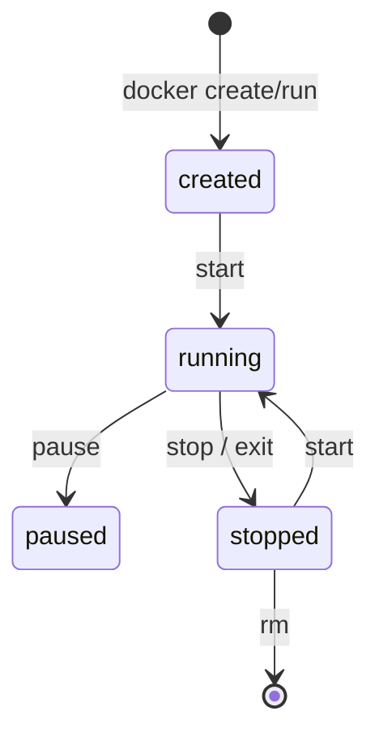

# 04. Container runtime: run, exec, logs, inspect, stop

## Введение: «контейнер завис, что внутри?»

На staging API перестал отвечать: в Kubernetes смотрят `kubectl logs`, локально — **`docker compose logs`**. Нужно зайти внутрь, проверить DNS до Redis, посмотреть переменные — **`docker exec`**. Перед рестартом снимают **`inspect`** — IP, mounts, health. Эта глава — **жизненный цикл контейнера** в CLI Docker (не путать с **containerd** в ноде K8s — [kuber-basic/02](../kuber-basic/02-docker-vs-containerd.md)).

## Что вы узнаете

- Команды **run**, **stop**, **rm**, **ps**.
- **logs**, **exec**, **inspect** для диагностики.
- Отличие **detach** / **attach**, **restart policy**.
- Имена контейнеров стенда `mock-containers-*`.

## Жизненный цикл



| Команда | Действие |
|---------|----------|
| `docker run` | create + start |
| `docker stop` | SIGTERM → grace → SIGKILL |
| `docker kill` | немедленный SIGKILL |
| `docker rm` | удалить остановленный |
| `docker compose down` | stop + remove compose-контейнеров |

**PID 1** в контейнере — ваша `CMD`. Если приложение не обрабатывает SIGTERM, `stop` ждёт timeout (по умолчанию 10 с).

## docker run (флаги, которые встретите)

```bash
docker run -d --name myapp -p 8080:80 \
  -e REDIS_HOST=redis \
  --network deploy-containers_frontend \
  myimage:tag
```

| Флаг | Назначение |
|------|------------|
| `-d` | detached (фон) |
| `--name` | стабильное имя для exec/logs |
| `-p host:container` | publish порта |
| `-e` | переменная окружения |
| `--rm` | удалить после exit |
| `--network` | подключить к сети |

Compose генерирует те же параметры из `docker-compose.yml`.

## logs

```bash
docker logs mock-containers-api
docker logs -f --tail 50 mock-containers-api
docker compose logs -f api web
```

| Опция | Зачем |
|-------|--------|
| `-f` | follow (как `tail -f`) |
| `--since 10m` | окно при инциденте |
| `--tail N` | не заливать терминал |

Логи приложения пишутся в **stdout/stderr** — не в файлы внутри образа без volume (12-factor).

## exec

Интерактивная оболочка (если есть `sh`/`bash` в образе):

```bash
docker exec -it mock-containers-api sh
# внутри:
env | grep REDIS
python -c "import urllib.request; print(urllib.request.urlopen('http://127.0.0.1:8080/health').read())"
exit
```

Одноразовая команда без TTY:

```bash
docker exec mock-containers-api python -c "import redis; r=redis.Redis('redis'); print(r.ping())"
```

**Важно:** `exec` работает в **уже запущенном** namespace; это не SSH в ВМ.

## inspect

```bash
docker inspect mock-containers-api --format '{{.State.Status}} {{.State.Health.Status}}'
docker inspect mock-containers-api --format '{{json .NetworkSettings.Networks}}' | head -c 500
docker inspect mock-containers-redis --format '{{range .Mounts}}{{.Type}} {{.Destination}}{{"\n"}}{{end}}'
```

Типичные поля при разборе инцидента:

| JSONPath / поле | Вопрос |
|-----------------|--------|
| `.State.Status` | running? |
| `.State.ExitCode` | почему упал |
| `.State.Health` | healthcheck compose |
| `.NetworkSettings.Networks` | в каких сетях |
| `.Mounts` | volumes |

## compose vs docker CLI

| Задача | Compose | Docker |
|--------|---------|--------|
| Поднять стек | `compose up -d` | N × `run` |
| Статус | `compose ps` | `ps --filter name=mock-containers` |
| Логи сервиса | `compose logs api` | `logs mock-containers-api` |
| Exec | `compose exec api sh` | `exec mock-containers-api sh` |

Имена контейнеров на стенде заданы `container_name:` в [`docker-compose.yml`](../../deploy/containers/docker-compose.yml).

## На стенде

```bash
cd deploy/containers
docker compose up -d --build
docker compose ps
docker inspect mock-containers-api --format '{{.State.Health.Status}}'
```

Ожидаете `healthy` для api после прогрева healthcheck.

## Типичные ошибки

| Ошибка | Симптом | Исправление |
|--------|---------|-------------|
| `docker exec` в stopped | Error | `compose ps`, поднять сервис |
| Путать **image** и **container** id | правки не помогают | rebuild image, recreate container |
| Логи только в файл внутри | `logs` пустой | писать в stdout |
| `kill` вместо `stop` | обрыв транзакций | сначала `stop`, потом разбор |
| exec в **alpine** без bash | `bash not found` | `sh` |

## В продакшене

- Централизованный сбор логов (Loki, CloudWatch) — контейнер всё равно пишет в **stdout**.
- **Liveness/readiness** в K8s — аналог healthcheck compose.
- **Graceful shutdown**: обработка SIGTERM в приложении.
- Не полагаться на `docker exec` в prod для рутины — только диагностика.

## Заметки для собеседования

- `docker run` создаёт новый контейнер; **изменения внутри** не попадают в image.
- `compose up` при смене image — **recreate** контейнера.
- Healthcheck в compose — встроенный **probe** до зависимостей (`depends_on: condition: service_healthy`).

## Резюме

Runtime CLI — **запуск, остановка, логи, вход внутрь, метаданные**. Это ежедневный инструмент DevOps до и рядом с Kubernetes. На стенде отрабатываете на `mock-containers-api` и redis.

## Чек-лист

- Чем `stop` отличается от `kill`?
- Как проверить health api одной командой `inspect`?
- Зачем логи в stdout?
- Как зайти в api и проверить `REDIS_HOST`?

Следующий урок: [05. Лаба: run, exec, logs](05-lab-run-exec-logs.md).
