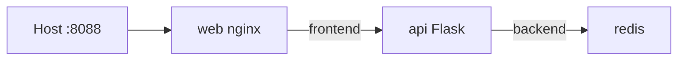

# 06. Сети Docker: bridge, publish, compose networks

## Введение: «почему api не достучался до redis»

Разработчик публикует Redis на `6379` «для удобства» — с хоста и из интернета. Security открывает тикет: **база не должна быть на localhost**. Правильная схема: **только api** в сети `backend`, **web** проксирует наружу **один** порт `8088`. Эта глава — **модель сети Docker** и **compose networks** стенда.

## Что вы узнаете

- Драйвер **bridge** и DNS по **имени сервиса**.
- **Publish** (`ports`) vs **expose** внутри сети.
- Паттерн **frontend / backend** в [`deploy/containers`](../../deploy/containers/docker-compose.yml).
- Reverse proxy nginx: `/api/` → `http://api:8080/`.

## Bridge network

По умолчанию Docker создаёт **bridge** — виртуальный L2-сегмент на хосте. Контейнеры в одной user-defined сети резолвят друг друга:

```text
web  →  api:8080     (hostname = service name / container_name)
api  →  redis:6379
```

| Понятие | Описание |
|---------|----------|
| `hostname` / service name | DNS внутри сети |
| `ports: "8088:80"` | NAT на хост |
| Без `ports` | сервис **только внутри** Docker |

На стенде **redis** не имеет `ports:` — с хоста `redis-cli -h 127.0.0.1` **не** подключится (если не проброшен отдельно).

## Publish и EXPOSE

| Механизм | Эффект |
|----------|--------|
| `EXPOSE 8080` в Dockerfile | документация |
| `ports` в compose | доступ с **хоста** |
| `expose` в compose | между сервисами compose (редко на стенде) |

Публикация **минимум портов** — меньше поверхность атаки ([`linux-intermediate`](../linux-intermediate/08-nginx.md) — reverse proxy).

## Две сети на стенде

```yaml
networks:
  frontend:
  backend:

services:
  web:
    networks: [frontend]
  api:
    networks: [frontend, backend]
  redis:
    networks: [backend]
```



| Участник | frontend | backend | Доступ с хоста |
|----------|----------|---------|----------------|
| web | да | нет | :8088 |
| api | да | да | нет (только через nginx) |
| redis | нет | да | нет |

**web не видит redis напрямую** — только через api (правильное разделение tier).

## nginx proxy_pass

Фрагмент [`nginx.conf`](../../deploy/containers/stack/web/nginx.conf):

```nginx
location /api/ {
    proxy_pass http://api:8080/;
}
```

Запрос `GET /api/health` → upstream `GET http://api:8080/health`. Trailing slash в `proxy_pass` **важен** — иначе путь `/api/health` уйдёт неверно.

## Пользовательские сети vs default bridge

| | default bridge | user-defined (compose) |
|---|----------------|-------------------------|
| DNS по имени | нет (legacy links) | да |
| Изоляция проектов | слабая | отдельная сеть на project |
| Рекомендация | избегать | **compose networks** |

## На стенде: проверки

```bash
docker network ls | grep containers
docker network inspect deploy-containers_frontend --format '{{range .Containers}}{{.Name}} {{end}}'
curl -s http://localhost:8088/api/hits
```

Второй вызов `/api/hits` увеличит счётчик — трафик прошёл web → api → redis.

## Типичные ошибки

| Ошибка | Симптом | Исправление |
|--------|---------|-------------|
| `localhost` внутри контейнера | бьёт в **сам** контейнер | hostname сервиса `redis`, `api` |
| Публиковать redis «на минутку» | утечка данных | убрать `ports` |
| api и web в разных compose project | DNS не резолвится | одна сеть / один compose file |
| Неверный `proxy_pass` без `/` | 404 на `/api/*` | как в стенде |
| `host` network mode без нужды | ломает изоляцию | только для особых кейсов |

## В продакшене

- **Ingress / ALB** — один вход в кластер; внутри — ClusterIP.
- **Network policies** (K8s) — аналог «redis только от api».
- TLS на edge (nginx, traefik), не обязательно в каждом микросервисе.
- Service mesh — поверх тех же правил L4/L7 (advanced).

## Заметки для собеседования

- Контейнеры в одной user-defined сети — **один DNS namespace**.
- `host.docker.internal` (Desktop) — доступ к хосту из контейнера.
- `docker compose port web 80` — узнать проброшенный порт.

## Резюме

Сеть Docker — **изоляция tier** и **внутренний DNS**. Compose networks `frontend`/`backend` моделируют DMZ: наружу только web:8088, данные — в backend. Следующая лаба — руками проверить, что redis недоступен с хоста, а api доступен из web.

## Чек-лист

- Почему `REDIS_HOST=redis`, а не `localhost`?
- Сколько сетей у сервиса api на стенде?
- Что делает `proxy_pass http://api:8080/`?
- Как с хоста вызвать hits без прямого доступа к redis?

Следующий урок: [07. Лаба: сети](07-lab-networks.md).
