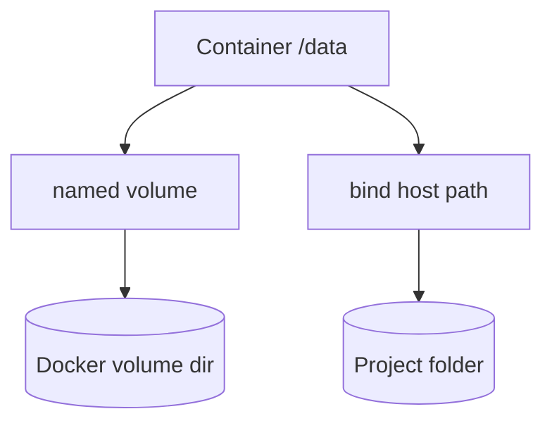

# 08. Тома: bind mount и named volume

## Введение: «после restart пропали заказы»

Контейнер Redis пересоздали после `compose up` — счётчик **hits** обнулился: данные жили в **writable layer** контейнера. Для stateful-сервисов нужен **volume**: данные переживают replace контейнера. Эта глава — **bind mount** vs **named volume**, что подходит для **Redis** и что — для конфигов.

## Что вы узнаете

- Отличие **volume**, **bind mount**, **tmpfs**.
- Где хранятся данные на диске хоста.
- Как добавить **persistence** для redis на стенде.
- Почему **код приложения** не монтируют в prod как bind.

## Три способа хранить данные

| Тип | Пример | Переживает rm container | Типичное use |
|-----|--------|-------------------------|--------------|
| **Named volume** | `redis-data:/data` | да | БД, redis, uploads |
| **Bind mount** | `./config:/etc/app:ro` | да (файлы на хосте) | dev hot-reload, конфиги |
| **tmpfs** | `tmpfs: /tmp` | нет | секреты в RAM |



## Named volume

Compose:

```yaml
services:
  redis:
    image: redis:7.2-alpine
    volumes:
      - redis-data:/data

volumes:
  redis-data:
```

Docker создаёт том в `/var/lib/docker/volumes/…`. **Имя** стабильно между `compose down` и `up` (без `-v`).

## Bind mount

```yaml
volumes:
  - ./stack/web/nginx.conf:/etc/nginx/conf.d/default.conf:ro
```

| Плюс | Минус |
|------|--------|
| правка с хоста без rebuild | путь зависит от ОС/CI |
| удобно в dev | риск случайно перезаписать prod data |

Флаг `:ro` — контейнер **не может** писать (безопаснее для конфигов).

## Writable layer контейнера

Всё, что пишет процесс **без volume**, исчезает при `docker rm` / recreate. Образ остаётся read-only; слой контейнера — **эфемерен**.

## Redis и персистентность

Официальный образ redis по умолчанию может писать **RDB** в `/data`. Без volume файл `dump.rdb` исчезает с контейнером.

На учебном стенде redis **без** volume — намеренно, чтобы увидеть обнуление hits ([лаба 09](09-lab-volumes.md)). В проде — **всегда** volume или managed Redis.

## Registry volume (preview)

[`docker-compose.registry.yml`](../../deploy/containers/docker-compose.registry.yml):

```yaml
volumes:
  - registry-data:/var/lib/registry
```

Образы registry хранятся между перезапусками — связь с [главой 12](12-registry.md).

## На стенде: текущее состояние

```bash
docker inspect mock-containers-redis --format '{{json .Mounts}}'
docker volume ls
```

Скорее всего `Mounts` пустой или только internal — hits не персистентны.

## Типичные ошибки

| Ошибка | Симптом | Исправление |
|--------|---------|-------------|
| `compose down -v` на prod | удалены volumes | бэкап; без `-v` в рутине |
| Bind DB data dir в dev на NTFS | slow / permissions | named volume |
| Путать **volume** и **image layer** | «закоммитил» данные в image | только Dockerfile |
| Права UID: файлы root на volume | app не пишет | `chown` / init container |
| Хранить секреты в volume без шифрования | утечка с диска | secret driver / KMS |

## В продакшене

- **StatefulSet + PVC** в K8s — эволюция named volume.
- Бэкапы volume / snapshot (EBS, Velero).
- Redis в prod — **managed** (ElastiCache) или operator с persistence.
- Не монтировать **Docker socket** в контейнер без крайней необходимости.

## Заметки для собеседования

- `docker volume inspect` — mountpoint на хосте (Linux).
- Bind — путь хоста; named — управляется Docker.
- `tmpfs` не попадает на диск хоста.

## Резюме

Контейнеры **stateless** по умолчанию; состояние — в **volumes**. Named volume — стандарт для redis/postgres; bind — конфиги и dev. Лаба добавит том redis и проверит сохранение **hits** после recreate.

## Чек-лист

- Что удалит `docker compose down -v`?
- Зачем `:ro` на bind?
- Где на стенде сейчас живёт ключ `hits`?
- Чем volume отличается от образа?

Следующий урок: [09. Лаба: volumes](09-lab-volumes.md).
