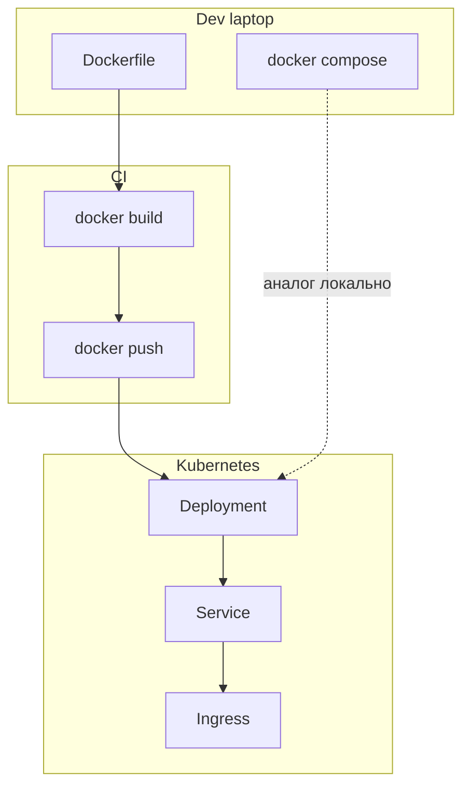

# 16. Docker vs Kubernetes: граница ответственности

## Введение: «у нас же есть Docker, зачем кластер»

Команда подняла production на **одном сервере** с `docker compose` — через месяц нужны **rolling update без даунтайма**, **авто-healing** при падении ноды и **секреты** по namespace. Docker на ноутбуке **не исчезает** — он собирает образ; **Kubernetes** распределяет контейнеры по кластеру. Эта глава связывает пройденный **containers-basic** с [`kuber-basic`](../kuber-basic/README.md).

## Что вы узнаете

- Что Docker делает **хорошо** локально и в CI.
- Что добавляет **Kubernetes**.
- **containerd** и удаление dockershim.
- Маппинг compose → K8s ресурсов.

## Два уровня абстракции

| Уровень | Инструмент | Вопрос |
|---------|------------|--------|
| Упаковка | Dockerfile, image | **Что** запускать? |
| Один хост | Docker Engine, Compose | **Как** запустить на машине? |
| Кластер | Kubernetes | **Где** и **сколько** экземпляров? |



## Docker vs containerd

Подробно: **[kuber-basic/02-docker-vs-containerd](../kuber-basic/02-docker-vs-containerd.md)**.

| | Docker (CLI + dockerd) | containerd |
|---|------------------------|--------------|
| Где | dev, CI build | worker node K8s |
| Сборка образов | да | нет (обычно) |
| CRI для kubelet | убран (1.24+) | да |

Вы **собираете** образ Docker'ом, **запускаете** в кластере через containerd/CRI-O.

## Маппинг стенда на K8s

Стенд [`deploy/containers`](../../deploy/containers/README.md):

| Compose | Kubernetes (упрощённо) |
|---------|------------------------|
| `service: web` | Deployment + Service |
| `ports: 8088:80` | Service NodePort / Ingress |
| `networks: frontend` | ClusterIP, NetworkPolicy |
| `service: redis` | StatefulSet или Helm redis |
| `environment: REDIS_HOST` | ConfigMap / env |
| `healthcheck` | livenessProbe / readinessProbe |
| `depends_on` | initContainers / probes order |
| `build:` | CI build → image в registry |
| `volumes` | PersistentVolumeClaim |

**Ingress** заменяет «один nginx снаружи»; **Service** — стабильный DNS `api` внутри кластера (как compose DNS).

## Что Compose не решает в prod

| Требование | Compose | Kubernetes |
|------------|---------|------------|
| Self-healing на другой ноде | нет | да |
| Rolling update 10% | ручной | Deployment strategy |
| HPA по CPU | нет | HPA |
| RBAC, quotas | нет | да |
| Multi-zone | нет | topology |

## Что остаётся за Docker

- Локальная разработка **3-tier** ([главы 10–11](10-compose-multi-service.md)).
- **CI**: build, scan, push ([registry](12-registry.md), [GitLab](../gitlab-intermediate/03-docker-registry.md)).
- Отладка образа до попадания в кластер.
- Иногда **Docker-in-Docker** в GitLab runner.

## Путь обучения в репозитории

```text
linux-basic (docker compose exec)
    → containers-basic (этот курс)
        → kuber-basic (Pod, Deployment, Service)
            → kuber-intermediate (Helm, HPA, …)
```

Маршрут DevOps: [`devops-path.md`](../devops-path.md).

## На стенде: осознанное сравнение

| Действие Docker | Аналог kubectl (preview) |
|-----------------|--------------------------|
| `docker compose ps` | `kubectl get pods` |
| `docker compose logs api` | `kubectl logs deploy/api` |
| `docker compose restart api` | `kubectl rollout restart` |
| publish `8088:80` | `kubectl port-forward` / Ingress |

После [`mockctl up`](../../INSTALL.md) и [kuber-basic](../kuber-basic/README.md) вы развернёте **тот же образ** api как Pod.

## Типичные ошибки

| Ошибка | Почему | Как правильно |
|--------|--------|---------------|
| «K8s заменяет Dockerfile» | нет | образ всё ещё из Dockerfile |
| Запускать docker.sock в Pod | RCE | Kaniko, buildkit, CI вне кластера |
| Копировать compose 1:1 в YAML | лишние антипаттерны | Deployment + Service + Ingress |
| Игнорировать limits | OOM на ноде | resources в Pod spec |
| latest в Deployment | drift | image:tag@digest |

## В продакшене

- **GitOps** (Argo CD) — desired state из git, не `kubectl apply` с ноутбука.
- **Registry** — единый источник образов для всех сред.
- **Policy** — Pod Security Standards, network policies.
- Локальный compose — **контракт** для smoke, не источник prod truth.

## Заметки для собеседования

- Pod ≠ контейнер; Pod может иметь несколько контейнеров (sidecar).
- Kubernetes **оркестрирует** уже собранные образы.
- Stateless app → Deployment; state → StatefulSet + PVC.

## Резюме

**Docker/Compose** — упаковка и локальный runtime. **Kubernetes** — оркестрация, масштаб, сеть кластера, self-healing. Basic containers даёт фундамент образа, сети и registry; **kuber-basic** переносит те же идеи на уровень кластера.

## Чек-лист

- Где в pipeline выполняется `docker build`?
- Чем Service в K8s похож на DNS имя `api` в compose?
- Почему kubelet не вызывает dockerd напрямую?
- Какой курс читать после этого?

Следующий урок: [17. Финальный проект](17-final-project.md).
