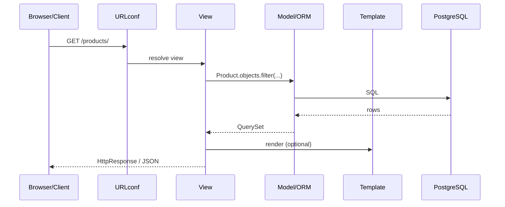

# 01. Django vs FastAPI: когда «батарейки», когда «тонкий API»

## Введение: «переписываем монолит или добавляем сервис?»

Компания живёт на **Django-монолите** восемь лет: admin для операторов, 400 миграций, auth из коробки, Celery-очереди. Product просит **публичный REST API** для партнёров и **админку** для контент-менеджеров без отдельного frontend. CTO: «может, FastAPI?» Backend lead: «admin + ORM + permissions уже в Django — DRF быстрее time-to-market».

Эта глава — **не** «Django лучше FastAPI», а **критерии выбора** и место Django в mock-exams стеке.

## Что вы узнаете

- Модель **MTV** (Model–Template–View) vs **ASGI API**.
- Сильные стороны **Django**: ORM, Admin, auth, ecosystem.
- Когда выбирать **DRF** vs отдельный **FastAPI**.
- Связь с [`fastapi/01-landscape`](../fastapi/01-landscape.md).

---

## MTV и request lifecycle

| Слой | Ответственность |
|------|-----------------|
| **Model** | данные, бизнес-правила уровня БД |
| **Template** | HTML (SSR) |
| **View** | HTTP in → logic → HTTP out |
| **URLconf** | маршрутизация |

DRF добавляет **Serializer** — аналог Pydantic на границе API.

---

## Django «batteries included»

| Компонент | В Django | В FastAPI (типично) |
|-----------|----------|---------------------|
| ORM | **встроен** | SQLAlchemy |
| Миграции | **makemigrations** | Alembic |
| Admin | **да** | нет |
| Auth | User, groups, permissions | JWT вручную |
| Forms | ModelForm | Pydantic |
| API | **DRF** (отдельный пакет) | OpenAPI native |

---

## Когда Django + DRF

| Сценарий | Почему Django |
|----------|---------------|
| Admin для non-dev | `ModelAdmin` за часы |
| CRUD + relations | ORM + migrations |
| Session auth + API | один user model |
| Команда знает Django | velocity |
| SSR + API в одном repo | templates + DRF |

## Когда FastAPI

| Сценарий | Почему FastAPI |
|----------|----------------|
| Только JSON API, без admin | меньше overhead |
| Async I/O heavy | native async |
| OpenAPI-first contract | автоген |
| Microservice 1 responsibility | минимализм |

**Гибрид в enterprise:** Django monolith + FastAPI BFF — нормальная схема.

---

## WSGI vs ASGI (Django 5)

Django historically **WSGI** (sync). Django 4.1+ — **async views** и async ORM **частично**. Production Django — **Gunicorn sync workers** или uvicorn для ASGI deployment.

| | Django sync | FastAPI |
|---|-------------|---------|
| Worker model | processes/threads | async event loop |
| CPU-bound | ok | offload |
| I/O-bound scale | workers × connections | async await |

---

## Стенд курса

[`deploy/django`](../../deploy/django/README.md) — порт **8092**:

- `catalog` app — models + admin
- `api` app — DRF viewsets
- PostgreSQL + Redis

Сравните с [`deploy/fastapi`](../../deploy/fastapi/README.md) `:8090`.

---

## Типичные ошибки

| Ошибка | Последствие |
|--------|-------------|
| Django для 2 endpoint microservice | тяжёлый deploy |
| FastAPI без admin когда ops просят UI | months of frontend |
| Смешать settings prod/dev | leak SECRET_KEY |
| Игнор migrations в CI | drift schema |

## На собеседовании

- Назовите **3** вещи, которые Django даёт «из коробки».
- Что такое **MTV**?
- Когда **DRF**, когда чистый FastAPI?

## Резюме

Django — **platform** (ORM, admin, auth). DRF — REST поверх Django. FastAPI — **typed ASGI API**. Выбор по admin, team, contract, async. Курс строит **catalog API** на Django 5 + DRF.

Далее: [02-first-project](02-first-project.md).
