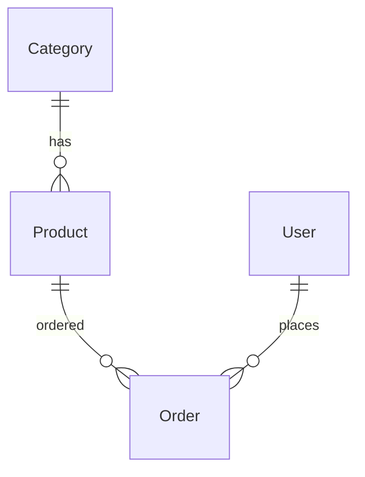

# 11. Relationships: FK, M2M, related_name, PROTECT

## Введение

Удалили Category — cascade снес **10 000 products**. **`on_delete=PROTECT`** в catalog — осознанный выбор.

## FK on_delete

| Policy | Поведение |
|--------|-----------|
| CASCADE | удалить детей |
| PROTECT | IntegrityError |
| SET_NULL | null FK (needs null=True) |
| SET_DEFAULT | default pk |
| DO_NOTHING | DB constraint only |

```python
category = models.ForeignKey(Category, on_delete=models.PROTECT, related_name="products")
```

---

## related_name

```python
cat = Category.objects.get(slug="books")
cat.products.filter(is_active=True)  # reverse relation
```

Без related_name: `product_set` — avoid in large codebases.

---

## M2M (pattern)

```python
class Tag(models.Model):
    name = models.CharField(max_length=50, unique=True)

class Product(models.Model):
    tags = models.ManyToManyField(Tag, blank=True, related_name="products")
```

```python
product.tags.add(tag)
product.tags.filter(name="sale")
```

---

## through model

For extra fields on M2M — intermediate model with FK to both.

---

## OneToOne

User profile extension — `OneToOneField(User, ...)`.

---

## ER diagram (catalog)



---

## Типичные ошибки

| Ошибка | Fix |
|--------|-----|
| CASCADE on critical FK | PROTECT or soft delete |
| related_name clash | unique names per model |
| M2M without blank | admin required all |

## Резюме

Choose on_delete by business rules. related_name for reverse queries. M2M for tags; through for payload.

Далее: [12-lab-relationships](12-lab-relationships.md).
