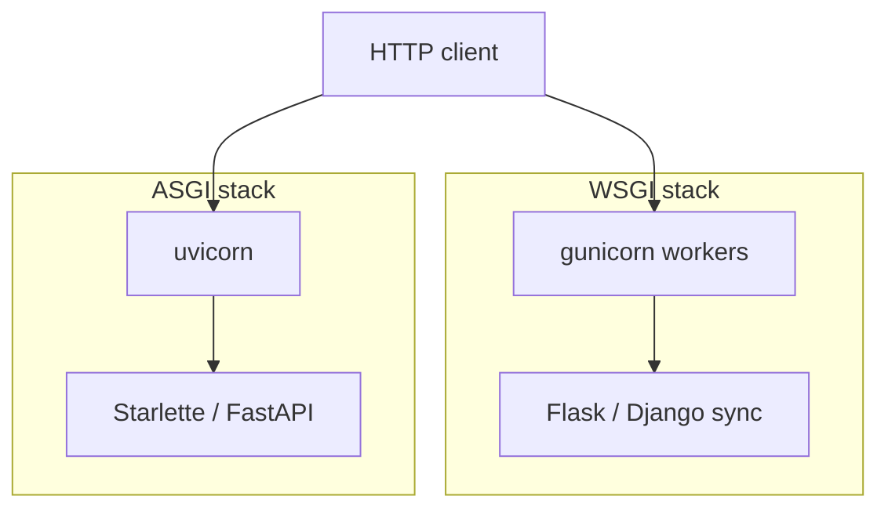
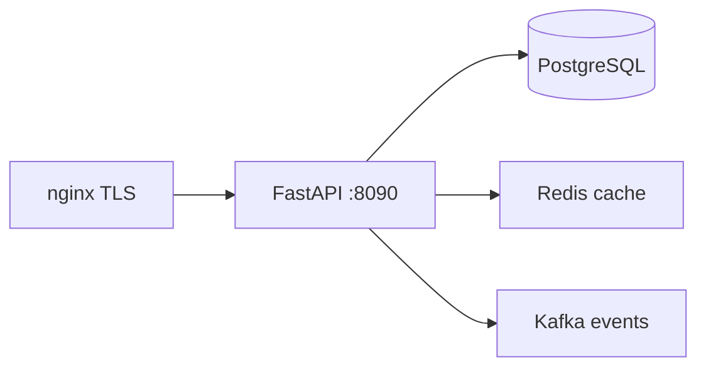

# 01. Ландшафт: Flask, Django, Starlette, FastAPI, ASGI

## Введение: «переписать монолит на микросервисы за квартал»

Команда из пяти человек обслуживает **Django-монолит** с админкой, Celery и 200 миграциями. Новый **B2B API** нужен за два месяца: JSON, OpenAPI для партнёров, 5k RPS на read. Переписывать весь монолит нельзя — выделяют отдельный сервис. CTO спрашивает: **Flask**, **FastAPI** или остаться в Django REST Framework?

Ответ начинается не с «что моднее», а с **модели выполнения** (WSGI vs ASGI), **типизации** и **контракта API**. Эта глава — карта местности перед кодом.

## Что вы узнаете

- Разницу **WSGI** и **ASGI** и почему FastAPI «async-first».
- Сильные стороны **Flask**, **Django**, **Starlette**, **FastAPI**.
- Когда выбирать что; типичные антипаттерны миграции.
- Как FastAPI вписывается в стек mock-exams (Postgres, Redis, nginx, k8s).

## WSGI и ASGI

| | WSGI | ASGI |
|---|------|------|
| Эпоха | sync Python web | async + websockets |
| Модель | один запрос — один поток/процесс worker | event loop, `await` |
| Серверы | gunicorn + sync workers | **uvicorn**, hypercorn, daphne |
| WebSockets | нет в спецификации | **да** |
| Типичные фреймворки | Flask, Django (sync views) | Starlette, FastAPI, Django 4.1+ async |

**WSGI** — контракт «callable(environ, start_response)» для синхронных приложений. Под нагрузкой масштабируют **числом процессов** (gunicorn workers).

**ASGI** — контракт для **async** приложений: HTTP, WebSocket, background tasks в одном процессе event loop.



FastAPI **не заменяет** uvicorn: фреймворк строит приложение, **ASGI-сервер** принимает соединения. См. [02. Первое приложение](02-first-app.md).

## Четыре игрока

| Фреймворк | Философия | Сильные стороны | Слабые для «чистого API» |
|-----------|-----------|-----------------|---------------------------|
| **Flask** | микрофреймворк, вы сами собираете | простота, огромная экосистема | нет встроенной валидации/OpenAPI; async — дополнение |
| **Django** | «batteries included» | ORM, admin, auth, миграции | тяжёлый для узкого JSON API; DRF отдельно |
| **Starlette** | минималистичный ASGI toolkit | routing, middleware, тесты | мало «из коробки» для схем |
| **FastAPI** | Starlette + Pydantic + OpenAPI | типы, автодоки, DI, perf | меньше «всё в одном», чем Django |

**FastAPI** = **Starlette** (HTTP слой) + **Pydantic** (валидация/сериализация) + генерация **OpenAPI 3**.

## Почему типизация — не «для фанатов mypy»

```python
from fastapi import FastAPI
from pydantic import BaseModel

app = FastAPI()

class ItemCreate(BaseModel):
    title: str
    price: float

@app.post("/items")
async def create_item(body: ItemCreate) -> ItemCreate:
    return body
```

Один класс `ItemCreate` даёт:

- валидацию тела запроса (422 при ошибке);
- JSON-сериализацию ответа;
- схему в `/docs` без ручного YAML.

В Flask аналог — связка marshmallow/cerberus + ручной swagger. В DRF — serializers, но async и OpenAPI — отдельная настройка.

## Сравнение для собеседования

| Критерий | Django | Flask | FastAPI |
|----------|--------|-------|---------|
| Admin UI | встроен | нет | нет |
| Async views | да (4.1+) | ограниченно | **нативно** |
| OpenAPI | через drf-spectacular | вручную | **авто** |
| ORM | Django ORM | SQLAlchemy отдельно | SQLAlchemy отдельно ([13](13-sqlalchemy-async.md)) |
| Learning curve для API-only | средняя | низкая | низкая–средняя |

## Где FastAPI в архитектуре mock-exams



- **Postgres** — источник правды ([`postgresql-basic`](../postgresql-basic/README.md)).
- **Redis** — кэш и rate limit ([`redis-basic`](../redis-basic/README.md)).
- **nginx** — TLS и rate limit на edge ([`nginx-basic`](../nginx-basic/README.md)).
- **Prometheus** — scrape `/metrics` ([`observability-basic`](../observability-basic/README.md)).

Учебный стенд: [`deploy/fastapi`](../../deploy/fastapi/README.md), порт **8090**.

## Когда НЕ FastAPI

| Ситуация | Лучший выбор |
|----------|--------------|
| Нужна админка на 80% функций | Django |
| Команда знает только Flask, дедлайн 2 недели | Flask + постепенная миграция |
| CPU-bound внутри запроса (ML inference) | sync workers или отдельный worker pool |
| «Async везде» без I/O | ложное ощущение скорости — блокируете event loop |

**Правило:** async имеет смысл при **ожидании I/O** (БД, HTTP, Redis). Чистый CPU в `async def` без `run_in_executor` — антипаттерн ([27-async-patterns](27-async-patterns.md)).

## На стенде: smoke без кода

```bash
cd deploy/fastapi
docker compose up -d --build
bash scripts/smoke.sh
```

Откройте [http://localhost:8090/docs](http://localhost:8090/docs) — уже сгенерированная OpenAPI-схема минимального API.

## Типичные ошибки

| Ошибка | Почему плохо | Как правильно |
|--------|--------------|---------------|
| «FastAPI = замена Django» | потеря admin, зрелых auth patterns | отдельный сервис API; монолит остаётся |
| `def` endpoint с тяжёлым CPU | блок event loop | sync endpoint + threadpool или worker |
| Выбор по хайпу без OpenAPI-требования | лишняя сложность DI/Pydantic | Flask достаточен для internal JSON |
| Игнор WSGI-наследия в legacy | смешение sync ORM в async route | `run_sync` / отдельный sync слой |
| Один процесс uvicorn в prod | нет отказоустойчивости | несколько workers / k8s replicas |

## В продакшене

- **Несколько** uvicorn workers или pods за load balancer.
- Health: `/health` для liveness, отдельный deep check для readiness (БД).
- Версионирование API: `/api/v1` (как в стенде).
- Контракт для клиентов — **OpenAPI** + contract tests ([30-testing](30-testing.md)).

## Резюме

**FastAPI** — ASGI-фреймворк на базе Starlette с **Pydantic** и автоматическим **OpenAPI**. Он силён там, где нужен **типизированный HTTP API** и async I/O. **Django** — полноценная платформа; **Flask** — гибкий минимализм. Выбор начинается с **модели concurrency** и **требований к контракту**, не с звёзд на GitHub.

## Чек-лист

- Чем ASGI отличается от WSGI одним предложением?
- Из чего технически «собран» FastAPI?
- Назовите два случая, когда Django предпочтительнее.
- Почему async не ускоряет CPU-bound код?

Следующий урок: [02. Первое приложение](02-first-app.md).
