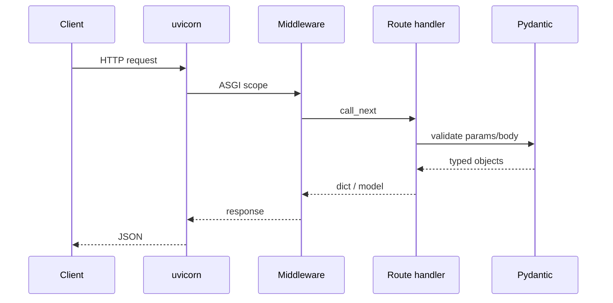

# 02. Первое приложение: uvicorn, OpenAPI

## Введение: «партнёр просит Swagger до пятницы»

Интегратор B2B требует **OpenAPI 3** и песочницу для тестовых запросов. Команда на Flask тратила неделю на ручной YAML. С FastAPI **схема появляется из кода** в день запуска `hello world`. Эта глава — минимальный рабочий API: приложение, сервер, документация, жизненный цикл запроса.

## Что вы узнаете

- Структуру **FastAPI app**, **path operations**, HTTP-методы.
- Запуск через **uvicorn** (dev и prod-like).
- **OpenAPI**, Swagger UI (`/docs`), ReDoc (`/redoc`).
- **lifespan** вместо устаревших `@app.on_event`.

## Минимальное приложение

```python
# main.py
from contextlib import asynccontextmanager

from fastapi import FastAPI

@asynccontextmanager
async def lifespan(app: FastAPI):
    # startup: пулы БД, клиенты Redis
    yield
    # shutdown: закрыть соединения

app = FastAPI(
    title="Orders API",
    version="1.0.0",
    description="Учебный сервис заказов",
    lifespan=lifespan,
)

@app.get("/health")
async def health():
    return {"status": "ok"}
```

Эталон в стенде: [`deploy/fastapi/stack/api/app/main.py`](../../deploy/fastapi/stack/api/app/main.py).

## Path operation

| Элемент | Пример | Назначение |
|---------|--------|------------|
| Декоратор метода | `@app.get`, `@app.post` | HTTP verb + путь |
| Путь | `"/items/{item_id}"` | URL template |
| Функция | `async def get_item(...)` | обработчик |
| `response_model` | `ItemOut` | схема ответа ([11](11-errors-response-model.md)) |
| `status_code` | `201` | код при успехе |
| `tags` | `["catalog"]` | группировка в OpenAPI |

```python
from fastapi import FastAPI

app = FastAPI()

@app.get("/api/v1/items/{item_id}", tags=["items"])
async def get_item(item_id: int):
    return {"id": item_id, "title": "Demo"}
```

## Запуск uvicorn

| Режим | Команда | Когда |
|-------|---------|-------|
| Dev, reload | `uvicorn main:app --reload --port 8000` | локальная разработка |
| Prod-like | `uvicorn main:app --host 0.0.0.0 --port 8090 --workers 4` | несколько процессов |
| Docker | `CMD ["uvicorn", "app.main:app", "--host", "0.0.0.0", "--port", "8080"]` | контейнер |

**`main:app`** — модуль `main`, объект `app`. В стенде модуль `app.main:app` ([`Dockerfile`](../../deploy/fastapi/stack/api/Dockerfile)).

```bash
# локально (venv с fastapi uvicorn)
pip install "fastapi[standard]"
uvicorn main:app --reload
```

Флаг `--reload` **только для dev** — в production перезапуск через orchestrator.

## Жизненный цикл HTTP-запроса



1. uvicorn принимает TCP, парсит HTTP.
2. **Middleware** (CORS, logging) — [22-middleware](22-middleware.md).
3. FastAPI сопоставляет путь и метод.
4. **Pydantic** валидирует query/path/body.
5. Ответ сериализуется в JSON; при ошибке валидации — **422**.

## OpenAPI из коробки

После старта доступны:

| URL | Инструмент |
|-----|------------|
| `/openapi.json` | сырая схема |
| `/docs` | Swagger UI |
| `/redoc` | ReDoc |

На стенде: [http://localhost:8090/docs](http://localhost:8090/docs).

Кастомизация заголовков и примеров — [31-openapi-custom](31-openapi-custom.md).

```python
app = FastAPI(
    openapi_tags=[
        {"name": "items", "description": "Каталог товаров"},
        {"name": "health", "description": "Проверки живости"},
    ],
)
```

## APIRouter (preview)

Для модульности выносите эндпоинты в роутеры — подробно в [08-project-structure](08-project-structure.md):

```python
from fastapi import APIRouter

router = APIRouter(prefix="/items", tags=["items"])

@router.get("")
async def list_items():
    return {"items": []}
```

```python
app.include_router(router, prefix="/api/v1")
```

В стенде: `items.router` с префиксом `/api/v1`.

## Сравнение с Flask

| | Flask | FastAPI |
|---|-------|---------|
| Маршрут | `@app.route("/x", methods=["GET"])` | `@app.get("/x")` |
| Тело JSON | `request.get_json()` + ручная проверка | `body: Model` |
| Документация | flask-swagger / вручную | автоматически |
| Async | `async def` с оговорками | нативно |

## На стенде

```bash
cd deploy/fastapi
docker compose up -d --build
curl -s http://localhost:8090/health | jq .
curl -s http://localhost:8090/api/v1/items | jq .
curl -s http://localhost:8090/openapi.json | jq '.info.title'
```

**Что увидите:** `{"status":"ok"}`, список demo items, `"Mock Exams FastAPI Lab"`.

## Типичные ошибки

| Симптом | Причина | Решение |
|---------|---------|---------|
| `Error loading ASGI app` | неверный путь `module:app` | проверить PYTHONPATH / рабочую директорию |
| `/docs` 404 | `docs_url=None` или root_path | не отключать docs в dev; настроить `--root-path` за proxy |
| 422 на «очевидно правильный» JSON | типы Pydantic строже JSON | смотреть `detail` в ответе |
| `--reload` в Docker prod | лишние рестарты | убрать reload, использовать healthcheck |
| Блокирующий `time.sleep` в `async def` | стоп event loop | `await asyncio.sleep` или sync `def` |

## В продакшене

- Отключайте интерактивные docs на публичном edge или за auth ([21-security-owasp](21-security-owasp.md)).
- За nginx передавайте `X-Forwarded-*` и `--proxy-headers` ([34-nginx-tls](34-nginx-tls.md)).
- Версионируйте API в URL: `/api/v1`.
- Метрики: endpoint `/metrics` — уже в стенде ([36-observability](36-observability.md)).

## Резюме

**FastAPI app** — ASGI-приложение с декларативными маршрутами. **uvicorn** — сервер. **OpenAPI** генерируется из типов и декораторов — партнёры получают `/docs` без отдельного этапа. Следующий шаг — hands-on в [03. Лаба](03-lab-first-app.md).

## Чек-лист

- Как запустить приложение с hot reload?
- Где взять JSON-схему API?
- Что делает `lifespan` вместо `startup`/`shutdown` events?
- Какой URL health на стенде курса?

Следующий урок: [03. Лаба: первое приложение](03-lab-first-app.md).
