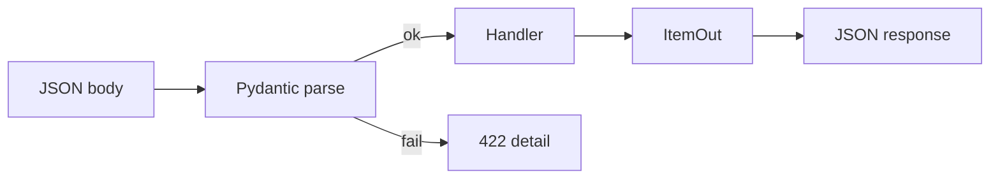

# 04. Pydantic v2: BaseModel, Field, validators

## Введение: «клиент прислал price: "бесплатно"»

Маркетплейс принимает JSON создания товара. Мобильное приложение старой версии шлёт `price` строкой; веб — числом. Без единой валидации баг уходит в БД и ломает отчёты. **Pydantic v2** — единый слой: типы, ограничения, понятные **422** с `detail`. FastAPI использует Pydantic на входе и выходе — эта глава фундамент для всего API.

## Что вы узнаете

- **BaseModel**, **Field**, разницу input/output схем.
- **model_validator** и **field_validator** (v2 API).
- **ConfigDict**, `model_dump`, совместимость с JSON.
- Связь моделей с OpenAPI и `response_model`.

## BaseModel

```python
from pydantic import BaseModel, Field

class ItemCreate(BaseModel):
    title: str = Field(min_length=1, max_length=200)
    description: str | None = None
    price: float = Field(gt=0, description="Цена в рублях")
    tags: list[str] = []
```

| Поле | Тип Python | JSON | Поведение |
|------|------------|------|-----------|
| `title` | `str` | string | обязательное, 1–200 символов |
| `description` | `str \| None` | string/null | опционально |
| `price` | `float` | number | строго > 0 |
| `tags` | `list[str]` | array | по умолчанию `[]` |

FastAPI:

```python
@app.post("/items", status_code=201)
async def create_item(body: ItemCreate):
    return body
```

Невалидный JSON → **422 Unprocessable Entity** с массивом ошибок.

## Field и метаданные

```python
from pydantic import BaseModel, Field

class ItemOut(BaseModel):
    id: int
    title: str = Field(examples=["Кружка"])
    price: float = Field(json_schema_extra={"minimum": 0.01})
```

`examples` и `description` попадают в **OpenAPI** ([31-openapi-custom](31-openapi-custom.md)).

## Отдельные модели Create / Update / Out

| Модель | Назначение | Поля |
|--------|------------|------|
| `ItemCreate` | POST body | без `id`, без `created_at` |
| `ItemUpdate` | PATCH body | все опциональные |
| `ItemOut` | ответ клиенту | `id`, даты, без секретов |

```python
class ItemUpdate(BaseModel):
    title: str | None = None
    price: float | None = Field(default=None, gt=0)

class ItemOut(BaseModel):
    id: int
    title: str
    price: float

    model_config = {"from_attributes": True}  # для ORM объектов, см. урок 13
```

**Никогда** не возвращайте ORM-модель напрямую без `response_model` — утечёт лишнее поле ([11-errors-response-model](11-errors-response-model.md)).

## Validators в v2

```python
from pydantic import BaseModel, field_validator, model_validator

class OrderCreate(BaseModel):
    quantity: int
    unit_price: float

    @field_validator("quantity")
    @classmethod
    def quantity_positive(cls, v: int) -> int:
        if v < 1:
            raise ValueError("quantity must be >= 1")
        return v

    @model_validator(mode="after")
    def total_sane(self) -> "OrderCreate":
        if self.quantity * self.unit_price > 1_000_000:
            raise ValueError("order total too large")
        return self
```

| API v1 (устарело) | API v2 |
|-------------------|--------|
| `@validator` | `@field_validator` |
| `@root_validator` | `@model_validator` |
| `class Config` | `model_config = ConfigDict(...)` |

## ConfigDict

```python
from pydantic import BaseModel, ConfigDict

class UserOut(BaseModel):
    model_config = ConfigDict(
        str_strip_whitespace=True,
        extra="forbid",  # лишние поля в JSON → ошибка
    )
    email: str
```

`extra="forbid"` — защита от **mass assignment** при приёме JSON.

## Сериализация

```python
item = ItemOut(id=1, title="Tea", price=9.99)
item.model_dump()           # dict для Python
item.model_dump_json()      # str JSON
ItemOut.model_validate({"id": 1, "title": "Tea", "price": 9.99})
```

В FastAPI ответ из `BaseModel` автоматически сериализуется.

## Вложенные модели

```python
class Address(BaseModel):
    city: str
    zip_code: str

class CustomerCreate(BaseModel):
    name: str
    billing_address: Address
    shipping_address: Address | None = None
```

OpenAPI покажет вложенные объекты — удобно для партнёров.

## Enum и Literal

```python
from enum import Enum
from typing import Literal

class Status(str, Enum):
    draft = "draft"
    published = "published"

class ArticleFilter(BaseModel):
    status: Status | None = None
    sort: Literal["created_at", "title"] = "created_at"
```

`str, Enum` — значения сериализуются как строки в JSON.

## Диаграмма потока валидации



## Связь с другими курсами

- Настройки из env — те же модели через **pydantic-settings** ([10-settings](10-settings.md)).
- Колонки БД ↔ поля модели — [13-sqlalchemy-async](13-sqlalchemy-async.md).
- JSONB в Postgres — [postgresql-developer/08-jsonb](../postgresql-developer/08-jsonb.md).

## Типичные ошибки

| Ошибка | Последствие | Исправление |
|--------|-------------|-------------|
| Одна модель на create и DB entity | утечка `hashed_password` | разделить Create / Out |
| `@validator` из туториалов v1 | deprecation / неверное поведение | `@field_validator` |
| `float` для денег | `0.1 + 0.2` артефакты | `Decimal` или integer копейки |
| `extra="ignore"` на публичном API | тихий приём мусора | `forbid` на input |
| Мутация `body.tags.append` без копии | побочный эффект на shared state | treat body as immutable |

## В продакшене

- Версионируйте **контракт** (v1/v2 схемы), не ломайте поля без deprecation header.
- Логируйте 422 агрегированно (метрика `validation_errors_total`).
- Для больших payload — `model_validate_json` stream ([28-file-uploads](28-file-uploads.md)).

## Резюме

**Pydantic v2** — строгая типизация данных на границе API. **Field** задаёт ограничения и документацию. **Validators** — бизнес-правила. Разделяйте **Create / Update / Out** модели. FastAPI превращает это в **автоматический OpenAPI** и предсказуемые **422**.

## Чек-лист

- Чем `ItemCreate` отличается от `ItemOut`?
- Как запретить неизвестные поля в JSON?
- Что вернёт FastAPI при `price: -1`?
- Какой декоратор заменил `@root_validator`?

Следующий урок: [05. Параметры](05-parameters.md).
