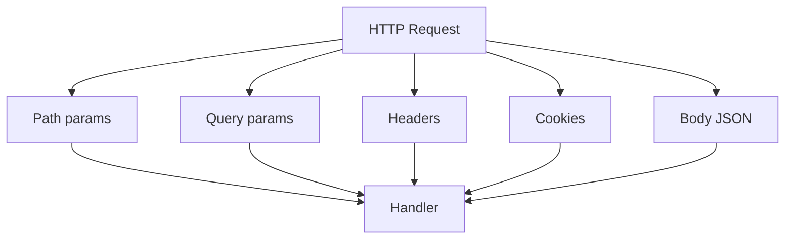

# 05. Параметры: Path, Query, Body, Header, Cookie

## Введение: «фильтр по дате ломает прод»

Аналитики вызывают `GET /orders?from=2024-13-40`. Без валидации query SQL падает с 500. Правильный API отвечает **422** ещё до БД. Path-параметры, query, заголовки и cookies — разные **источники данных** с разными правилами. FastAPI + Pydantic различают их явно.

## Что вы узнаете

- **Path**, **Query**, **Body**, **Header**, **Cookie** в FastAPI.
- Одиночные параметры vs **модель** для группы query.
- `Annotated` + `Depends` (preview DI — [07](07-dependency-injection.md)).
- Влияние на OpenAPI и кэширование.

## Источники параметров

| Источник | Где в HTTP | FastAPI | Пример |
|----------|------------|---------|--------|
| Path | `/items/{id}` | `Path()` | `item_id: int` |
| Query | `?skip=0&limit=10` | `Query()` | `limit: int = 10` |
| Body | JSON POST/PUT | Pydantic model | `body: ItemCreate` |
| Header | `X-Request-Id` | `Header()` | `x_request_id: str \| None` |
| Cookie | `session_id=...` | `Cookie()` | `session_id: str \| None` |



## Path

```python
from fastapi import FastAPI, Path

app = FastAPI()

@app.get("/items/{item_id}")
async def get_item(
    item_id: int = Path(ge=1, description="ID товара"),
):
    return {"item_id": item_id}
```

Порядок в URL важен: статические сегменты объявляйте **выше** динамических:

```python
@app.get("/items/special")   # сначала
async def special(): ...

@app.get("/items/{item_id}") # потом
async def by_id(item_id: int): ...
```

## Query

```python
from fastapi import Query

@app.get("/items")
async def list_items(
    skip: int = Query(0, ge=0),
    limit: int = Query(20, ge=1, le=100),
    q: str | None = Query(None, min_length=2),
):
    return {"skip": skip, "limit": limit, "q": q}
```

### Модель для query (много фильтров)

```python
from fastapi import Depends
from pydantic import BaseModel, Field

class ItemFilter(BaseModel):
    min_price: float | None = Field(None, ge=0)
    tag: str | None = None

async def filter_params(
    min_price: float | None = Query(None, ge=0),
    tag: str | None = None,
) -> ItemFilter:
    return ItemFilter(min_price=min_price, tag=tag)

@app.get("/search")
async def search(f: ItemFilter = Depends(filter_params)):
    return f
```

Пагинация углублённо — [27-pagination-filtering](27-pagination-filtering.md).

## Body

Один body на операцию (по умолчанию). Несколько тел — редкий кейс (`Body(embed=True)`).

```python
@app.post("/items")
async def create(body: ItemCreate):
    return body
```

Для PUT/PATCH частичное обновление — все поля optional в `ItemUpdate` ([04-pydantic-v2](04-pydantic-v2.md)).

## Header и Cookie

Имена заголовков case-insensitive; Python-параметры в **snake_case**:

```python
from fastapi import Header, Cookie

@app.get("/me")
async def me(
    authorization: str | None = Header(None),
    session_id: str | None = Cookie(None),
):
    return {"authorization_set": authorization is not None, "session_id": session_id}
```

`Authorization` → параметр `authorization`. Для нестандартных имён: `Header(alias="X-Trace-Id")`.

## Annotated (рекомендуемый стиль)

```python
from typing import Annotated
from fastapi import FastAPI, Query

Limit = Annotated[int, Query(ge=1, le=100)]

@app.get("/items")
async def list_items(limit: Limit = 20):
    return {"limit": limit}
```

Переиспользуйте типы `Limit`, `ItemId` в нескольких эндпоинтах — единые ограничения в OpenAPI.

## Таблица кодов ответов

| Ситуация | Код |
|----------|-----|
| Path `item_id=abc` | 422 |
| Query `limit=1000` при `le=100` | 422 |
| Ресурс не найден | 404 ([11-errors-response-model](11-errors-response-model.md)) |
| Успех GET | 200 |
| Успех POST create | 201 |

## Form и File (preview)

`application/x-www-form-urlencoded` и multipart — [28-file-uploads](28-file-uploads.md):

```python
from fastapi import Form, File, UploadFile

@app.post("/upload")
async def upload(file: UploadFile = File(...), note: str = Form("")):
    return {"filename": file.filename, "note": note}
```

## На стенде

```bash
curl -s "http://localhost:8090/api/v1/items" | jq .
curl -s "http://localhost:8090/api/v1/items/not-int"
# ожидайте 422 для не-int path
```

## Типичные ошибки

| Ошибка | Симптом | Решение |
|--------|---------|---------|
| Optional query без `None` | клиент не передал поле → 422 | `q: str \| None = None` |
| Body там, где ждали query | пустое тело ломает POST | разделить методы/модели |
| Дубли path `/{a}/{a}` | неоднозначный роутинг | уникальные шаблоны |
| Секрет в query string | логи nginx/proxy | только Header / POST body |
| `list` query без явного стиля | `?tag=a&tag=b` vs `?tag=a,b` | `Query()` / документировать |

## В продакшене

- Идемпотентность и trace id — заголовки `Idempotency-Key`, `X-Request-Id` ([39-versioning-idempotency](39-versioning-idempotency.md)).
- Не логируйте cookies с session/JWT.
- За nginx — учитывайте `X-Forwarded-For` только от доверенного proxy ([34-nginx-tls](34-nginx-tls.md)).

## Резюме

FastAPI **явно** разделяет path, query, body, headers, cookies. **Path/Query** принимают ограничения как у **Field**. Группируйте сложные фильтры в **Pydantic-модели** через Depends. Ошибки валидации — всегда **422** с деталями для клиента.

## Чек-лист

- Как объявить query с default `limit=20` и max 100?
- Почему `GET` не должен менять состояние?
- Где передавать JWT — query или header?
- Что сломается при `items/{item_id}` перед `items/special`?

Следующий урок: [06. Лаба: CRUD](06-lab-crud.md).
