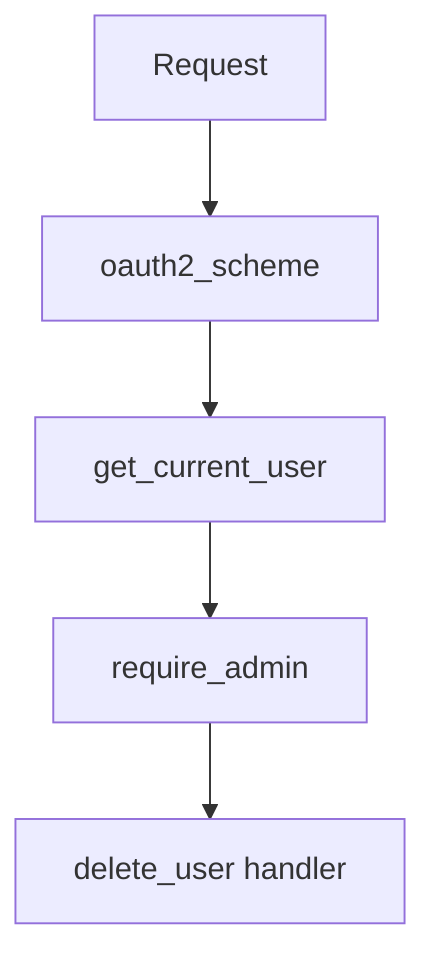

# 07. Dependency Injection: Depends, scopes, yield

## Введение: «открыли 500 соединений к Postgres»

После деплоя нового сервиса DBA видит **500 idle connections** — по числу одновременных запросов. Каждый handler вызывал `asyncpg.connect()` напрямую. Правильный паттерн — **один пул на процесс**, сессия на запрос через **dependency injection**. FastAPI встроил DI через `Depends` — без отдельного контейнера.

## Что вы узнаете

- **`Depends`**: переиспользование логики auth, DB, settings.
- Цепочки зависимостей и **кэширование** в рамках запроса.
- **`yield` dependencies** для cleanup (сессии, транзакции).
- Отличие DI FastAPI от «глобальных синглтонов».

## Базовый Depends

```python
from fastapi import Depends, FastAPI, Header, HTTPException

app = FastAPI()

async def verify_api_key(x_api_key: str = Header(..., alias="X-API-Key")):
    if x_api_key != "secret-dev-key":
        raise HTTPException(status_code=401, detail="Invalid API key")
    return x_api_key

@app.get("/internal/stats")
async def stats(api_key: str = Depends(verify_api_key)):
    return {"ok": True}
```

`verify_api_key` выполняется **до** `stats`. Ошибка в dependency — запрос не доходит до handler.

## Цепочки

```python
async def get_current_user(token: str = Depends(oauth2_scheme)):
    ...

async def require_admin(user: User = Depends(get_current_user)):
    if not user.is_admin:
        raise HTTPException(403)
    return user

@app.delete("/users/{uid}")
async def delete_user(_: User = Depends(require_admin)):
    ...
```

Полная auth — [19-oauth2-jwt](19-oauth2-jwt.md).



## Кэш в рамках одного запроса

FastAPI **кэширует** результат dependency по умолчанию (для одного request scope):

```python
async def get_db():
    ...

@app.get("/a")
async def a(db=Depends(get_db)): ...

@app.get("/b")
async def b(db=Depends(get_db)): ...
```

В **одном** запросе к `/a` `get_db` вызовется один раз. В разных запросах — снова.

Отключить кэш: `Depends(get_db, use_cache=False)`.

## Yield dependencies (cleanup)

Идеал для **DB session** и **транзакций**:

```python
from collections.abc import AsyncGenerator
from fastapi import Depends

async def get_session() -> AsyncGenerator[AsyncSession, None]:
    async with async_session_factory() as session:
        try:
            yield session
            await session.commit()
        except Exception:
            await session.rollback()
            raise
        finally:
            await session.close()

@app.get("/items")
async def list_items(session: AsyncSession = Depends(get_session)):
    result = await session.execute(select(Item))
    return result.scalars().all()
```

Код после `yield` выполняется **после** ответа (или при исключении). Подробнее — [14-sessions-repos](14-sessions-repos.md).

## Класс как dependency

```python
class Pagination:
    def __init__(self, skip: int = 0, limit: int = 20):
        self.skip = skip
        self.limit = limit

@app.get("/items")
async def list_items(page: Pagination = Depends()):
    ...
```

FastAPI вызовет `Pagination(skip=..., limit=...)` из query.

## Annotated + Depends (стиль 2024+)

```python
from typing import Annotated
from fastapi import Depends

DbSession = Annotated[AsyncSession, Depends(get_session)]

@app.get("/items")
async def list_items(session: DbSession):
    ...
```

Переиспользуйте `DbSession` во всех роутерах.

## Scopes: что НЕ встроено

| Scope | FastAPI | Где реализовать |
|-------|---------|-----------------|
| Request | `Depends` default | встроено |
| Application | один пул на процесс | `lifespan` ([02-first-app](02-first-app.md)) |
| «Singleton» глобальный | осторожно | module-level + lifespan init |

Нет полноценного scope как в Spring — **lifespan** + явные фабрики.

```python
@asynccontextmanager
async def lifespan(app: FastAPI):
    app.state.pool = await create_pool()
    yield
    await app.state.pool.close()
```

```python
async def get_pool(request: Request):
    return request.app.state.pool
```

## Тестирование с override

```python
from fastapi.testclient import TestClient

def fake_session():
    yield FakeSession()

app.dependency_overrides[get_session] = fake_session
client = TestClient(app)
```

Подробнее — [30-testing](30-testing.md).

## Сравнение с ручным подходом

| Подход | Плюсы | Минусы |
|--------|-------|--------|
| Глобальная переменная `db` | быстро в прототипе | тесты, race, нет cleanup |
| Явная передача аргументов | явность | дублирование в каждом handler |
| **Depends** | DRY, тестируемость, OpenAPI не ломается | нужна дисциплина структуры |

## Связь с курсами

- Пулы Postgres — [`postgresql-basic`](../postgresql-basic/README.md).
- Redis client как dependency — [28-redis-cache](28-redis-cache.md).
- Слои routers/services — [08-project-structure](08-project-structure.md).

## Типичные ошибки

| Ошибка | Симптом | Решение |
|--------|---------|---------|
| `commit` в каждом handler | частичные коммиты, сложные откаты | commit в yield dep или service layer |
| Тяжёлая работа в dependency | latency на всех эндпоинтах | кэш на уровне app state |
| Циклический Depends A→B→A | ImportError / runtime loop | третий модуль или lazy import |
| Забыли `finally close` | connection leak | `async with` / yield pattern |
| `use_cache=False` везде | лишние запросы к БД | кэш по умолчанию, отключать осознанно |

## В продакшене

- Auth dependency на **router level** (`dependencies=[Depends(...)]`) для целых групп.
- Таймауты на внешние клиенты внутри dependencies.
- Не храните **request-scoped** данные в глобальных dict.

## Резюме

**Depends** — механизм переиспользования и композиции: auth, DB, pagination. **Yield** — гарантированный cleanup и транзакции. **Lifespan** — ресурсы уровня приложения (пулы). DI FastAPI легковесен, но требует дисциплины слоёв.

## Чек-лист

- Когда вызывается код после `yield`?
- Сколько раз `get_db` выполнится в одном запросе с тремя `Depends(get_db)`?
- Где создавать connection pool?
- Как подменить dependency в тесте?

Следующий урок: [08. Структура проекта](08-project-structure.md).
