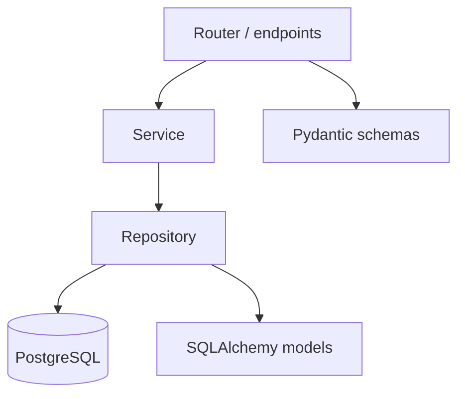

# 08. Структура проекта: APIRouter, слои

## Введение: «main.py на 3000 строк»

Стартап вырос: в одном файле — auth, каталог, биллинг, webhooks. Merge conflicts каждый день, circular imports, невозможность вынести модуль в отдельный сервис. Рефакторинг начинается со **структуры каталогов** и **APIRouter**, не с «перепишем на Go».

## Что вы узнаете

- Типовую **layout** FastAPI-проекта.
- **APIRouter**, `include_router`, теги и префиксы.
- Слои **router → service → repository**.
- Как устроен эталон в `deploy/fastapi/stack/api`.

## Рекомендуемая структура

```text
app/
  main.py              # FastAPI(), lifespan, include_router
  core/
    config.py          # Settings (pydantic-settings)
    deps.py            # общие Depends
  api/
    v1/
      router.py        # собирает v1 роутеры
      endpoints/
        items.py
        users.py
  schemas/
    item.py            # Pydantic Create/Out
  services/
    item_service.py    # бизнес-логика
  repositories/
    item_repo.py       # SQL / Redis
  models/
    item.py            # SQLAlchemy ORM
  db/
    session.py         # engine, session factory
```

Не обязательно всё с первого дня — растите по мере появления второго модуля.

## main.py — только сборка

```python
from contextlib import asynccontextmanager
from fastapi import FastAPI
from app.api.v1.router import api_router
from app.core.config import settings

@asynccontextmanager
async def lifespan(app: FastAPI):
    # init pools, redis
    yield

app = FastAPI(title=settings.APP_NAME, lifespan=lifespan)
app.include_router(api_router, prefix="/api/v1")
```

Эталон стенда — площе, но тот же принцип:

```text
app/main.py
app/routers/health.py
app/routers/items.py
```

См. [`deploy/fastapi/stack/api`](../../deploy/fastapi/stack/api).

## APIRouter

```python
# app/api/v1/endpoints/items.py
from fastapi import APIRouter, Depends
from app.schemas.item import ItemOut
from app.services.item_service import ItemService
from app.core.deps import get_item_service

router = APIRouter(prefix="/items", tags=["items"])

@router.get("", response_model=list[ItemOut])
async def list_items(svc: ItemService = Depends(get_item_service)):
    return await svc.list_items()
```

```python
# app/api/v1/router.py
from fastapi import APIRouter
from app.api.v1.endpoints import items, users

api_router = APIRouter()
api_router.include_router(items.router)
api_router.include_router(users.router, prefix="/users")
```

| Параметр | Уровень | Пример итогового пути |
|----------|---------|------------------------|
| `include_router(..., prefix="/api/v1")` | app | `/api/v1` |
| `APIRouter(prefix="/items")` | router | `/api/v1/items` |
| `@router.get("/{id}")` | endpoint | `/api/v1/items/{id}` |

## Слои ответственности



| Слой | Знает о | Не знает о |
|------|---------|------------|
| **Router** | HTTP, status codes, Depends | SQL деталях |
| **Service** | бизнес-правила, orchestration | HTTP headers |
| **Repository** | запросы, транзакции | OpenAPI |
| **Schemas** | валидация IO | ORM |

```python
# services/item_service.py
class ItemService:
    def __init__(self, repo: ItemRepository):
        self.repo = repo

    async def list_items(self) -> list[ItemOut]:
        rows = await self.repo.list_all()
        return [ItemOut.model_validate(r) for r in rows]
```

## core/deps.py

```python
from app.db.session import get_session
from app.repositories.item_repo import ItemRepository
from app.services.item_service import ItemService

async def get_item_repo(session=Depends(get_session)):
    return ItemRepository(session)

async def get_item_service(repo=Depends(get_item_repo)):
    return ItemService(repo)
```

Один файл для **wiring** — routers остаются тонкими.

## Версионирование API

```python
app.include_router(api_v1_router, prefix="/api/v1")
app.include_router(api_v2_router, prefix="/api/v2")
```

Параллельные версии — разные каталоги `api/v1`, `api/v2`. Не ломайте v1 при добавлении v2.

## Тестируемость

| Слой | Тест |
|------|------|
| Repository | интеграция с test DB |
| Service | unit с mock repo |
| Router | httpx + override deps |

[30-testing](30-testing.md), [31-lab-testing](31-lab-testing.md).

## Связь с другими курсами

- Docker COPY слоёв — [`containers-basic/02-images-dockerfile`](../containers-basic/02-images-dockerfile.md).
- Миграции схемы — [15-alembic](15-alembic.md), [`postgresql-developer`](../postgresql-developer/README.md).
- Monorepo / несколько сервисов — [42-capstone](42-capstone.md).

## Типичные ошибки

| Ошибка | Симптом | Решение |
|--------|---------|---------|
| SQL в router | fat endpoints, нет тестов | в repository |
| Circular import models↔schemas | ImportError | `TYPE_CHECKING`, forward refs |
| Один router на 50 файлов | сложный merge | endpoints/ по доменам |
| Бизнес-логика в Pydantic validator | смешение слоёв | service layer |
| `from app.main import app` везде | циклы | зависимости только вниз по слоям |

## В продакшене

- **Bounded context** → отдельный router или microservice.
- Shared lib для schemas между сервисами — версионировать как package.
- Линтер import-order (ruff/isort) в CI ([`gitlab-basic`](../gitlab-basic/README.md)).

## Резюме

**main.py** собирает приложение; **APIRouter** модульно группирует эндпоинты. **Router → Service → Repository** изолирует HTTP, бизнес-логику и данные. Эталон курса в `deploy/fastapi` — отправная точка для [09. Лабы](09-lab-modular-app.md).

## Чек-лист

- Где объявлять `prefix="/api/v1"`?
- Кто должен вызывать `session.execute`?
- Зачем `tags` на router?
- Как добавить v2 без копирования v1 целиком?

Следующий урок: [09. Лаба: модульное приложение](09-lab-modular-app.md).
