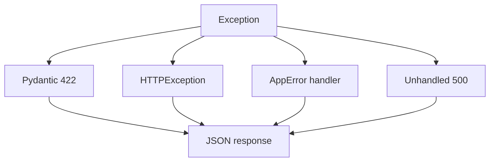

# 11. Ошибки и response_model

## Введение: «в ответе утечёл hashed_password»

Pen-тест нашёл в JSON пользователя поле `hashed_password`. Разработчик вернул ORM-объект `User` целиком — «так быстрее». **response_model** и явные исключения — контракт API и безопасность, не косметика.

## Что вы узнаете

- **HTTPException** и кастомные обработчики.
- **response_model**, `response_model_exclude`, status codes.
- Единый формат ошибок для клиентов.
- Validation 422 vs бизнес-ошибки 400/409.

## HTTPException

```python
from fastapi import HTTPException, status

@app.get("/items/{item_id}")
async def get_item(item_id: int):
    item = await repo.get(item_id)
    if not item:
        raise HTTPException(
            status_code=status.HTTP_404_NOT_FOUND,
            detail="Item not found",
        )
    return item
```

Ответ:

```json
{"detail": "Item not found"}
```

| Код | Когда |
|-----|-------|
| 400 | неверная бизнес-операция |
| 401 | не аутентифицирован |
| 403 | нет прав |
| 404 | ресурс не найден |
| 409 | конфликт (дубликат email) |
| 422 | невалидные типы/поля (Pydantic) |
| 500 | неожиданная ошибка (не раскрывать детали) |

## response_model

```python
class UserOut(BaseModel):
    id: int
    email: str
    is_active: bool

@app.get("/users/{uid}", response_model=UserOut)
async def get_user(uid: int):
    user = await session.get(User, uid)
    if not user:
        raise HTTPException(404)
    return user  # ORM → UserOut через from_attributes
```

`response_model` **фильтрует** лишние поля ORM даже если разработчик ошибся.

```python
class UserOut(BaseModel):
    model_config = ConfigDict(from_attributes=True)
    id: int
    email: str
```

### Исключение полей

```python
@app.get("/users/me", response_model=UserOut, response_model_exclude={"email"})
async def me(): ...
```

Предпочтительнее отдельная схема `UserPublicOut`.

## Несколько типов ответов (OpenAPI)

```python
from typing import Union

@app.get(
    "/items/{id}",
    response_model=ItemOut,
    responses={
        404: {"description": "Not found", "model": ErrorBody},
    },
)
async def get_item(id: int): ...
```

## Кастомные exception handlers

```python
from fastapi import Request
from fastapi.responses import JSONResponse

class AppError(Exception):
    def __init__(self, code: str, message: str, status: int = 400):
        self.code = code
        self.message = message
        self.status = status

@app.exception_handler(AppError)
async def app_error_handler(request: Request, exc: AppError):
    return JSONResponse(
        status_code=exc.status,
        content={"error": {"code": exc.code, "message": exc.message}},
    )
```

Единый формат упрощает мобильным клиентам и BFF. Лаба — [12-lab-error-handling](12-lab-error-handling.md).



## 422 vs 400

| | 422 | 400 |
|---|-----|-----|
| Источник | FastAPI/Pydantic | ваш код |
| Пример | `price: "abc"` | «нельзя отменить доставленный заказ» |
| `detail` | массив loc/type/msg | строка или объект |

Не используйте 422 для бизнес-правил — клиенты отличают «синтаксис» от «семантики».

## ORM и lazy loading

```python
# опасно: lazy load в async после session closed
@app.get("/orders/{id}", response_model=OrderOut)
async def get_order(id: int, session: DbSession):
    order = await session.get(Order, id)
    return order  # OrderOut требует items — нужен eager load
```

См. [postgresql-developer/06-n-plus-one](../postgresql-developer/06-n-plus-one.md), [postgresql-developer/06-n-plus-one](../postgresql-developer/06-n-plus-one.md).

## Связь с observability

Логируйте 5xx с `request_id`; не логируйте stack trace клиенту. Метрики по `status` — [36-observability](36-observability.md).

## На стенде

```bash
curl -s http://localhost:8090/api/v1/items/999 | jq .
```

Зафиксируйте фактический статус и тело — в учебном стенде может быть JSON `detail` без 404 (техдолг для исправления в лабе 12).

## Типичные ошибки

| Ошибка | Риск | Решение |
|--------|------|---------|
| `return {"detail": "..."}` вместо raise | неверный HTTP код 200 | `HTTPException` |
| Общий `except Exception: return None` | 200 с пустым телом | пробросить или 500 handler |
| `response_model=None` «временно» | утечка полей в prod | всегда схема на публичных API |
| Детали SQL в 500 | information disclosure | generic message + log server-side |
| Разный JSON ошибок по эндпоинтам | боль клиентов | `AppError` + handler |

## В продакшене

- **Problem Details** (RFC 9457) для enterprise API — опциональная унификация.
- Локализация `detail` — через `Accept-Language` (редко на internal API).
- Rate limit 429 — [39-versioning-idempotency](39-versioning-idempotency.md).

## Резюме

**HTTPException** — контролируемые HTTP-ошибки. **response_model** — фильтр ответа и документация OpenAPI. **Exception handlers** — единый JSON для доменных ошибок. Разделяйте **422** (валидация) и **400/409** (бизнес).

## Чек-лист

- Как скрыть поле ORM от клиента?
- Когда 409 вместо 400?
- Что вернёт FastAPI при неперехваченном Exception?
- Зачем `from_attributes=True`?

Следующий урок: [12. Лаба: обработка ошибок](12-lab-error-handling.md).
