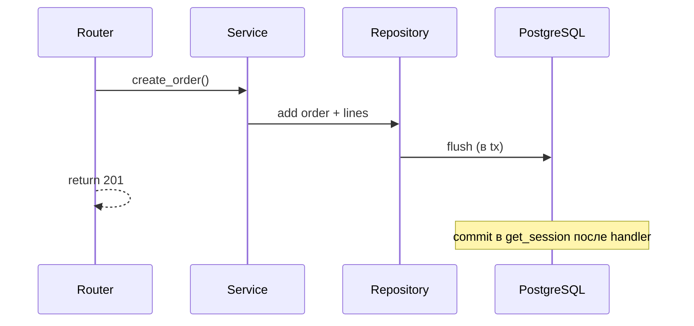

# 14. Сессии, репозитории, транзакции

## Введение: «половина заказа записалась»

При сбое между `INSERT order` и `INSERT order_lines` клиент видит заказ без позиций. Деньги списаны, склад не резервирован. **Транзакция** — атомарная граница; **сессия** — единица работы на запрос; **репозиторий** — изолирует SQL от бизнес-логики. Эта глава связывает [07 DI](07-dependency-injection.md) и [13 ORM](13-sqlalchemy-async.md).

## Что вы узнаете

- Паттерн **Repository** для async SQLAlchemy.
- Границы **транзакций**: commit/rollback в yield-dep.
- **Unit of Work** на уровне service.
- Изоляция и типичные гонки (preview).

## Repository

```python
# app/repositories/item_repo.py
from sqlalchemy import select
from sqlalchemy.ext.asyncio import AsyncSession
from app.models.item import Item

class ItemRepository:
    def __init__(self, session: AsyncSession):
        self.session = session

    async def list_by_owner(self, owner_id: int, *, skip: int = 0, limit: int = 20) -> list[Item]:
        stmt = (
            select(Item)
            .where(Item.owner_id == owner_id)
            .order_by(Item.id)
            .offset(skip)
            .limit(limit)
        )
        result = await self.session.execute(stmt)
        return list(result.scalars().all())

    async def get(self, item_id: int) -> Item | None:
        return await self.session.get(Item, item_id)

    async def add(self, item: Item) -> Item:
        self.session.add(item)
        await self.session.flush()
        return item

    async def delete(self, item: Item) -> None:
        await self.session.delete(item)
```

Router **не** импортирует `select` — только service/repo.

## Service + транзакция

```python
# app/services/order_service.py
class OrderService:
    def __init__(self, orders: OrderRepository, lines: OrderLineRepository):
        self.orders = orders
        self.lines = lines

    async def create_order(self, user_id: int, items: list[LineCreate]) -> Order:
        order = Order(user_id=user_id, status="pending")
        await self.orders.add(order)
        for line in items:
            await self.lines.add(OrderLine(order_id=order.id, **line.model_dump()))
        # commit снаружи — в get_session
        return order
```

Один **commit** на успешный HTTP-запрос — в dependency.

## Yield dependency с commit/rollback

```python
async def get_session() -> AsyncGenerator[AsyncSession, None]:
    async with async_session_factory() as session:
        try:
            yield session
            await session.commit()
        except Exception:
            await session.rollback()
            raise
```

| Событие | Действие |
|---------|----------|
| Handler завершился без исключения | **commit** |
| HTTPException / AppError | rollback (если не перехватили) |
| Необработанное исключение | rollback |

**HTTPException** наследует `Exception` — откатит транзакцию. Если нужен commit при частичном сценарии — проектируйте иначе (редко).



## Wiring Depends

```python
async def get_item_repo(session: DbSession) -> ItemRepository:
    return ItemRepository(session)

async def get_item_service(repo: ItemRepository = Depends(get_item_repo)) -> ItemService:
    return ItemService(repo)
```

## Явная транзакция (вложенная логика)

```python
async with session.begin():
    await repo_a.add(...)
    await repo_b.add(...)
# auto commit on exit, rollback on exception
```

Для фоновых задач — отдельная сессия ([23-background-tasks](23-background-tasks.md)).

## Read-only запросы

Для чистых GET можно не коммитить:

```python
async def get_read_session() -> AsyncGenerator[AsyncSession, None]:
    async with async_session_factory() as session:
        yield session
        # no commit — read only
```

Или один `get_session` с commit (пустая транзакция — дешёвая на Postgres).

## Изоляция (кратко)

| Уровень | Феномен |
|---------|---------|
| READ COMMITTED | default Postgres, non-repeatable read |
| REPEATABLE READ | snapshot |
| SERIALIZABLE | редкие serialization failures |

Детали — [`postgresql-basic`](../postgresql-basic/README.md). Очереди — `SELECT FOR UPDATE SKIP LOCKED` ([postgresql-developer/12](../postgresql-developer/12-advisory-locks.md)).

## Тестирование repository

```python
@pytest.fixture
async def session():
    async with async_session_factory() as s:
        yield s
        await s.rollback()

async def test_add_item(session):
    repo = ItemRepository(session)
    item = Item(title="t", owner_id=1)
    await repo.add(item)
    assert item.id is not None
```

Интеграция с testcontainers или стендом `deploy/postgres`.

## На стенде курса

```bash
docker exec mock-fastapi-postgres psql -U course -d course -c \
  "INSERT INTO items (title, description, owner_id) VALUES ('Lab item', 'tx demo', 1) RETURNING id;"
```

Проверьте FK на `users` — demo user из init SQL.

## Типичные ошибки

| Ошибка | Симптом | Решение |
|--------|---------|---------|
| `commit` в repository | двойной commit / неясные границы | commit в dep или `session.begin()` |
| Долгая транзакция в request | блокировки, pool exhaustion | короткие tx; тяжёлое — в worker |
| Session в background task | closed session | новая session в task |
| Repo возвращает dict ORM наружу | coupling | ORM внутри; Out — в service |
| N+1 в list | сотни запросов | joinedload/selectinload ([postgresql-developer/06-n-plus-one](../postgresql-developer/06-n-plus-one.md)) |

## В продакшене

- **Outbox pattern** для событий в Kafka ([messaging-deep/10-outbox-saga](../messaging-deep/10-outbox-saga.md)).
- Мониторинг `idle in transaction` — [`postgresql-ops`](../postgresql-ops/README.md).
- Retry на `SerializationFailure` — ограниченный exponential backoff.

## Резюме

**Repository** инкапсулирует SQL; **service** оркестрирует use-case. **Одна сессия на запрос** через Depends; **commit/rollback** в yield-dependency. Транзакции держите **короткими**. Следующий блок — **миграции Alembic** ([15-alembic](15-alembic.md)).

## Чек-лист

- Где должен быть единственный `commit` для REST-запроса?
- Что происходит с транзакцией при `HTTPException(404)`?
- Зачем `flush` в repository?
- Кто вызывает `select()` — router или repository?

Следующий урок: [15. Alembic](15-alembic.md).
