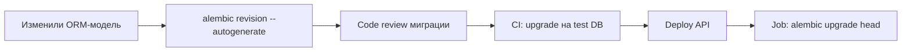

# 15. Alembic: миграции схемы БД

## Введение: «работает на моей машине, в проде — нет»

Разработчик добавил колонку `owner_id` в модель SQLAlchemy и задеплоил код. PostgreSQL в staging **не знала** про колонку — `500` на каждый `INSERT`. Ручные `ALTER TABLE` в чате «срочно выполни на проде» — путь к рассинхрону и инцидентам. **Alembic** версионирует схему так же, как git — кодом, с `upgrade`/`downgrade` и историей в таблице `alembic_version`.

Связь с [`postgresql-developer`](../postgresql-developer/README.md): миграции — часть жизненного цикла приложения, не разовая DBA-задача.

## Что вы узнаете

- Инициализация Alembic в проекте FastAPI + SQLAlchemy 2.0 async.
- **Autogenerate**: сравнение моделей и схемы БД.
- Команды `upgrade`, `downgrade`, `revision`.
- CI/CD: когда гонять миграции относительно деплоя API.

---

## Установка и структура

```bash
pip install alembic
alembic init alembic
```

| Файл / каталог | Назначение |
|----------------|------------|
| `alembic.ini` | URL БД, путь к скриптам |
| `alembic/env.py` | подключение metadata, target_metadata |
| `alembic/versions/` | файлы ревизий `xxxx_description.py` |
| `alembic_version` (в БД) | текущая ревизия |

В `alembic.ini` **не храните** пароль продакшена — URL подставляйте из `DATABASE_URL` в `env.py`:

```python
# alembic/env.py (фрагмент)
import os
from app.db.base import Base  # все модели импортированы в base

config.set_main_option("sqlalchemy.url", os.environ["DATABASE_URL"].replace("+asyncpg", ""))
target_metadata = Base.metadata
```

Для autogenerate SQLAlchemy должен видеть **все** модели — импортируйте их в `app/db/base.py` до `Base.metadata`.

---

## Первая ревизия и autogenerate

```bash
# модели уже описаны, БД пустая или совпадает со стартовой схемой
alembic revision --autogenerate -m "add users and items"
alembic upgrade head
```

Autogenerate **не идеален**: он не увидит переименование колонки (предложит drop + add), не создаст сложные partial index без ручной правки. Всегда **читайте** сгенерированный `upgrade()` перед применением.

Пример ревизии:

```python
"""add users and items

Revision ID: a1b2c3d4
"""
from alembic import op
import sqlalchemy as sa

revision = "a1b2c3d4"
down_revision = None

def upgrade() -> None:
    op.create_table(
        "users",
        sa.Column("id", sa.Integer(), primary_key=True),
        sa.Column("email", sa.String(255), nullable=False, unique=True),
        sa.Column("hashed_password", sa.String(255), nullable=False),
        sa.Column("is_active", sa.Boolean(), server_default=sa.text("true")),
        sa.Column("created_at", sa.DateTime(timezone=True), server_default=sa.text("now()")),
    )
    op.create_table(
        "items",
        sa.Column("id", sa.Integer(), primary_key=True),
        sa.Column("title", sa.String(200), nullable=False),
        sa.Column("owner_id", sa.Integer(), sa.ForeignKey("users.id", ondelete="CASCADE")),
    )

def downgrade() -> None:
    op.drop_table("items")
    op.drop_table("users")
```

---

## upgrade / downgrade

| Команда | Действие |
|---------|----------|
| `alembic upgrade head` | применить все ревизии до последней |
| `alembic upgrade +1` | одна ревизия вперёд |
| `alembic downgrade -1` | откат на одну ревизию |
| `alembic downgrade base` | откат всего (осторожно в prod) |
| `alembic current` | текущая ревизия в БД |
| `alembic history` | цепочка ревизий |

```bash
alembic upgrade head
docker exec mock-fastapi-postgres psql -U course -d course -c '\dt'
```

На стенде [`deploy/fastapi`](../../deploy/fastapi/README.md) начальная схема лежит в `init/01-schema.sql`. В лабе [16-lab-postgres](16-lab-postgres.md) вы перейдёте на Alembic как единственный источник правды.

---

## Async и Alembic

Alembic по умолчанию работает **синхронно**. Для `postgresql+asyncpg://` в runtime приложения миграции обычно гоняют с URL `postgresql://` (psycopg2) или через `run_sync` в async env — на курсе достаточно **синхронного драйвера для CLI** и asyncpg в API.

```python
# env.py — async template (упрощённо)
from sqlalchemy.ext.asyncio import async_engine_from_config

async def run_async_migrations():
    connectable = async_engine_from_config(...)
    async with connectable.connect() as connection:
        await connection.run_sync(do_run_migrations)
```

Не смешивайте: одна ревизия — один стиль `op` в `upgrade`.

---

## Workflow в команде



| Правило | Зачем |
|---------|-------|
| Миграция в том же PR, что и модель | нет рассинхрона |
| Destructive change — data migration отдельным шагом | не потерять данные |
| Downgrade проверяйте на копии БД | откат при failed deploy |

---

## На стенде

```bash
cd deploy/fastapi
docker compose exec api sh -c "cd /app && alembic current"
# после настройки Alembic в образе:
docker compose exec api alembic upgrade head
```

API доступен на [http://localhost:8090/health](http://localhost:8090/health).

---

## Типичные ошибки

| Ошибка | Последствие | Решение |
|--------|-------------|---------|
| Правили БД руками, autogenerate пустой | дрейф схемы | только через ревизии |
| `down_revision` конфликт при merge | две головы | `alembic merge` |
| Долгий `ALTER` без `CONCURRENTLY` | lock таблицы | отдельная ревизия, off-peak |
| Секреты в `alembic.ini` в git | утечка | env var в `env.py` |

---

## Резюме

**Alembic** — версионирование DDL рядом с кодом. **Autogenerate** ускоряет старт, но ревизию всегда ревьюят. **`upgrade head`** перед или вместе с деплоем API — обязательный шаг pipeline. Подробнее о транзакциях и индексах — [`postgresql-developer`](../postgresql-developer/README.md).

## Чек-лист

- Чем `revision` отличается от `upgrade`?
- Почему autogenerate опасен без review?
- Где хранится текущая версия схемы в PostgreSQL?

Далее: [16-lab-postgres](16-lab-postgres.md).
