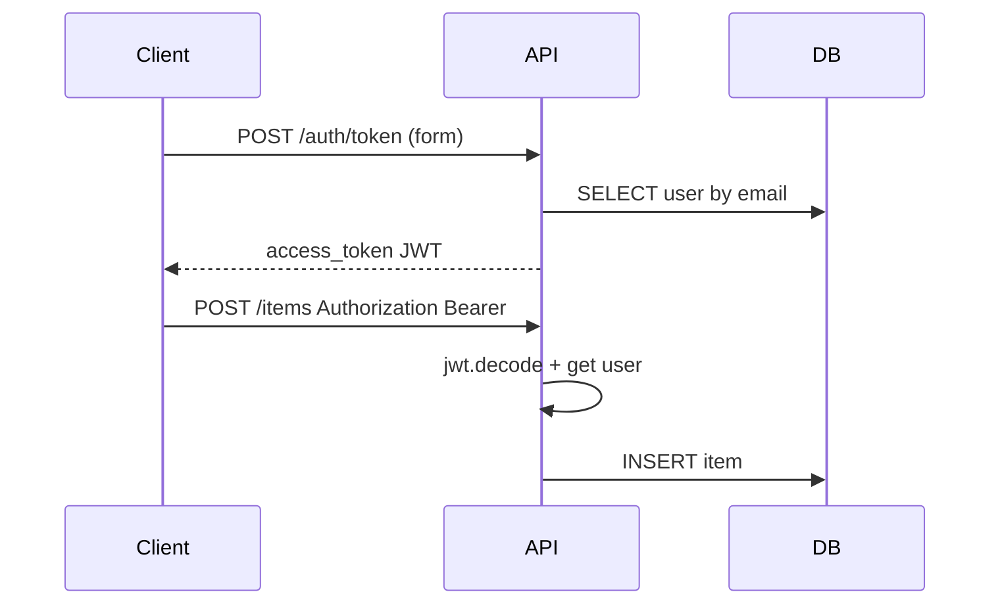

# 19. OAuth2 Password Flow, JWT и хеширование паролей

## Введение: «пароль в query string и токен навсегда»

Аудит безопасности нашёл: логин принимает `?password=` в URL (логи nginx), JWT подписан алгоритмом `none`, пароли в БД в plain text. FastAPI даёт **готовые building blocks** — `OAuth2PasswordBearer`, интеграцию с OpenAPI «Authorize», но криптографию и срок жизни токена настраиваете вы. Базовый threat model — [`appsec-fundamentals`](../appsec-fundamentals/README.md).

## Что вы узнаете

- **OAuth2 Password Bearer** (Resource Owner Password) для first-party API.
- Выдача и проверка **JWT** (`python-jose`).
- **passlib + bcrypt** для `hashed_password`.
- Защита эндпоинтов через `Depends(get_current_user)`.

---

## OAuth2PasswordBearer в FastAPI

```python
from fastapi import Depends, FastAPI, HTTPException, status
from fastapi.security import OAuth2PasswordBearer, OAuth2PasswordRequestForm

oauth2_scheme = OAuth2PasswordBearer(tokenUrl="/api/v1/auth/token")

app = FastAPI()

@app.get("/api/v1/me")
async def read_me(token: str = Depends(oauth2_scheme)):
    return {"token_prefix": token[:20]}
```

| Элемент | Назначение |
|---------|------------|
| `tokenUrl` | путь **form login** (`username`, `password`) |
| `OAuth2PasswordBearer` | извлекает `Authorization: Bearer ...` |
| Swagger **Authorize** | подставляет Bearer в запросы |

**Важно:** Password flow подходит для **своих** SPA/mobile с доверенным backend. Для third-party — Authorization Code + PKCE ([`appsec-fundamentals`](../appsec-fundamentals/README.md)).

---

## Хеширование: passlib + bcrypt

```python
from passlib.context import CryptContext

pwd_context = CryptContext(schemes=["bcrypt"], deprecated="auto")

def hash_password(plain: str) -> str:
    return pwd_context.hash(plain)

def verify_password(plain: str, hashed: str) -> bool:
    return pwd_context.verify(plain, hashed)
```

| Правило | Зачем |
|---------|-------|
| Никогда не логировать пароль | compliance, инциденты |
| bcrypt cost 12+ | баланс CPU / стойкость |
| Не хранить plain, не reversible encrypt | только one-way hash |

На Windows хеширование в лабах — **в контейнере** ([README стенда](../../deploy/fastapi/README.md): bcrypt quirks).

---

## JWT: создание и проверка

Стенд задаёт `JWT_SECRET` в compose. В коде:

```python
from datetime import datetime, timedelta, timezone
from jose import JWTError, jwt

ALGORITHM = "HS256"
ACCESS_TOKEN_EXPIRE_MINUTES = 30

def create_access_token(subject: str, secret: str) -> str:
    expire = datetime.now(timezone.utc) + timedelta(minutes=ACCESS_TOKEN_EXPIRE_MINUTES)
    payload = {"sub": subject, "exp": expire, "type": "access"}
    return jwt.encode(payload, secret, algorithm=ALGORITHM)

def decode_token(token: str, secret: str) -> dict:
    return jwt.decode(token, secret, algorithms=[ALGORITHM])
```

Login endpoint:

```python
@router.post("/auth/token")
async def login(
    form: OAuth2PasswordRequestForm = Depends(),
    db: AsyncSession = Depends(get_db),
):
    user = await get_user_by_email(db, form.username)
    if not user or not verify_password(form.password, user.hashed_password):
        raise HTTPException(
            status_code=status.HTTP_401_UNAUTHORIZED,
            detail="Incorrect username or password",
            headers={"WWW-Authenticate": "Bearer"},
        )
    token = create_access_token(subject=str(user.id), secret=settings.JWT_SECRET)
    return {"access_token": token, "token_type": "bearer"}
```

---

## Current user dependency

```python
async def get_current_user(
    token: str = Depends(oauth2_scheme),
    db: AsyncSession = Depends(get_db),
) -> User:
    credentials_exc = HTTPException(
        status_code=status.HTTP_401_UNAUTHORIZED,
        detail="Could not validate credentials",
        headers={"WWW-Authenticate": "Bearer"},
    )
    try:
        payload = decode_token(token, settings.JWT_SECRET)
        user_id = int(payload.get("sub"))
    except (JWTError, ValueError, TypeError):
        raise credentials_exc
    user = await db.get(User, user_id)
    if not user or not user.is_active:
        raise credentials_exc
    return user
```

Использование:

```python
@router.post("/items", response_model=ItemOut)
async def create_item(
    body: ItemCreate,
    user: User = Depends(get_current_user),
    db: AsyncSession = Depends(get_db),
):
    item = Item(**body.model_dump(), owner_id=user.id)
    ...
```

---

## Поток запроса



Проверка на стенде (после лабы [21-lab-auth](21-lab-auth.md)):

```bash
curl -s -X POST http://localhost:8090/api/v1/auth/token \
  -d "username=demo@course.local&password=secret" \
  -H "Content-Type: application/x-www-form-urlencoded"
```

---

## Типичные ошибки

| Ошибка | Последствие | Решение |
|--------|-------------|---------|
| `JWT_SECRET` в git | подделка токенов | env / Vault |
| `algorithms=["HS256","none"]` | algorithm confusion | один явный alg |
| Долгий TTL access token | украли — долго valid | 15–60 мин + refresh |
| 401 без `WWW-Authenticate` | ломает OAuth2 clients | header в HTTPException |
| Сравнение пароля через `==` timing | side channel | `verify_password` |

---

## Резюме

**OAuth2PasswordBearer** связывает OpenAPI и Bearer-токены. Пароли — только **bcrypt** через passlib. **JWT** несёт `sub` и `exp`; секрет из окружения (`JWT_SECRET` на стенде). RBAC и refresh — [20-rbac-scopes](20-rbac-scopes.md).

## Чек-лист

- Почему login — `application/x-www-form-urlencoded`?
- Что проверяет `jwt.decode` помимо подписи?
- Где в Swagger клиент вводит Bearer?

Далее: [20-rbac-scopes](20-rbac-scopes.md).
