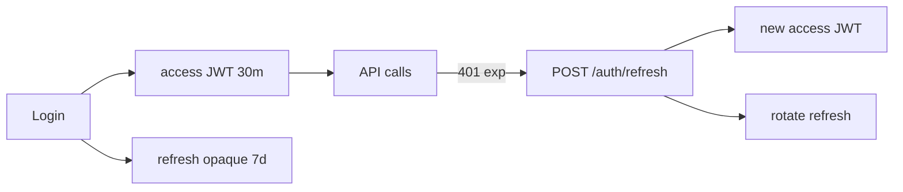

# 20. RBAC, scopes и refresh tokens (обзор)

## Введение: «все с валидным JWT — админы»

После внедрения JWT любой авторизованный пользователь вызывал `DELETE /users/{id}` — в токене не было **роли**, проверяли только факт login. Разделение **аутентификации** (кто ты) и **авторизации** (что можно) — RBAC через claims, scopes или таблицу permissions. Refresh tokens продлевают сессию без вечного access JWT.

См. threat modeling в [`appsec-fundamentals`](../appsec-fundamentals/02-threat-modeling.md).

## Что вы узнаете

- **RBAC**: роли `admin`, `user`, проверка на эндпоинте.
- **Scopes** в JWT и `SecurityScopes` FastAPI.
- Обзор **refresh token** rotation (без полной реализации — лаба [21-lab-auth](21-lab-auth.md)).
- Принцип least privilege для API.

---

## RBAC: роли в модели и токене

```python
# models/user.py
class User(Base):
    __tablename__ = "users"
    id: Mapped[int] = mapped_column(primary_key=True)
    email: Mapped[str] = mapped_column(String(255), unique=True)
    role: Mapped[str] = mapped_column(String(32), default="user")  # user | admin
```

При выдаче access token добавьте claim:

```python
payload = {
    "sub": str(user.id),
    "role": user.role,
    "exp": expire,
}
```

Проверка роли:

```python
from fastapi import Depends, HTTPException, status

def require_role(*allowed: str):
    async def checker(user: User = Depends(get_current_user)):
        if user.role not in allowed:
            raise HTTPException(status_code=status.HTTP_403_FORBIDDEN, detail="Forbidden")
        return user
    return checker

@router.delete("/users/{user_id}")
async def delete_user(
    user_id: int,
    admin: User = Depends(require_role("admin")),
    db: AsyncSession = Depends(get_db),
):
    ...
```

| Код | Смысл |
|-----|--------|
| **401** | не авторизован (нет/битый токен) |
| **403** | авторизован, но нет прав |

Не путайте: 401 — «логинись», 403 — «тебе нельзя».

---

## Scopes (OAuth2-style)

Для микросервисов и machine-to-machine удобны **scopes** в JWT: `items:read`, `items:write`.

```python
from fastapi import Security
from fastapi.security import SecurityScopes

oauth2_scheme = OAuth2PasswordBearer(
    tokenUrl="/api/v1/auth/token",
    scopes={"items:read": "Read items", "items:write": "Create/update items"},
)

async def get_current_user(
    security_scopes: SecurityScopes,
    token: str = Depends(oauth2_scheme),
) -> User:
    payload = decode_token(token, settings.JWT_SECRET)
    token_scopes = payload.get("scopes", [])
    for scope in security_scopes.scopes:
        if scope not in token_scopes:
            raise HTTPException(status_code=403, detail=f"Missing scope: {scope}")
    ...
```

Эндпоинт:

```python
@router.get("/items", dependencies=[Security(oauth2_scheme, scopes=["items:read"])])
async def list_items(...):
    ...
```

OpenAPI покажет required scopes per operation — полезно для contract и audit.

---

## RBAC vs scopes

| Подход | Когда |
|--------|-------|
| **RBAC (роли)** | админка, немного фиксированных ролей |
| **Scopes** | API products, M2M, granular permissions |
| **ABAC** (атрибуты) | «владелец записи» — `owner_id == user.id` |

Часто комбинируют: роль `user` + scope `items:write` + проверка `owner_id` на update.

```python
async def ensure_owner(item: Item, user: User):
    if item.owner_id != user.id and user.role != "admin":
        raise HTTPException(403, detail="Not owner")
```

---

## Refresh tokens (обзор)

Access token короткий (15–60 мин). **Refresh** — длинный, хранится HttpOnly cookie или secure storage, **только** для `POST /auth/refresh`.



| Практика | Зачем |
|----------|-------|
| Refresh в БД / Redis с `jti` | revoke при logout |
| **Rotation** | каждый refresh выдаёт новый RT, старый invalid |
| Не класть refresh в localStorage | XSS → угон сессии |
| Отдельный `type: refresh` claim | не принимать refresh как access |

Полная реализация — расширение [21-lab-auth](21-lab-auth.md); Redis для blacklist — [28-redis-cache](28-redis-cache.md).

---

## Таблица permissions (опционально)

Для сложных систем:

```sql
CREATE TABLE role_permissions (
    role VARCHAR(32),
    permission VARCHAR(64),
    PRIMARY KEY (role, permission)
);
```

Загрузка в dependency один раз при старте или кэш в Redis. Для курса достаточно колонки `role` в `users`.

---

## На стенде

После лабы auth проверьте 403:

```bash
TOKEN_USER=$(curl -s -X POST http://localhost:8090/api/v1/auth/token -d "username=user@x&password=p" -H "Content-Type: application/x-www-form-urlencoded" | jq -r .access_token)
curl -s -o /dev/null -w "%{http_code}\n" -H "Authorization: Bearer $TOKEN_USER" \
  -X DELETE http://localhost:8090/api/v1/users/1
```

Ожидаете **403** для роли `user`.

---

## Типичные ошибки

| Ошибка | Последствие | Решение |
|--------|-------------|---------|
| Роль только в БД, не в токене | лишний SELECT; stale role до exp | короткий TTL или version claim |
| Один scope `admin` на всё | blast radius | granular scopes |
| Refresh без rotation | украли RT — доступ недели | rotate + reuse detection |
| 403 вместо 401 | клиент не обновляет токен | правильные статусы |

---

## Резюме

**RBAC** — роли на пользователе и проверка в dependencies. **Scopes** — fine-grained права в JWT и OpenAPI. **Refresh** — отдельный долгоживущий токен с rotation и хранением в Redis/БД. Безопасный baseline API — [22-security-checklist](22-security-checklist.md).

## Чек-лист

- Разница 401 и 403?
- Когда scope лучше роли?
- Зачем rotation refresh token?

Далее: [21-lab-auth](21-lab-auth.md).
