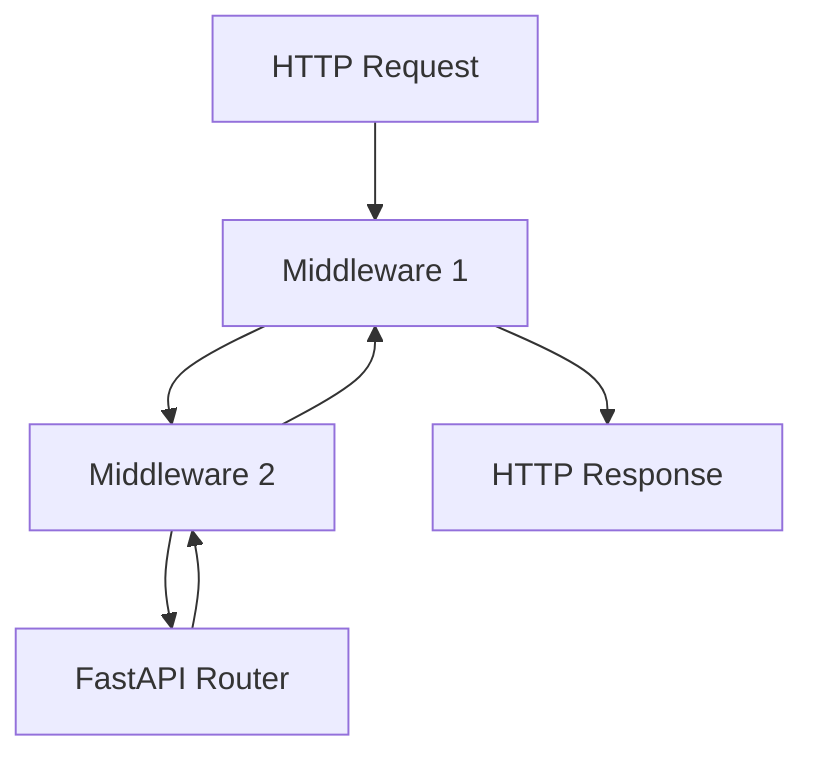

# 23. Middleware, CORSMiddleware и кастомные слои

## Введение: «request id в логах есть, в ответе клиенту — нет»

Support не мог сопоставить логи API и жалобу пользователя: **request id** генерировался в одном месте, в другом терялся. **Middleware** в ASGI оборачивает каждый запрос единообразно — до и после роутера. CORS, GZip, timing, security headers — всё здесь, а не в каждом endpoint.

Связь с [`nginx-basic`](../nginx-basic/README.md): edge middleware (rate limit, TLS) + app middleware — разные уровни.

## Что вы узнаете

- Порядок **middleware stack** в Starlette/FastAPI.
- **CORSMiddleware** — настройка и типичные ловушки.
- **BaseHTTPMiddleware** и чистый ASGI middleware.
- Когда логику не класть в middleware.

---

## Как устроен стек



**Правило:** первый `add_middleware` — **внешний** слой (ближе к клиенту на ответе).

```python
app.add_middleware(CORSMiddleware, ...)      # внешний
app.add_middleware(GZipMiddleware, minimum_size=500)
```

| Тип | Примеры |
|-----|---------|
| Встроенные Starlette | CORS, GZip, TrustedHost |
| Кастомные | request id, audit log, timing |
| Не middleware | business auth — **dependencies** |

---

## CORSMiddleware

```python
from fastapi import FastAPI
from fastapi.middleware.cors import CORSMiddleware

app = FastAPI()

app.add_middleware(
    CORSMiddleware,
    allow_origins=[
        "http://localhost:3000",
        "https://app.example.com",
    ],
    allow_credentials=True,
    allow_methods=["*"],
    allow_headers=["*"],
    expose_headers=["X-Request-ID"],
)
```

| Параметр | Заметка |
|----------|---------|
| `allow_origins` | whitelist; `["*"]` несовместим с `credentials=True` |
| `allow_credentials` | cookies / Authorization в браузере |
| `expose_headers` | какие response headers видит JS |
| preflight `OPTIONS` | CORSMiddleware отвечает автоматически |

Проверка с curl (без браузера CORS не виден):

```bash
curl -sI -X OPTIONS http://localhost:8090/api/v1/items \
  -H "Origin: http://localhost:3000" \
  -H "Access-Control-Request-Method: GET"
```

Ожидаете `access-control-allow-origin` при совпадении whitelist.

Security baseline CORS — [22-security-checklist](22-security-checklist.md).

---

## GZip и TrustedHost

```python
from starlette.middleware.gzip import GZipMiddleware
from starlette.middleware.trustedhost import TrustedHostMiddleware

app.add_middleware(GZipMiddleware, minimum_size=1000)
app.add_middleware(
    TrustedHostMiddleware,
    allowed_hosts=["api.example.com", "localhost"],
)
```

**TrustedHost** — защита от Host header attacks при неправильном proxy.

---

## Кастомный middleware: Request ID

```python
import uuid
from starlette.middleware.base import BaseHTTPMiddleware
from starlette.requests import Request

class RequestIdMiddleware(BaseHTTPMiddleware):
    async def dispatch(self, request: Request, call_next):
        request_id = request.headers.get("X-Request-ID") or str(uuid.uuid4())
        request.state.request_id = request_id
        response = await call_next(request)
        response.headers["X-Request-ID"] = request_id
        return response

app.add_middleware(RequestIdMiddleware)
```

В endpoint:

```python
@router.get("/health")
async def health(request: Request):
    return {"status": "ok", "request_id": request.state.request_id}
```

| Практика | Зачем |
|----------|-------|
| Принимать `X-Request-ID` от nginx | сквозная трассировка |
| Иначе генерировать UUID | корреляция логов |
| Логировать `request_id` в structured JSON | observability ([36-observability](36-observability.md)) |

---

## Pure ASGI middleware (производительность)

`BaseHTTPMiddleware` удобен, но добавляет overhead. Для hot path:

```python
class TimingMiddleware:
    def __init__(self, app):
        self.app = app

    async def __call__(self, scope, receive, send):
        if scope["type"] != "http":
            await self.app(scope, receive, send)
            return
        import time
        start = time.perf_counter()

        async def send_wrapper(message):
            if message["type"] == "http.response.start":
                elapsed = time.perf_counter() - start
                headers = list(message.get("headers", []))
                headers.append((b"x-process-time", f"{elapsed:.4f}".encode()))
                message = {**message, "headers": headers}
            await send(message)

        await self.app(scope, receive, send_wrapper)
```

---

## Что не делать в middleware

| Задача | Лучшее место |
|--------|--------------|
| JWT validation per route | `Depends(get_current_user)` |
| DB session | `Depends(get_db)` |
| Тяжёлая бизнес-логика | service layer |
| Блокирующий `time.sleep` | блокирует весь loop |

---

## На стенде

Добавьте `RequestIdMiddleware` в `stack/api/app/main.py`, пересоберите:

```bash
cd deploy/fastapi
docker compose up -d --build
curl -sI http://localhost:8090/health | grep -i x-request-id
```

---

## Типичные ошибки

| Ошибка | Последствие | Решение |
|--------|-------------|---------|
| Middleware после `include_router` | не применится | `add_middleware` до mount |
| CORS только на часть путей | preflight fail | глобальный CORSMiddleware |
| Исключения глотаются в middleware | 500 без логов | re-raise или log |
| DB в middleware на каждый запрос | утечки сессий | dependency yield |

---

## Резюме

**Middleware** — поперечные concerns: CORS, сжатие, request id, security headers. Порядок добавления определяет вложенность. **Auth и БД** — dependencies, не middleware. CORS на стенде **8090** настраивайте под origin вашего frontend.

## Чек-лист

- Какой middleware срабатывает первым при входящем запросе?
- Почему `allow_origins=["*"]` с cookies опасен?
- Где хранить `request_id` для access log?

Далее: [24-lifespan-background](24-lifespan-background.md).
