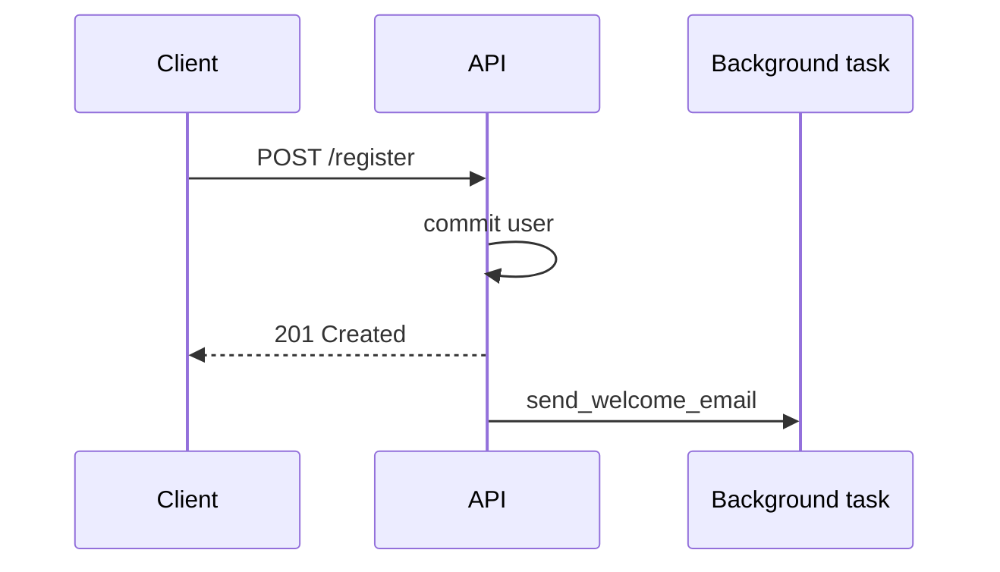

# 24. Lifespan и BackgroundTasks

## Введение: «после рестарта пул БД не открылся, а /health уже green»

Kubernetes перезапустил pod; `/health` отвечал `ok`, но **первый** запрос к БД падал — `engine` создавали лениво в dependency без явного **startup**. **Lifespan** (ASGI) заменяет устаревшие `@app.on_event("startup")` и даёт один контекст для init/shutdown: пулы, Redis, graceful close.

**BackgroundTasks** — «ответь клиенту сейчас, письмо отправь после» без отдельной очереди.

## Что вы узнаете

- `lifespan` context manager в FastAPI 0.93+.
- Инициализация **engine**, Redis, shared clients.
- **BackgroundTasks** vs Celery/RQ.
- Graceful shutdown с uvicorn.

---

## Lifespan: startup и shutdown

```python
from contextlib import asynccontextmanager
from fastapi import FastAPI
from sqlalchemy.ext.asyncio import create_async_engine

@asynccontextmanager
async def lifespan(app: FastAPI):
    # startup
    app.state.engine = create_async_engine(
        settings.DATABASE_URL,
        pool_pre_ping=True,
        pool_size=10,
    )
    app.state.redis = await redis.from_url(settings.REDIS_URL)
    yield
    # shutdown
    await app.state.redis.aclose()
    await app.state.engine.dispose()

app = FastAPI(lifespan=lifespan)
```

| Фаза | Действия |
|------|----------|
| До `yield` | открыть пулы, warmup, миграции (осторожно) |
| После `yield` | `dispose()`, закрыть соединения, flush metrics |

Доступ в dependency:

```python
async def get_db(request: Request):
    factory = async_sessionmaker(request.app.state.engine, expire_on_commit=False)
    async with factory() as session:
        yield session
```

На стенде [`deploy/fastapi`](../../deploy/fastapi/README.md) `main.py` уже содержит заготовку `lifespan` — расширьте её в лабах.

---

## Сравнение с on_event

| | `@app.on_event` | `lifespan` |
|---|-----------------|------------|
| Статус | deprecated | рекомендуется |
| Один контекст startup+shutdown | нет | да |
| Тестируемость | слабее | `async with lifespan(app)` |
| Несколько ресурсов | разрозненные handlers | один блок |

---

## BackgroundTasks

```python
from fastapi import BackgroundTasks

def send_welcome_email(email: str):
    # sync: SMTP, HTTP — лучше короткая операция
    ...

@router.post("/auth/register", status_code=201)
async def register(
    body: UserCreate,
    background_tasks: BackgroundTasks,
    db: AsyncSession = Depends(get_db),
):
    user = await create_user(db, body)
    background_tasks.add_task(send_welcome_email, user.email)
    return {"id": user.id}
```



| Критерий | BackgroundTasks | Очередь (Celery) |
|----------|-----------------|------------------|
| Длительность | секунды | минуты/часы |
| Retry | нет | да |
| После crash | задача потеряна | персистентная |
| Сложность | низкая | broker + workers |

**Правило:** не кладите в BackgroundTasks тяжёлую CPU или долгий I/O без `run_in_executor` — см. [27-async-patterns](27-async-patterns.md).

---

## Async background task

```python
async def notify_webhook(url: str, payload: dict):
    async with httpx.AsyncClient(timeout=5.0) as client:
        await client.post(url, json=payload)

background_tasks.add_task(notify_webhook, settings.WEBHOOK_URL, {"event": "user.created"})
```

FastAPI выполнит coroutine после отправки response в том же event loop.

---

## Health vs readiness

```python
@router.get("/health")
async def health():
    return {"status": "ok"}

@router.get("/ready")
async def ready(request: Request):
    try:
        async with request.app.state.engine.connect() as conn:
            await conn.execute(text("SELECT 1"))
        return {"status": "ready"}
    except Exception:
        raise HTTPException(503, detail="not ready")
```

| Probe | Проверка |
|-------|----------|
| **Liveness** `/health` | процесс жив |
| **Readiness** `/ready` | БД/Redis доступны |

K8s не должен слать трафик, пока lifespan startup не завершён и `/ready` не OK.

---

## Graceful shutdown

Uvicorn при SIGTERM:

1. Перестаёт принимать новые соединения.
2. Ждёт активные запросы (timeout).
3. Вызывает **shutdown** lifespan — `engine.dispose()`.

```bash
docker compose stop api   # SIGTERM
docker compose logs api | tail -5
```

Настройка: `uvicorn app.main:app --timeout-graceful-shutdown 30` ([33-docker-production](33-docker-production.md)).

---

## На стенде

```bash
curl -s http://localhost:8090/health
# после добавления /ready:
curl -s http://localhost:8090/ready
```

Порт **8090** на хосте → uvicorn **8000** в контейнере.

---

## Типичные ошибки

| Ошибка | Последствие | Решение |
|--------|-------------|---------|
| Engine на module level без dispose | leak connections | lifespan shutdown |
| Background task падает молча | пользователь не получил email | try/log в task |
| Долгая миграция в startup | K8s kill probe | Job отдельно от Deployment |
| `yield` без finally | нет cleanup при exception | try/finally в lifespan |

---

## Резюме

**Lifespan** — единая точка открытия/закрытия пулов БД и Redis. **BackgroundTasks** — лёгкие post-response задачи, не замена очереди. **Readiness** проверяет зависимости; **liveness** — только процесс.

## Чек-лист

- Что выполняется раньше: lifespan startup или первый запрос?
- Когда BackgroundTasks недостаточно?
- Зачем `engine.dispose()` на shutdown?

Далее: [25-websockets-sse](25-websockets-sse.md).
