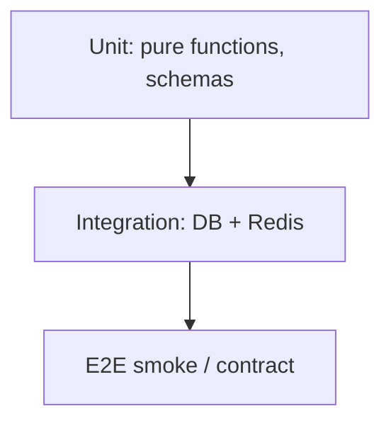

# 30. Тестирование FastAPI: pytest, TestClient, AsyncClient

## Введение: «зелёный CI — красный прод»

Релиз прошёл pipeline, smoke зелёный — а в проде 500 на каждом `POST`, потому что тесты били в in-memory dict, а прод ходит в PostgreSQL. Тестирование API — не «проверить, что 200», а **изолировать слои**, воспроизводить контракт и ловить регрессии до merge.

## Что вы узнаете

- Пирамида тестов для API: unit → integration → e2e.
- **TestClient** (Starlette) vs **httpx.AsyncClient** + `ASGITransport`.
- **Fixtures**: app, db, redis, auth headers.
- `pytest-asyncio`, `anyio`, override dependencies.
- Паттерны: factory, freeze time, testcontainers (preview).

---

## Пирамида для FastAPI



| Уровень | Что тестируем | Скорость |
|---------|---------------|----------|
| Unit | Pydantic validators, бизнес-функции | мс |
| Integration | роутеры + реальная/тестовая БД | секунды |
| E2E | docker compose, smoke.sh | минуты |

Большинство ценности — **integration** с подменой внешних сервисов.

---

## TestClient (синхронный)

Удобен для простых CRUD без async DB:

```python
from fastapi.testclient import TestClient
from app.main import app

client = TestClient(app)

def test_health():
    r = client.get("/health")
    assert r.status_code == 200
    assert r.json()["status"] == "ok"
```

**Ограничение:** `TestClient` поднимает event loop внутри — для чистого async-кода с `asyncpg` предпочтительнее httpx.

---

## httpx.AsyncClient + ASGITransport

Рекомендуемый способ для async FastAPI:

```python
import pytest
from httpx import ASGITransport, AsyncClient
from app.main import app

@pytest.fixture
async def client():
    transport = ASGITransport(app=app)
    async with AsyncClient(transport=transport, base_url="http://test") as ac:
        yield ac

@pytest.mark.asyncio
async def test_list_items(client):
    r = await client.get("/api/v1/items")
    assert r.status_code == 200
    assert "items" in r.json()
```

`pytest.ini`:

```ini
[pytest]
asyncio_mode = auto
testpaths = tests
```

---

## Override dependencies

Подмена БД и Redis без реальных сервисов:

```python
from app.deps import get_db, get_redis

@pytest.fixture
def app_with_fakes():
    app.dependency_overrides[get_db] = lambda: FakeSession()
    app.dependency_overrides[get_redis] = lambda: FakeRedis()
    yield app
    app.dependency_overrides.clear()
```

| Подход | Когда |
|--------|-------|
| Fake in-memory | unit + быстрые integration |
| SQLite async (aiosqlite) | схема ORM без Postgres |
| Testcontainers Postgres | максимальная fidelity |
| Стенд `deploy/fastapi` | e2e в CI nightly |

---

## Fixtures: структура каталога

См. [examples/project-layout.md](examples/project-layout.md):

```text
tests/
  conftest.py      # client, db, settings
  unit/
  integration/
  e2e/
```

`conftest.py` — общие фикстуры; **не** дублируйте `create_app()` в каждом файле.

---

## Тестирование auth

```python
@pytest.fixture
def auth_headers():
    token = create_test_token(sub="user-1")
    return {"Authorization": f"Bearer {token}"}

async def test_protected(client, auth_headers):
    r = await client.get("/api/v1/me", headers=auth_headers)
    assert r.status_code == 200
```

Для OAuth2 password flow — fixture `authenticated_client`, который логинится один раз.

---

## Что проверять в ответе

| Проверка | Пример |
|----------|--------|
| Status code | `assert r.status_code == 201` |
| JSON schema | ключи, типы |
| Headers | `X-Request-Id`, `Cache-Control` |
| Side effects | запись в БД после POST |
| OpenAPI contract | [32-contract-tests](32-contract-tests.md) |

```python
def test_create_item_returns_location(client):
    r = client.post("/api/v1/items", json={"title": "t"})
    assert r.status_code == 201
    body = r.json()
    assert body["title"] == "t"
    assert "id" in body
```

---

## Маркеры и изоляция

```python
@pytest.mark.integration
@pytest.mark.redis
```

В CI:

```bash
pytest -m "not integration"   # быстрый PR gate
pytest -m integration         # nightly
```

Связь с GitLab: [gitlab-basic/04-lab-first-pipeline](../gitlab-basic/04-lab-first-pipeline.md) — job `test` в `.gitlab-ci.yml`.

---

## Типичные ошибки

| Ошибка | Последствие | Решение |
|--------|-------------|---------|
| Общий mutable state между тестами | flaky order-dependent | fixture scope + rollback |
| Нет `dependency_overrides.clear()` | утечка моков | `yield` fixture |
| Тесты только happy path | регресс на 422/401 | table-driven cases |
| E2E на каждый commit | медленный pipeline | пирамида |

---

## Резюме

**TestClient** — быстрый старт; **AsyncClient** — правильный путь для async stack. **Fixtures** и **dependency overrides** изолируют БД/Redis. Большая часть регрессий ловится integration-тестами; e2e — на стенде [`deploy/fastapi`](../../deploy/fastapi/README.md).

## Чек-лист

- Когда TestClient, когда AsyncClient?
- Как подменить `get_db` в тесте?
- Зачем маркеры `integration`?
- Что проверить кроме status code?

Следующий урок: [31-lab-testing](31-lab-testing.md).
