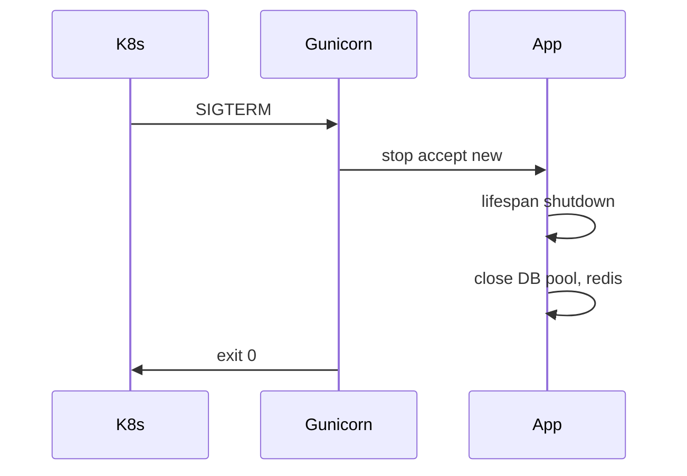

# 33. Docker production: multi-stage, gunicorn, graceful shutdown

## Введение: «образ 1.2 ГБ и один uvicorn на всё»

Dev-образ на `python:3.12` с gcc и кэшем pip уехал в registry — pull 40 секунд, CVE в build-tools, один процесс uvicorn на 4 CPU. Production Dockerfile — это **размер**, **безопасность** и **масштабирование воркеров** с корректным shutdown.

Стенд: [`deploy/fastapi/stack/api/Dockerfile`](../../deploy/fastapi/stack/api/Dockerfile). Контейнеры: [containers-basic](../containers-basic/README.md).

---

## Что вы узнаете

- **Multi-stage** build: builder → runtime.
- Non-root user, минимальный base (`slim`, distroless preview).
- **gunicorn + uvicorn workers** vs чистый uvicorn.
- Graceful shutdown: SIGTERM, lifespan, drain.
- Healthcheck в compose и Kubernetes.

---

## Multi-stage Dockerfile

```dockerfile
# --- builder ---
FROM python:3.12-slim AS builder
WORKDIR /build
RUN pip install --no-cache-dir pip wheel
COPY requirements.txt .
RUN pip wheel --no-cache-dir -r requirements.txt -w /wheels

# --- runtime ---
FROM python:3.12-slim AS runtime
WORKDIR /app
RUN useradd -m -u 10001 appuser
COPY --from=builder /wheels /wheels
COPY requirements.txt .
RUN pip install --no-cache-dir --no-index -f /wheels -r requirements.txt \
    && rm -rf /wheels
COPY app/ ./app/
USER appuser
EXPOSE 8000
```

| Этап | Зачем |
|------|-------|
| builder | компиляция wheels, тяжёлые dev-deps не в runtime |
| runtime | только wheels + код |

`.dockerignore`:

```text
__pycache__
.pytest_cache
.git
tests/
*.md
```

---

## gunicorn + UvicornWorker

Один uvicorn — один event loop на контейнер. Для CPU-bound sync кода или смешанной нагрузки — **несколько воркеров**:

```dockerfile
CMD ["gunicorn", "app.main:app", \
     "-k", "uvicorn.workers.UvicornWorker", \
     "-w", "4", \
     "-b", "0.0.0.0:8000", \
     "--graceful-timeout", "30", \
     "--timeout", "60", \
     "--access-logfile", "-"]
```

| Параметр | Рекомендация |
|----------|--------------|
| `-w` | `2 * CPU + 1` (старт), тюнинг по метрикам |
| `--graceful-timeout` | ≥ max request time |
| `--timeout` | kill stuck workers |

**Async-only I/O API:** часто достаточно **1 uvicorn** + горизонтальный scale реплик в K8s ([kuber-intermediate](../kuber-intermediate/README.md)).

```bash
# dev (как в стенде)
uvicorn app.main:app --host 0.0.0.0 --port 8000 --reload

# prod
gunicorn app.main:app -k uvicorn.workers.UvicornWorker -w 2
```

---

## Graceful shutdown



FastAPI `lifespan`:

```python
@asynccontextmanager
async def lifespan(app: FastAPI):
    await init_db_pool()
    yield
    await close_db_pool()  # дождаться активных запросов
```

В Kubernetes: `terminationGracePeriodSeconds: 45` > graceful-timeout. Probes: [kuber-intermediate/13-probes-advanced](../kuber-intermediate/13-probes-advanced.md).

| Ошибка | Симптом |
|--------|---------|
| Нет shutdown hook | обрыв транзакций |
| `preStop` слишком короткий | 502 при rolling update |
| Shared state между workers | race на in-memory dict |

**Не храните** сессии в памяти процесса — Redis/DB.

---

## Переменные окружения

```yaml
environment:
  WEB_CONCURRENCY: "2"
  LOG_LEVEL: info
  DATABASE_URL: postgresql+asyncpg://...
```

Entrypoint script (опционально):

```bash
#!/bin/sh
exec gunicorn app.main:app -k uvicorn.workers.UvicornWorker \
  -w "${WEB_CONCURRENCY:-2}" -b 0.0.0.0:8000
```

Секреты — не в образе; Vault/GitLab masked vars: [gitlab-basic/07-variables-secrets](../gitlab-basic/07-variables-secrets.md).

---

## Healthcheck

Как в [`deploy/fastapi/docker-compose.yml`](../../deploy/fastapi/docker-compose.yml):

```yaml
healthcheck:
  test: ["CMD", "python", "-c", "import urllib.request; urllib.request.urlopen('http://127.0.0.1:8000/health')"]
  interval: 5s
  timeout: 3s
  retries: 10
  start_period: 15s
```

`/health` должен проверять **критические** зависимости (опционально `?deep=1` для postgres/redis).

---

## Безопасность образа

| Практика | Деталь |
|----------|--------|
| Non-root | `USER appuser` |
| Read-only FS | K8s `readOnlyRootFilesystem` + emptyDir `/tmp` |
| Pin digest | `python:3.12-slim@sha256:...` |
| Scan | `trivy image`, GitLab container scanning |

---

## Сравнение стратегий deploy

| Стратегия | Плюсы | Минусы |
|-----------|-------|--------|
| 1 container × N gunicorn workers | простой compose | blast radius |
| N replicas × 1 uvicorn | K8s-native scale | больше подов |
| Sidecar nginx | TLS, rate limit | сложность — [34-nginx-tls](34-nginx-tls.md) |

---

## Резюме

**Multi-stage** уменьшает образ и attack surface. **gunicorn + UvicornWorker** масштабирует процессы; в K8s часто лучше **больше реплик**. **Graceful shutdown** через lifespan и `terminationGracePeriodSeconds` предотвращает 502 при rollout.

## Чек-лист

- Зачем builder stage?
- Когда gunicorn, когда один uvicorn?
- Что делать в `lifespan` shutdown?
- Как связаны graceful-timeout и preStop?

Следующий урок: [34-nginx-tls](34-nginx-tls.md).
