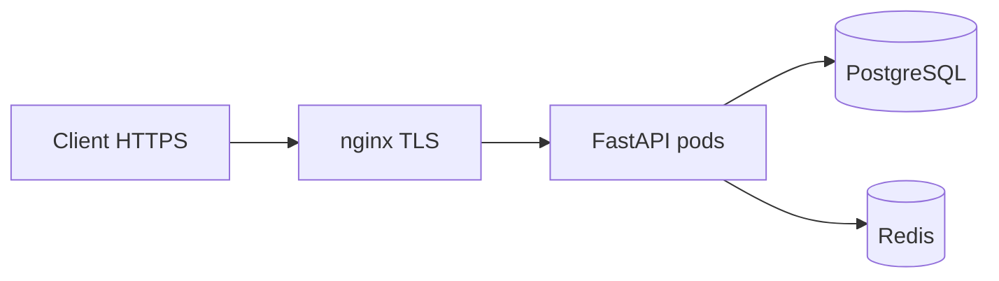

# 34. nginx: reverse proxy, TLS и health probes

## Введение: «API торчит в интернет на :8090»

Прямой доступ к uvicorn — нет TLS, нет rate limit на edge, нет единого access log. **nginx** (или Ingress в K8s) — стандартный **edge**: termination TLS, маршрутизация, лимиты, заголовки безопасности.

Стенд: [`deploy/nginx`](../../deploy/nginx/README.md). TLS теория: [linux-intermediate/09-tls-openssl](../linux-intermediate/09-tls-openssl.md).

---

## Что вы узнаете

- Reverse proxy к FastAPI (`proxy_pass`).
- TLS termination и HSTS (lab).
- Заголовки `X-Forwarded-*`, trusted proxies.
- Health endpoints для **liveness/readiness** в K8s.
- Rate limit на edge vs в приложении ([29-lab-redis](29-lab-redis.md)).

---

## Минимальный proxy_pass

```nginx
upstream fastapi_backend {
    server api:8000;
    keepalive 32;
}

server {
    listen 80;
    server_name api.lab.local;

    location / {
        proxy_pass http://fastapi_backend;
        proxy_http_version 1.1;
        proxy_set_header Host $host;
        proxy_set_header X-Real-IP $remote_addr;
        proxy_set_header X-Forwarded-For $proxy_add_x_forwarded_for;
        proxy_set_header X-Forwarded-Proto $scheme;
        proxy_set_header Connection "";
    }
}
```

| Директива | Зачем |
|-----------|-------|
| `keepalive` | меньше TCP handshake к upstream |
| `proxy_http_version 1.1` | keepalive к backend |
| `X-Forwarded-Proto` | FastAPI знает HTTPS за proxy |

В FastAPI:

```python
from uvicorn.middleware.proxy_headers import ProxyHeadersMiddleware
app.add_middleware(ProxyHeadersMiddleware, trusted_hosts=["*"])  # сузить в prod
```

---

## TLS termination

На стенде `deploy/nginx`:

```bash
cd deploy/nginx
bash scripts/gen-certs.sh
docker compose exec edge nginx -t
docker compose exec edge nginx -s reload
curl -sk https://localhost:8443/api/health
```

Фрагмент `10-tls.conf`:

```nginx
server {
    listen 443 ssl;
    ssl_certificate     /etc/nginx/certs/server.crt;
    ssl_certificate_key /etc/nginx/certs/server.key;
    ssl_protocols TLSv1.2 TLSv1.3;
    add_header Strict-Transport-Security "max-age=86400" always;
    # ... proxy_pass ...
}
```

**Прод:** Let's Encrypt / cert-manager в K8s ([kuber-basic/20-ingress](../kuber-basic/20-ingress.md)).

---

## Пути и trailing slash

| Клиент | nginx | Backend |
|--------|-------|---------|
| `/api/v1/items` | `location /api/` → `proxy_pass http://api:8000/;` | `/v1/items` или полный path |

Ошибка **502** часто от неверного slash в `proxy_pass`. Проверка: `nginx -t`, `docker compose logs edge`.

---

## Rate limiting на edge

Из `deploy/nginx/config/conf.d/20-rate-limit.conf`:

```nginx
limit_req_zone $binary_remote_addr zone=login:10m rate=5r/s;

location /login {
    limit_req zone=login burst=10 nodelay;
    proxy_pass http://api_backend/slow;
}
```

| Уровень | Плюсы |
|---------|-------|
| nginx | до приложения, дешёво |
| Redis в app | per-user, гибкая логика |
| API Gateway | централизованно в mesh |

Комбинируйте: грубый лимит на edge + тонкий в app.

---

## Health probes для Kubernetes

```yaml
livenessProbe:
  httpGet:
    path: /health
    port: 8000
  initialDelaySeconds: 10
  periodSeconds: 10

readinessProbe:
  httpGet:
    path: /health/ready
    port: 8000
  periodSeconds: 5
```

| Probe | Проверяет | Fail action |
|-------|-----------|-------------|
| **Liveness** | процесс жив | restart pod |
| **Readiness** | готов принимать трафик | убрать из Service |
| **Startup** | долгий старт | отложить liveness |

`/health` — лёгкий (200 OK). `/health/ready` — postgres + redis ping.

Через nginx для внешнего мониторинга:

```nginx
location /health {
    proxy_pass http://fastapi_backend/health;
    access_log off;
}
```

Подробнее: [kuber-intermediate/13-probes-advanced](../kuber-intermediate/13-probes-advanced.md).

---

## Таймауты и буферы

```nginx
proxy_connect_timeout 5s;
proxy_send_timeout    60s;
proxy_read_timeout    60s;
client_max_body_size  10m;
```

Согласуйте с gunicorn `--timeout` ([33-docker-production](33-docker-production.md)).

---

## WebSocket и HTTP/2 (preview)

FastAPI WebSocket за nginx:

```nginx
location /ws {
    proxy_pass http://fastapi_backend;
    proxy_http_version 1.1;
    proxy_set_header Upgrade $http_upgrade;
    proxy_set_header Connection "upgrade";
    proxy_read_timeout 3600s;
}
```

---

## Схема production edge



В K8s nginx → **Ingress Controller**; паттерны те же.

---

## Резюме

**nginx** снимает TLS и даёт единую точку для лимитов и логов. Настройте **forwarded headers** и health paths для K8s probes. Практика — [35-lab-nginx](35-lab-nginx.md) на [`deploy/nginx`](../../deploy/nginx/README.md).

## Чек-лист

- Зачем `X-Forwarded-Proto`?
- Разница liveness и readiness?
- Где rate limit — nginx или Redis?
- Что проверить при 502?

Следующий урок: [35-lab-nginx](35-lab-nginx.md).
