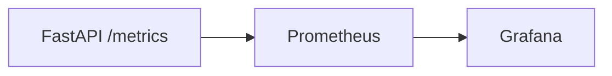

# 36. Observability: Prometheus, structured logging, RED

## Введение: «пользователи жалуются — метрик нет»

Latency выросла в 3 раза, в логах только `INFO: started` — непонятно, БД или Redis виноваты. **Observability** для API: метрики (Prometheus), структурные логи, трассировка (preview [38-opentelemetry](38-opentelemetry.md)). Метод **RED** — минимальный набор для HTTP-сервисов.

Курсы: [observability-basic](../observability-basic/README.md). Стенд: [`deploy/observability`](../../deploy/observability/README.md). FastAPI стенд уже отдаёт `/metrics`.

---

## Что вы узнаете

- Метод **RED** (Rate, Errors, Duration).
- `prometheus_client` / `prometheus-fastapi-instrumentator`.
- Structured logging (JSON) и correlation id.
- Алерты и SLO (preview).
- Связь с Grafana из observability-basic.

---

## RED для HTTP API

| Буква | Метрика | PromQL (пример) |
|-------|---------|-----------------|
| **R**ate | requests/sec | `sum(rate(http_requests_total[5m]))` |
| **E**rrors | доля 5xx (и 4xx?) | `sum(rate(http_requests_total{status=~"5.."}[5m])) / sum(rate(...))` |
| **D**uration | latency p95/p99 | `histogram_quantile(0.95, sum by (le)(rate(http_request_duration_seconds_bucket[5m])))` |

Лаба PromQL: [observability-basic/03-lab-promql](../observability-basic/03-lab-promql.md).



---

## Instrumentator (рекомендуемый путь)

```bash
pip install prometheus-fastapi-instrumentator
```

```python
from prometheus_fastapi_instrumentator import Instrumentator

instrumentator = Instrumentator(
    should_group_status_codes=True,
    excluded_handlers=["/metrics", "/health"],
)
instrumentator.instrument(app).expose(app, endpoint="/metrics")
```

Даёт `http_request_duration_seconds` histogram и counters по method/handler/status.

Стенд [`deploy/fastapi`](../../deploy/fastapi/README.md) использует ручной Counter — мигрируйте в лабе [37-lab-observability](37-lab-observability.md).

---

## Кастомные метрики бизнеса

```python
from prometheus_client import Counter, Histogram

CACHE_OPS = Counter("cache_operations_total", "cache", ["op", "result"])
DB_QUERY_TIME = Histogram("db_query_seconds", "DB latency", ["query"])

# в handler
with DB_QUERY_TIME.labels("select_item").time():
    row = await session.execute(...)
CACHE_OPS.labels("get", "hit" if cached else "miss").inc()
```

| Тип | Когда |
|-----|-------|
| Counter | всегда растёт (requests, errors) |
| Gauge | текущее значение (in-flight, pool size) |
| Histogram | latency, размеры |

---

## Structured logging

```python
import structlog

log = structlog.get_logger()

@app.middleware("http")
async def logging_middleware(request, call_next):
    request_id = request.headers.get("X-Request-Id", str(uuid4()))
    structlog.contextvars.bind_contextvars(request_id=request_id)
    response = await call_next(request)
    log.info("request_done", method=request.method, path=request.url.path,
             status=response.status_code, request_id=request_id)
    response.headers["X-Request-Id"] = request_id
    return response
```

| Поле | Зачем |
|------|-------|
| `request_id` | связь log ↔ trace |
| `user_id` | аудит (без PII в логах) |
| `duration_ms` | быстрый поиск slow |

Вывод JSON в prod; human-readable в dev. Loki: [observability-basic/11-logs-preview](../observability-basic/11-logs-preview.md).

---

## Уровни логов

| Уровень | Пример |
|---------|--------|
| DEBUG | SQL echo (только dev) |
| INFO | старт, request_done |
| WARNING | retry, degrade redis |
| ERROR | необработанное исключение + stack |

```python
@app.exception_handler(Exception)
async def unhandled(request, exc):
    log.exception("unhandled_error", path=request.url.path)
    return JSONResponse(500, {"detail": "Internal error"})
```

**Не логируйте** тела с паролями и JWT целиком.

---

## Health vs metrics

| Endpoint | Назначение | В Prometheus? |
|----------|------------|-----------------|
| `/health` | K8s probes | нет |
| `/metrics` | scrape | да |
| `/debug/pprof` | profiling | никогда публично |

Scrape config (добавить в `deploy/observability`):

```yaml
- job_name: fastapi-course
  static_configs:
    - targets: ["host.docker.internal:8090"]  # или service name в compose overlay
  metrics_path: /metrics
```

---

## Алерты (preview)

```yaml
# prometheus rules
- alert: FastAPIHighErrorRate
  expr: |
    sum(rate(http_requests_total{job="fastapi-course",status=~"5.."}[5m]))
    / sum(rate(http_requests_total{job="fastapi-course"}[5m])) > 0.05
  for: 5m
```

SLO и error budget: [sre/04-error-budgets](../sre/04-error-budgets.md).

---

## USE vs RED

| Метод | Объект |
|-------|--------|
| RED | сервисы (API) |
| USE | ресурсы (CPU, disk, pool) |

Для FastAPI добавьте pool gauge: `db_pool_connections_in_use`.

---

## Резюме

**RED** — стартовый набор метрик HTTP. **Instrumentator** ускоряет внедрение; **structlog** + `request_id` связывают логи. Практика на Grafana — [37-lab-observability](37-lab-observability.md). Трассировка — [38-opentelemetry](38-opentelemetry.md).

## Чек-лист

- Расшифруйте RED?
- Зачем исключать `/health` из histogram?
- Какие поля в structured log обязательны?
- Counter vs Histogram?

Следующий урок: [37-lab-observability](37-lab-observability.md).
