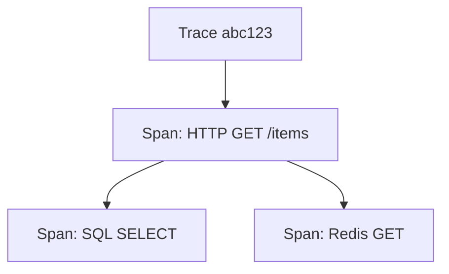

# 38. OpenTelemetry traces в FastAPI

## Введение: «p95 высокий — узкое место неизвестно»

Метрики показывают рост latency, логи — отдельные строки без связи. **Distributed tracing** связывает span'ы: nginx → FastAPI → PostgreSQL → Redis в один **trace_id**. OpenTelemetry (OTel) — стандарт инструментации и экспорта.

Стенд OTel: [`deploy/observability`](../../deploy/observability/README.md) overlay `docker-compose.otel.yml`. Лаба collector: [observability-intermediate/14-lab-otel-collector](../observability-intermediate/14-lab-otel-collector.md).

---

## Что вы узнаете

- Traces, spans, context propagation.
- `opentelemetry-instrumentation-fastapi`.
- Экспорт OTLP → Collector → Jaeger.
- Связь trace_id с логами ([36-observability](36-observability.md)).
- Sampling в production.

---

## Модель данных



| Термин | Значение |
|--------|----------|
| Trace | полный путь запроса |
| Span | одна операция с start/end, attributes |
| Baggage | cross-service metadata (осторожно с PII) |
| Context | trace_id, span_id в headers |

Propagation headers: `traceparent` (W3C), `baggage`.

---

## Установка

```text
opentelemetry-api
opentelemetry-sdk
opentelemetry-exporter-otlp
opentelemetry-instrumentation-fastapi
opentelemetry-instrumentation-httpx
opentelemetry-instrumentation-sqlalchemy
opentelemetry-instrumentation-redis
```

---

## Bootstrap в приложении

```python
# app/core/telemetry.py
from opentelemetry import trace
from opentelemetry.sdk.trace import TracerProvider
from opentelemetry.sdk.trace.export import BatchSpanProcessor
from opentelemetry.exporter.otlp.proto.grpc.trace_exporter import OTLPSpanExporter
from opentelemetry.sdk.resources import Resource
from opentelemetry.instrumentation.fastapi import FastAPIInstrumentor

def setup_telemetry(service_name: str, otlp_endpoint: str):
    resource = Resource.create({"service.name": service_name})
    provider = TracerProvider(resource=resource)
    exporter = OTLPSpanExporter(endpoint=otlp_endpoint, insecure=True)
    provider.add_span_processor(BatchSpanProcessor(exporter))
    trace.set_tracer_provider(provider)

def instrument_app(app):
    FastAPIInstrumentor.instrument_app(app)
```

В `lifespan` / startup:

```python
setup_telemetry("fastapi-course", os.environ.get("OTEL_EXPORTER_OTLP_ENDPOINT", "http://otel-collector:4317"))
instrument_app(app)
```

Переменные (стандарт OTel):

```bash
OTEL_SERVICE_NAME=fastapi-course
OTEL_EXPORTER_OTLP_ENDPOINT=http://localhost:4317
OTEL_TRACES_SAMPLER=parentbased_traceidratio
OTEL_TRACES_SAMPLER_ARG=0.1
```

---

## Ручные span'ы

```python
tracer = trace.get_tracer(__name__)

async def get_item(item_id: int):
    with tracer.start_as_current_span("get_item") as span:
        span.set_attribute("item.id", item_id)
        cached = await redis_get(item_id)
        if cached:
            span.add_event("cache_hit")
            return cached
        span.add_event("cache_miss")
        return await db_get(item_id)
```

Именуйте span'ы стабильно — для поиска в Jaeger.

---

## Связь с логами

```python
from opentelemetry import trace

span = trace.get_current_span()
ctx = span.get_span_context()
log.info("item_loaded", trace_id=format(ctx.trace_id, "032x"), item_id=item_id)
```

В Grafana (Loki + Tempo) — derived fields по `trace_id`. Preview: observability-intermediate.

---

## Запуск стенда с Jaeger

```bash
cd deploy/observability
docker compose -f docker-compose.yml -f docker-compose.otel.yml up -d
```

| URL | Назначение |
|-----|------------|
| http://localhost:16686 | Jaeger UI |
| localhost:4317 | OTLP gRPC |
| localhost:4318 | OTLP HTTP |

Пробросьте `OTEL_EXPORTER_OTLP_ENDPOINT` в `deploy/fastapi` compose:

```yaml
environment:
  OTEL_EXPORTER_OTLP_ENDPOINT: http://host.docker.internal:4317
```

Сгенерируйте трафик → Jaeger → Service `fastapi-course` → trace с spans HTTP + DB.

---

## Sampling

| Стратегия | Когда |
|-----------|-------|
| AlwaysOn | dev |
| TraceIdRatioBased 0.1 | prod 10% |
| ParentBased | microservices chain |

100% traces на 10k RPS — дорого на storage. Начните с 1–10%, повышайте при инциденте (tail sampling — advanced).

---

## nginx и edge spans

Ingress/nginx может передавать `traceparent` upstream. Без propagation trace обрывается на edge — настройте opentelemetry в proxy (envoy/ingress) в advanced-треке.

---

## Ошибки в span

```python
from opentelemetry.trace import Status, StatusCode

with tracer.start_as_current_span("risky") as span:
    try:
        ...
    except Exception as e:
        span.record_exception(e)
        span.set_status(Status(StatusCode.ERROR))
        raise
```

В Jaeger видно stack и failed span — быстрее, чем grep логов.

---

## OTel vs «только метрики»

| Сигнал | Вопрос |
|--------|--------|
| Metrics | «Сколько? Как быстро в среднем?» |
| Logs | «Что случилось на этом инстансе?» |
| Traces | «Где потратили время в цепочке?» |

Три столпа: [observability-basic](../observability-basic/README.md).

---

## Резюме

**OTel** инструментирует FastAPI автоматически; ручные span'ы — для БД/кэша. Экспорт **OTLP** в collector стенда observability. **Sampling** обязателен в prod. Связывайте **trace_id** с structured logs.

## Чек-лист

- Trace vs span?
- Куда указывает OTEL_EXPORTER_OTLP_ENDPOINT?
- Зачем ParentBased sampler?
- Как найти медленный SQL в Jaeger?

Следующий урок: [39-versioning-idempotency](39-versioning-idempotency.md).
