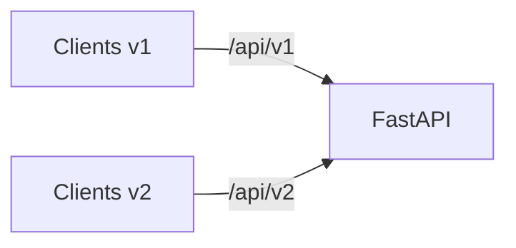
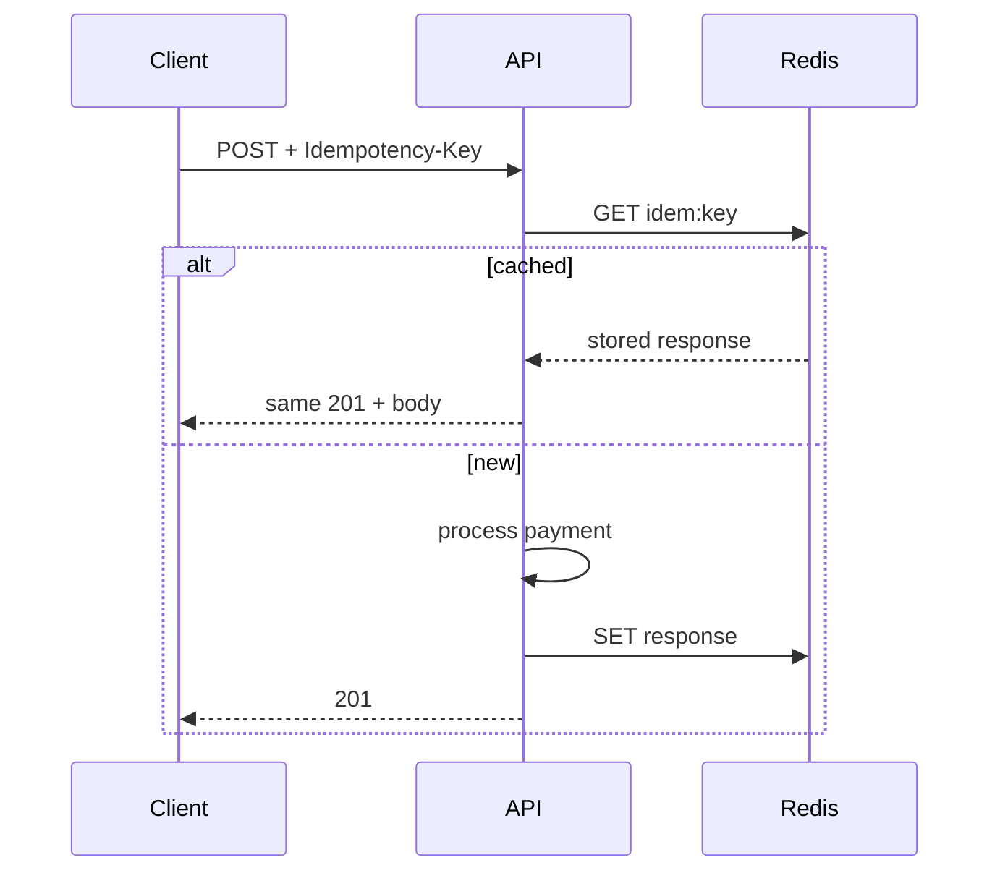

# 39. Версионирование API и idempotency keys

## Введение: «v2 выкатили — старые клиенты упали»

Поле переименовали, путь сменили без предупреждения — мобильные приложения на v1 получают 404. **Версионирование** и **идемпотентность** — контракты, которые переживают релизы и сетевые повторы.

Связь: [32-contract-tests](32-contract-tests.md), [40-system-design](40-system-design.md).

---

## Что вы узнаете

- Стратегии версий: URL, header, Accept.
- Deprecation policy и sunset headers.
- **Idempotency-Key** для POST/PUT.
- Хранение ключей в Redis/DB.
- FastAPI patterns: `APIRouter(prefix="/api/v1")`.

---

## Стратегии версионирования

| Стратегия | Пример | Плюсы | Минусы |
|-----------|--------|-------|--------|
| URL path | `/api/v1/items` | явно, кэшируемо | дублирование роутов |
| Header | `Api-Version: 2024-01` | чистый URL | хуже для CDN/cache |
| Accept | `Accept: application/vnd.app.v2+json` | REST-purist | сложнее клиентам |
| Query | `?version=2` | быстрый хак | не для prod |

**Рекомендация для курса:** URL prefix `/api/v1`, `/api/v2` — как в [`deploy/fastapi`](../../deploy/fastapi/README.md).

```python
v1 = APIRouter(prefix="/api/v1")
v2 = APIRouter(prefix="/api/v2")

@v1.get("/items/{id}", response_model=ItemV1)
async def get_v1(id: int): ...

@v2.get("/items/{id}", response_model=ItemV2)
async def get_v2(id: int): ...
```

---

## Parallel run и sunset



| Фаза | Действие |
|------|----------|
| Introduce v2 | v1 frozen, v2 новые поля |
| Deprecate v1 | header `Deprecation: true`, `Sunset: Sat, 01 Jan 2027 00:00:00 GMT` |
| Remove v1 | после метрик usage < 1% |

Мониторьте RPS по prefix в Prometheus ([36-observability](36-observability.md)):

```promql
sum by (handler) (rate(http_requests_total[1d]))
```

---

## Breaking vs compatible (повтор)

| Изменение | v1 | v2 |
|-----------|----|----|
| Добавить optional field | OK | OK |
| Rename field | breaking | новое имя в v2 only |
| Изменить тип | breaking | migration guide |

OpenAPI diff в CI: [32-contract-tests](32-contract-tests.md).

---

## Идемпотентность

**Проблема:** клиент отправил `POST /payments`, timeout — повторил POST → двойное списание.

**Решение:** заголовок `Idempotency-Key: <uuid>` — сервер возвращает **тот же** результат при повторе.

```http
POST /api/v1/payments HTTP/1.1
Idempotency-Key: 7c9e6679-7425-40de-944b-e07fc1f90ae7
Content-Type: application/json

{"amount": 100, "currency": "RUB"}
```

| Метод | Идемпотентен по HTTP? | Нужен ключ? |
|-------|----------------------|-------------|
| GET | да | нет |
| PUT | да (по resource) | редко |
| POST | **нет** | **да** для money/order |
| DELETE | да | нет |

---

## Реализация с Redis

```python
IDEM_TTL = 86400  # 24h

async def idempotency_guard(redis, key: str, request_hash: str):
    cache_key = f"idem:{key}"
    existing = await redis.get(cache_key)
    if existing:
        if existing.startswith("processing:"):
            raise HTTPException(409, "Request in progress")
        return json.loads(existing)  # cached response body + status
    await redis.set(cache_key, f"processing:{request_hash}", nx=True, ex=60)

async def idempotency_store(redis, key: str, status: int, body: dict):
    await redis.set(f"idem:{key}", json.dumps({"status": status, "body": body}), ex=IDEM_TTL)
```

Dependency:

```python
async def require_idempotency_key(
    idempotency_key: str | None = Header(None, alias="Idempotency-Key"),
):
    if not idempotency_key:
        raise HTTPException(400, "Idempotency-Key required")
    if len(idempotency_key) > 128:
        raise HTTPException(400, "Key too long")
    return idempotency_key
```

**409 Conflict** — параллельные дубли с одним ключом; **422** — другой body с тем же ключом (нарушение контракта).

---

## Хранение в PostgreSQL

Для audit и долгого TTL:

```sql
CREATE TABLE idempotency_keys (
    key TEXT PRIMARY KEY,
    request_hash TEXT NOT NULL,
    response_status INT NOT NULL,
    response_body JSONB NOT NULL,
    created_at TIMESTAMPTZ DEFAULT now()
);
```

Unique constraint на `key` — атомарность через INSERT ON CONFLICT.

---

## Stripe-style flow



---

## Версии + idempotency вместе

Ключ должен включать **версию API** или scope:

```text
idem:v1:7c9e6679-7425-40de-944b-e07fc1f90ae7
```

Иначе v1 и v2 с одним UUID вернут несовместимые тела.

---

## Резюме

**URL versioning** — практичный default для FastAPI. **Deprecation/Sunset** — вежливый вывод v1. **Idempotency-Key** обязателен для создающих операций с side effects; Redis — быстрый store, Postgres — audit.

## Чек-лист

- Три способа версионирования?
- Когда POST идемпотентен без ключа?
- Что вернуть при повторе с тем же ключом?
- Зачем 409?

Следующий урок: [40-system-design](40-system-design.md).
