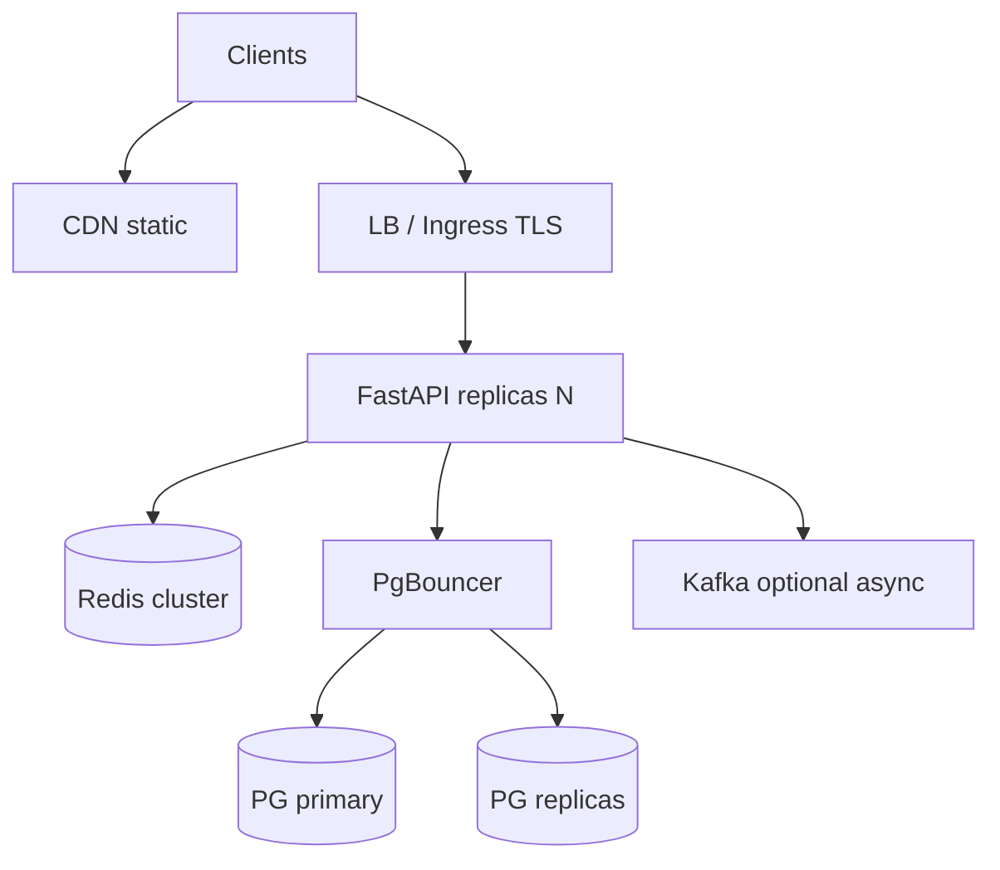

# 40. System design: REST API на 10k RPS

## Введение: «нарисуй архитектуру заказов на 10 000 RPS»

Типичный вопрос senior-интервью: спроектировать API, который выдержит **10k requests/sec** с p99 < 200ms. Ответ «поставим больше FastAPI» недостаточен — нужны **оценки**, узкие места, кэш, масштабирование БД, observability.

Опирается на: [29-lab-redis](29-lab-redis.md), [36-observability](36-observability.md), [39-versioning-idempotency](39-versioning-idempotency.md).

---

## Что вы узнаете

- Back-of-envelope расчёты (QPS, bandwidth, connections).
- Слои: edge, app, cache, DB, queue.
- Read vs write path.
- PostgreSQL scaling (replica, pool, partition).
- Что сказать на интервью за 35 минут.

---

## Уточняющие вопросы (always ask)

| Вопрос | Зачем |
|--------|-------|
| Read/write ratio? | 90/10 → другой кэш |
| Consistency? | strong vs eventual |
| Payload size? | bandwidth |
| Auth model? | stateless JWT vs session |
| Multi-region? | replication lag |

**Пример:** каталог товаров — 95% read, eventual OK, 2 KB JSON, JWT.

---

## Back-of-envelope

```text
10k RPS × 2 KB response ≈ 20 MB/s egress ≈ 160 Mbps (+ headers)
10k RPS × 50 ms DB time = 500 concurrent DB ops без pool → death
```

| Ресурс | Грубая оценка |
|--------|---------------|
| App pods | 10k / 2k RPS per pod ≈ 5–10 pods (I/O bound) |
| DB connections | pool 20/pod × 10 = 200 → PgBouncer |
| Redis | 10k GET ~ 10k ops/s — один shard на грани ([redis-basic](../redis-basic/README.md)) |

---

## Референсная архитектура



Edge: [34-nginx-tls](34-nginx-tls.md) или cloud LB. K8s HPA: [kuber-intermediate](../kuber-intermediate/README.md).

---

## Read path (hot)

1. CDN для static/OpenAPI docs.
2. **Cache-aside** Redis — 80%+ hit rate на каталог.
3. Replica PostgreSQL для тяжёлых list/query.
4. Pagination + field filter — не отдавать 1 MB JSON.

```python
@router.get("/items")
async def list_items(cursor: str | None = None, limit: int = 20):
    limit = min(limit, 100)
```

**Stampede:** jitter, singleflight ([redis-basic/06](../redis-basic/06-patterns-cache.md)).

---

## Write path

1. Primary PG only.
2. **Idempotency-Key** на create ([39-versioning-idempotency](39-versioning-idempotency.md)).
3. Инвалидация кэша: `DEL cache:item:{id}` + fan-out pub/sub при multi-region.
4. Тяжёе async — Kafka/RabbitMQ ([messaging-deep](../messaging-deep/README.md) preview).

| Sync write | Async |
|------------|-------|
| создание заказа | email, analytics, search index |

---

## Connection pooling

```python
# SQLAlchemy async
engine = create_async_engine(DATABASE_URL, pool_size=10, max_overflow=5)
```

**PgBouncer** transaction mode — тысячи app connections → десятки DB. См. [postgresql-developer](../postgresql-developer/README.md).

---

## Scaling PostgreSQL

| Техника | Когда |
|---------|-------|
| Read replicas | read-heavy |
| Partitioning | таблицы > 100M rows |
| CQRS | extreme read/write split |
| Sharding | last resort |

Индексы и EXPLAIN — [postgresql-performance](../postgresql-performance/README.md).

---

## Rate limiting и защита

| Слой | Механизм |
|------|----------|
| Edge | nginx limit_req, WAF |
| App | Redis token bucket per user |
| DB | query timeout, statement_timeout |

10k RPS DDoS — cloud shield + autoscale limits.

---

## Observability и SLO

| SLO | Пример |
|-----|--------|
| Availability | 99.9% monthly |
| Latency p99 | < 200ms read |
| Error rate | < 0.1% 5xx |

RED метрики + traces ([37-lab-observability](37-lab-observability.md), [38-opentelemetry](38-opentelemetry.md)). On-call runbook: [sre/14-production-readiness](../sre/14-production-readiness.md).

---

## Deploy и release

- Blue/green или canary — [gitlab-intermediate](../gitlab-intermediate/README.md).
- DB migrations отдельным Job ([kuber-intermediate/05-jobs](../kuber-intermediate/05-jobs.md)).
- Feature flags для v2 API.

---

## Failure modes

| Отказ | Поведение |
|-------|-----------|
| Redis down | bypass cache, higher DB load — alert |
| Replica lag | stale read или route to primary |
| Primary PG | failover — RTO/RPO в runbook |
| Single pod OOM | HPA + memory limits |

---

## Интервью: структура ответа (35 мин)

1. **Requirements** (5 мин) — RPS, read/write, consistency.
2. **API design** (5 мин) — resources, versioning, pagination.
3. **High-level diagram** (10 мин) — edge, app, cache, DB.
4. **Deep dive** (10 мин) — cache, pool, one bottleneck.
5. **Trade-offs** (5 мин) — eventual cache, cost vs latency.

---

## Резюме

**10k RPS** достижимы с горизонтальным scale FastAPI, **агрессивным кэшем** read path, **pool + replica** для PG и **observability** с первого дня. Цифры — оценки; валидируйте load test (k6/Locust) в [42-capstone](42-capstone.md).

## Чек-лист

- Как оценить bandwidth при 10k RPS?
- Где idempotency на write path?
- Зачем PgBouncer?
- Что спросить перед design?

Следующий урок: [41-interview-qa](41-interview-qa.md).
