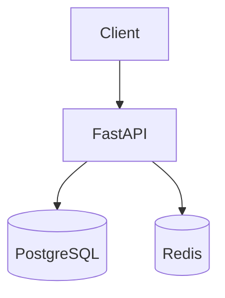

# 42. Capstone: Task Manager API (6–8 часов)

## Задача

Спроектировать и реализовать **полноценный Task Manager API** на FastAPI: аутентификация, CRUD задач с тегами, PostgreSQL, Redis (кэш + rate limit), тесты, Docker production-ready, опционально nginx и observability. Проект замыкает уроки **29–41** и готовит портфолио-репозиторий.

**Оценка времени:** 6–8 часов чистой работы (можно разбить на 2–3 сессии).

---

## Функциональные требования

### Пользователи и auth

| Endpoint | Описание |
|----------|----------|
| `POST /api/v1/auth/register` | email + password → user |
| `POST /api/v1/auth/login` | JWT access (+ refresh опционально) |
| `GET /api/v1/users/me` | текущий профиль |

- Password hashing: **bcrypt** или argon2.
- JWT в `Authorization: Bearer`.
- Защита всех task endpoints.

### Задачи

| Endpoint | Описание |
|----------|----------|
| `GET /api/v1/tasks` | список с filter `status`, `tag`, pagination `cursor`/`limit` |
| `POST /api/v1/tasks` | создать; **Idempotency-Key** опционально (+бонус) |
| `GET /api/v1/tasks/{id}` | одна задача |
| `PATCH /api/v1/tasks/{id}` | partial update |
| `DELETE /api/v1/tasks/{id}` | soft delete опционально |

Поля задачи: `title`, `description`, `status` (`todo`/`doing`/`done`), `due_at`, `tags: list[str]`, `owner_id`.

### Нефункциональные

- OpenAPI актуален; `response_model` на всех routes.
- `/health`, `/health/ready`, `/metrics`.
- Structured JSON logs + `X-Request-Id`.

---

## Технический стек (обязательно)

| Компонент | Технология |
|-----------|------------|
| Framework | FastAPI 0.110+ |
| DB | PostgreSQL 16 + SQLAlchemy 2 async / asyncpg |
| Migrations | Alembic |
| Cache | Redis cache-aside на `GET /tasks/{id}` |
| Rate limit | Redis на `POST /auth/login` |
| Tests | pytest + httpx AsyncClient, ≥ 15 тестов |
| Container | multi-stage Dockerfile, non-root |
| Compose | api + postgres + redis |

Базовый стенд: [`deploy/fastapi`](../../deploy/fastapi/README.md) — форкните `stack/api` в свой проект или расширьте in-place для сдачи.

---

## Архитектура (целевая)

Структура каталогов: [examples/project-layout.md](examples/project-layout.md). Зависимости: [examples/pyproject.toml](examples/pyproject.toml).

---

## Пошаговый план

### Фаза 1 — Скелет (1.5 ч)

1. Создайте структуру `app/` с `main.py`, `core/config.py`, `routers/`.
2. Подключите PostgreSQL через `lifespan` + pool.
3. Alembic: миграции `users`, `tasks`, `task_tags`.
4. `/health`, `/health/ready` (postgres ping).

**Критерий:** `docker compose up`, миграции применены, health 200.

### Фаза 2 — Auth (1.5 ч)

1. Модели User, хеш пароля.
2. Register/login, JWT create/decode dependency `get_current_user`.
3. Тесты: register, login, 401 без token.

См. [30-testing](30-testing.md), [31-lab-testing](31-lab-testing.md).

### Фаза 3 — Tasks CRUD (2 ч)

1. Schemas Pydantic v2, service layer.
2. Фильтры и pagination (limit max 100).
3. Owner isolation — user видит только свои tasks.
4. Тесты integration на CRUD + 403 чужой задачи.

### Фаза 4 — Redis (1 ч)

1. Cache-aside `GET /tasks/{id}` ([29-lab-redis](29-lab-redis.md)).
2. Invalidate on PATCH/DELETE.
3. Rate limit login 5/min per IP.
4. Degrade if Redis down.

### Фаза 5 — Production hardening (1.5 ч)

1. Multi-stage Dockerfile ([33-docker-production](33-docker-production.md)).
2. gunicorn + UvicornWorker или документированный выбор uvicorn + replicas.
3. `prometheus-fastapi-instrumentator` ([36-observability](36-observability.md)).
4. structlog middleware.

### Фаза 6 — CI и docs (0.5–1 ч)

1. `pytest` в GitLab CI ([gitlab-basic/04](../gitlab-basic/04-lab-first-pipeline.md)).
2. `README` проекта (локально): как запустить, env vars, API примеры curl.
3. Опционально: Schemathesis smoke ([32-contract-tests](32-contract-tests.md)).

---

## Опциональные бонусы (+рейтинг)

| Бонус | Ссылка |
|-------|--------|
| FastAPI за nginx | [35-lab-nginx](35-lab-nginx.md), [`deploy/nginx`](../../deploy/nginx/README.md) |
| Grafana dashboard | [37-lab-observability](37-lab-observability.md) |
| OTel traces | [38-opentelemetry](38-opentelemetry.md) |
| Idempotency-Key на POST /tasks | [39-versioning-idempotency](39-versioning-idempotency.md) |
| `POST /api/v2/tasks` с другой схемой | versioning |
| k6 load test 100 VU | [40-system-design](40-system-design.md) |

---

## Критерии оценки

| Критерий | Вес |
|----------|-----|
| Auth JWT + изоляция данных | 20% |
| CRUD + валидация + OpenAPI | 20% |
| PostgreSQL + миграции | 15% |
| Redis cache + rate limit | 15% |
| Тесты ≥ 15, CI green | 15% |
| Docker prod practices | 10% |
| Observability (metrics/logs) | 5% |

**Минимум на зачёт:** все обязательные строки таблицы без критических багов безопасности.

---

## Чего не делать

- Пароли в открытом виде в БД или логах.
- `SECRET_KEY` в git.
- `trusted_hosts=["*"]` в prod без обоснования.
- In-memory tasks «для скорости» — SoT только PostgreSQL.
- Отсутствие тестов на auth boundaries.

---

## Сдача

1. Репозиторий (GitLab/GitHub) с `stack/` или корневым `app/`.
2. `docker compose up --build` поднимает всё с нуля.
3. Файл `CAPSTONE.md` с:
   - архитектурная схема (ascii/mermaid);
   - список env vars;
   - 5 curl-примеров;
   - что бы улучшили при 10k RPS ([40-system-design](40-system-design.md)).

---

## Рефлексия после capstone

Ответьте письменно:

1. Где узкое место при 10× трафика?
2. Какие метрики RED настроили?
3. Как откатить плохой релиз миграции?
4. Что вынесли в [interview-cheatsheet](interview-cheatsheet.md) для себя?

---

## Дальнейший путь

| Курс | Тема |
|------|------|
| [kuber-intermediate](../kuber-intermediate/README.md) | deploy API в K8s |
| [gitlab-intermediate](../gitlab-intermediate/README.md) | полный CD |
| [observability-intermediate](../observability-intermediate/README.md) | Loki, OTel collector |
| [postgresql-performance](../postgresql-performance/README.md) | индексы под ваши queries |

Поздравляем с завершением трека **FastAPI** (уроки 29–42).
