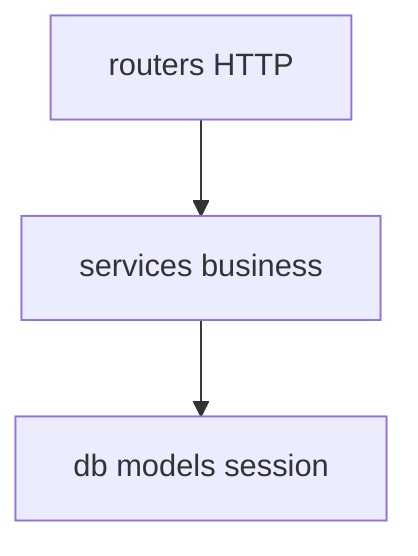

# Рекомендуемая структура FastAPI-проекта

Согласована с capstone [42-capstone](../42-capstone.md) и стендом [`deploy/fastapi`](../../../deploy/fastapi/README.md). Масштабируется от лаб до production без «god package».

---

## Дерево каталогов

```text
task-manager/                    # корень репозитория
├── app/
│   ├── __init__.py
│   ├── main.py                  # FastAPI app, lifespan, middleware
│   ├── core/
│   │   ├── config.py            # pydantic-settings BaseSettings
│   │   ├── security.py          # JWT, password hash
│   │   ├── redis.py             # Redis client factory
│   │   ├── telemetry.py         # OTel setup (optional)
│   │   └── logging.py           # structlog config
│   ├── db/
│   │   ├── base.py              # DeclarativeBase
│   │   ├── session.py           # async engine, sessionmaker
│   │   └── models/
│   │       ├── user.py
│   │       └── task.py
│   ├── schemas/
│   │   ├── auth.py
│   │   ├── task.py
│   │   └── common.py            # ErrorOut, Pagination
│   ├── services/
│   │   ├── auth_service.py
│   │   └── task_service.py      # бизнес-логика, без HTTP
│   ├── deps.py                  # get_db, get_current_user, get_redis
│   └── routers/
│       ├── health.py
│       ├── auth.py
│       └── tasks.py
├── alembic/
│   ├── env.py
│   └── versions/
├── tests/
│   ├── conftest.py
│   ├── unit/
│   ├── integration/
│   └── e2e/
├── deploy/
│   ├── Dockerfile
│   └── docker-compose.yml
├── alembic.ini
├── pyproject.toml
├── .env.example
└── .dockerignore
```

---

## Правила слоёв



| Слой | Ответственность | Не делает |
|------|-----------------|-----------|
| **routers** | HTTP codes, Depends, thin | SQL напрямую |
| **services** | правила, транзакции | Request/Response Starlette |
| **schemas** | валидация in/out | DB access |
| **models** | ORM mapping | бизнес-правила |

---

## main.py (скелет)

```python
from contextlib import asynccontextmanager
from fastapi import FastAPI
from app.core.config import settings
from app.routers import auth, health, tasks

@asynccontextmanager
async def lifespan(app: FastAPI):
    # await init_db(), init_redis()
    yield
    # await close pools

app = FastAPI(title=settings.APP_NAME, lifespan=lifespan)
app.include_router(health.router)
app.include_router(auth.router, prefix="/api/v1")
app.include_router(tasks.router, prefix="/api/v1")
```

---

## config.py

```python
from pydantic_settings import BaseSettings, SettingsConfigDict

class Settings(BaseSettings):
    model_config = SettingsConfigDict(env_file=".env", extra="ignore")
    APP_NAME: str = "task-manager"
    DATABASE_URL: str
    REDIS_URL: str = "redis://localhost:6379/0"
    JWT_SECRET: str
    JWT_TTL_MINUTES: int = 60

settings = Settings()
```

Секреты: [gitlab-basic/07-variables-secrets](../../gitlab-basic/07-variables-secrets.md).

---

## deps.py

```python
from fastapi import Depends
from app.db.session import get_session
from app.core.redis import get_redis

# Re-export для единой точки импорта в роутерах
__all__ = ["get_session", "get_redis", "get_current_user"]
```

---

## Тесты

| Каталог | Содержимое |
|---------|------------|
| `tests/unit/` | schemas, pure functions |
| `tests/integration/` | routers + fake db/redis |
| `tests/e2e/` | smoke против compose |

`conftest.py` — `AsyncClient`, `app`, overrides. См. [30-testing](../30-testing.md).

---

## Deploy

Для курса можно держать код в [`deploy/fastapi/stack/api`](../../../deploy/fastapi/stack/api) — тогда `app/` внутри `stack/api/`. Для capstone — отдельный репозиторий с `deploy/` в корне.

| Файл | Назначение |
|------|------------|
| `Dockerfile` | multi-stage, non-root |
| `docker-compose.yml` | api + postgres + redis |
| `.dockerignore` | tests, .git, __pycache__ |

[33-docker-production](../33-docker-production.md).

---

## Антипаттерны

| Антипаттерн | Проблема |
|-------------|----------|
| Всё в `main.py` | нетестируемо |
| ORM models в response_model | утечка полей |
| Глобальная sync session | race в async |
| `routers/` вызывает Redis напрямую без service | дублирование |

---

## Расширения (позже)

```text
app/workers/          # Celery / arq consumers
app/integrations/     # внешние HTTP clients
kubernetes/           # manifests для kuber-intermediate
.gitlab-ci.yml        # gitlab-basic pipeline
```

---

## Связанные материалы

- Зависимости: [pyproject.toml](pyproject.toml)
- Observability hooks: [36-observability](../36-observability.md)
- nginx front: [35-lab-nginx](../35-lab-nginx.md)
