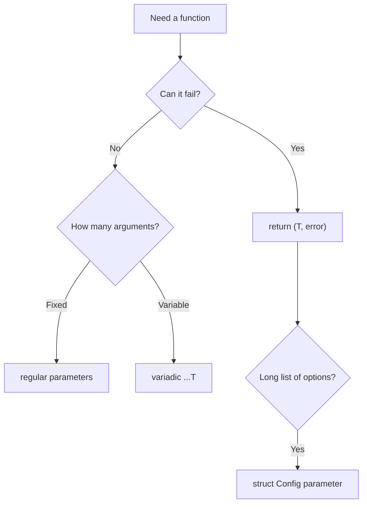

# 10. Functions: declaration, multiple returns, variadic

## What you'll learn

- Function declaration and call syntax in Go.
- **Multiple return values** and the `(T, error)` idiom.
- **Named returns** — when they help, when they get in the way.
- **Variadic functions** (`...T`) and unpacking slices at the call site.
- **Functions as values**: variables of type `func`, callbacks, passing behavior.
- Common production bugs and their root causes.

## A function is a named block with a typed signature

In Go, a function is declared with the `func` keyword. The name, parameters, and return types are **required** (except for `main` in package `main`):

```go
package main

import "fmt"

func greet(name string) string {
	return "Hello, " + name
}

func main() {
	fmt.Println(greet("World"))
}
```

**Why there's no hoisting:** in Go you can't call `greet()` before its declaration line in the same file — the compiler will report `undefined: greet`. The file reads top-to-bottom predictably; all type-checking happens at compile time ([01](01-landscape.md)).

### Parameters of the same type — shorthand

```go
func minMax(a, b int) (int, int) {
	if a < b {
		return a, b
	}
	return b, a
}
```

If several consecutive parameters share the same type, the type is written once, after the last name.

## Multiple return values

The main Go idiom is to return a **result and an error**:

```go
func divide(a, b float64) (float64, error) {
	if b == 0 {
		return 0, fmt.Errorf("divide by zero")
	}
	return a / b, nil
}

func main() {
	result, err := divide(10, 2)
	if err != nil {
		fmt.Println("error:", err)
		return
	}
	fmt.Println(result) // 5
}
```

**Why not exceptions:** an explicit `error` in the signature forces the caller to **handle** the failure. The compiler won't force you to check `err` (unlike Rust's `Result`), but `go vet` and code review in a team will. More on `error` in [21](21-errors.md).

### Ignoring a value: `_`

```go
_, err := divide(1, 0) // the result isn't needed
min, _ := minMax(3, 7) // no error here — but we're deliberately discarding max
```

The blank identifier `_` tells the compiler: "this value is intentionally unused."

## Named returns

You can give names to return values right in the signature:

```go
func splitHostPort(addr string) (host string, port int, err error) {
	host, portStr, err := parseAddr(addr)
	if err != nil {
		return // zero values: "", 0, err
	}
	port, err = strconv.Atoi(portStr)
	return // host, port, err
}
```

**What happens:**

1. At the start of the function, `host`, `port`, and `err` are local variables with zero values.
2. A "naked" `return` returns their **current** values.

**When it's appropriate:** short functions with a single exit point and clear names (parsers, DTO constructors).

**When to avoid it:** long functions — a bare `return` without explicit values reads worse, and it's easy to accidentally return the wrong field. Production code more often writes `return host, port, nil` explicitly.

### Warning: named returns and defer

```go
func counter() (n int) {
	defer func() { n++ }() // modifies the named result!
	return 0               // actually returns 1
}
```

`defer` can see named return values — powerful for error-wrapping helpers, but dangerous without a comment.

## Variadic functions: `...T`

A function can accept an arbitrary number of arguments of the same type:

```go
func sum(nums ...int) int {
	total := 0
	for _, n := range nums {
		total += n
	}
	return total
}

func main() {
	fmt.Println(sum(1, 2, 3))       // 6
	fmt.Println(sum())              // 0
	slice := []int{4, 5, 6}
	fmt.Println(sum(slice...))      // unpacking a slice
}
```

Inside the function, `nums` has type `[]int` — an ordinary slice ([08](08-slices-arrays.md)).

**Rules:**

- A variadic parameter can **only be the last** one in the list.
- `sum(slice...)` is the only way to pass a slice as a list of arguments.
- `sum(slice)` is a compile error: `...int` is expected, but `[]int` was passed.

In Go, a variadic parameter is **typed** (`...int`, not "any arguments").

## Functions as values

A function type is a type just like `int` or `string`. A function can be assigned to a variable, passed as an argument, or returned from a function:

```go
type Op func(a, b int) int

func apply(a, b int, op Op) int {
	return op(a, b)
}

func main() {
	add := func(a, b int) int { return a + b }
	fmt.Println(apply(3, 4, add)) // 7
	fmt.Println(apply(3, 4, func(a, b int) int { return a * b })) // 12
}
```

**Anonymous functions** (`func(a, b int) int { ... }`) are function literals; Go has no lexical `this`.

### Callbacks and higher-order functions

```go
func filter(nums []int, pred func(int) bool) []int {
	var out []int
	for _, n := range nums {
		if pred(n) {
			out = append(out, n)
		}
	}
	return out
}

evens := filter([]int{1, 2, 3, 4}, func(n int) bool { return n%2 == 0 })
```

The "pass behavior" pattern is the basis for `http.HandlerFunc` and middleware in Chi/Gin.

### Closures

An inner function captures variables from the enclosing scope:

```go
func makeCounter() func() int {
	n := 0
	return func() int {
		n++
		return n
	}
}

func main() {
	next := makeCounter()
	fmt.Println(next(), next(), next()) // 1 2 3
}
```

A closure captures variables **by reference**: if a variable is needed after the function returns, the compiler places it on the heap (escape analysis).

## Diagram: choosing a signature



## Common mistakes

| Mistake | Root cause | Fix |
|--------|------------------|-----------|
| Checking only `result`, not `err` | Forgot the second value | Always `if err != nil` after the call |
| `return err` without a zero result | Incomplete return | `return zero, err` |
| `sum(slice)` instead of `sum(slice...)` | A slice ≠ a variadic list | `sum(slice...)` |
| Named return + a long function | An implicit `return` | Explicit values in `return` |
| Capturing the loop variable in a goroutine | A classic issue before Go 1.22 | Go 1.22+: per-iteration `range`; otherwise, copy it into a parameter |
| "Overloading" via different names | Go has no overloading | `ParseInt` / `ParseInt64` or an options struct |
| Variadic not the last parameter | Language syntax | `...T` only at the end |

## In production

- **Place** the returned `error` last — a convention throughout the stdlib.
- For three or more "optional" parameters, use a **config struct**, not eight arguments.
- Public package APIs: document whether a function can return a `nil` error alongside a partial result.
- Don't log an error **inside** a library function and don't swallow it — return it to the caller ([21](21-errors.md)).

## Summary

Go functions are **typed** blocks with no hoisting and no `this`. **Multiple returns** are the norm; the `(T, error)` pair is the standard way to handle failures. **Variadic** (`...int`) accepts a list or an unpacked slice. **Functions are values**: the type `func(...) ...`, callbacks, closures. Named returns are a tool for short parsers, not for "magic" in long methods. Explicitness beats brevity — the compiler won't convert types for you ([19](19-type-conversions.md)).

## Checklist

- Why is there no function hoisting in Go?
- Write a function signature that returns `([]string, error)`.
- How does `sum(1, 2, 3)` differ from `sum([]int{1,2,3}...)`?
- When do named returns hurt readability?
- What does `_, err := divide(1, 0)` return for `result`, given `return 0, err`?
- Can you declare `func f(...int, string)`?

Next lesson: [11. Pointers](11-pointers.md).
