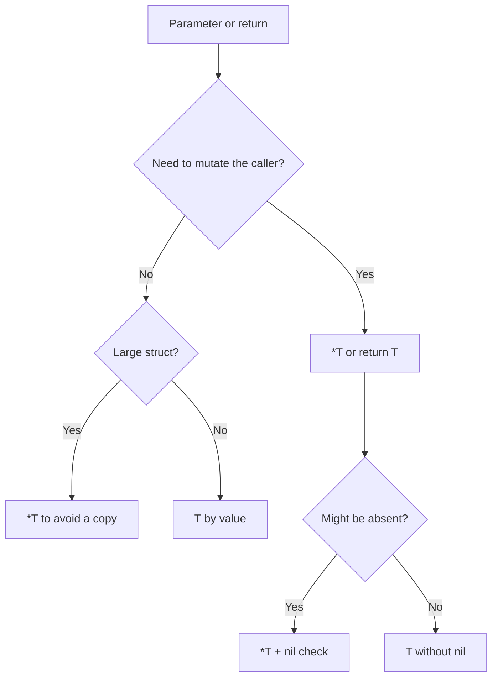

# 11. Pointers: `&`, `*`, nil, and a receiver preview

## What you'll learn

- The **`&`** (address-of) and **`*`** (dereference) operators.
- The difference between passing **by value** and **by pointer**.
- A pointer's zero value — **`nil`** — and what you can do with it.
- When to return `*T` versus `T`.
- **A preview of pointer receivers** — why methods are written on `*T`.

## Memory: value vs address

A variable stores a **value** of some type. A pointer stores the **address** of another variable:

```go
package main

import "fmt"

func main() {
	x := 42
	p := &x   // p has type *int — a pointer to int

	fmt.Println(x)   // 42
	fmt.Println(p)   // 0xc0000140a8 (an address, example)
	fmt.Println(*p)  // 42 — dereference

	*p = 100
	fmt.Println(x)   // 100 — changed through the pointer
}
```

| Operator | Reads as | Action |
|----------|--------------|----------|
| `&x` | "address of x" | Get a `*T` |
| `*p` | "value at p" | Read/write at the address |
| `*int` in a declaration | "pointer to int" | Type |

**Why there's no pointer arithmetic:** in Go you can't do `p++` like in C — fewer buffer-overflow bug classes, and a simpler GC.

## Passing to a function: copy vs shared memory

```go
func incrementVal(n int) {
	n++
}

func incrementPtr(n *int) {
	*n++
}

func main() {
	x := 10
	incrementVal(x)
	fmt.Println(x) // 10 — a copy

	incrementPtr(&x)
	fmt.Println(x) // 11 — changed the original
}
```

The same goes for structs:

```go
type Product struct {
	SKU      string
	Quantity int
}

func addStockVal(p Product, delta int) {
	p.Quantity += delta
}

func addStockPtr(p *Product, delta int) {
	p.Quantity += delta
}

func main() {
	p := Product{SKU: "A1", Quantity: 5}
	addStockVal(p, 3)
	fmt.Println(p.Quantity) // 5

	addStockPtr(&p, 3)
	fmt.Println(p.Quantity) // 8
}
```

**Rule:** to change the caller's data, pass a `*T` or return a new value (immutable style).

Slices, maps, and channels are **reference types** (internally a descriptor with a pointer to an array/hash), but that's not "a pointer in the syntax."

## `new` and `&` literals

```go
p1 := new(int)    // *int, *p1 == 0
*p1 = 7

p2 := &Product{SKU: "B2", Quantity: 1} // pointer to a struct literal
```

`new(T)` allocates memory and returns a `*T` with the zero value. `&T{...}` is written more often — it's more idiomatic for structs with fields.

## Nil pointers

The zero value for `*T` is **`nil`** (no address):

```go
var p *Product
fmt.Println(p == nil) // true

// DANGEROUS:
// fmt.Println(p.SKU)     // panic: nil pointer dereference
// p.Quantity = 1         // panic
```

**Safe patterns:**

```go
if p != nil {
	fmt.Println(p.SKU)
}

func describe(p *Product) string {
	if p == nil {
		return "<nil product>"
	}
	return p.SKU
}
```

| Type | Zero value | "Empty" |
|-----|------------|---------|
| `*T` | `nil` | no object |
| `map[K]V` | `nil` | can't write without `make` |
| `slice` | `nil` | `len==0`, `append` still works |
| `string` | `""` | not `nil` |
| `int` | `0` | not a pointer |

## Returning a pointer from a function

```go
func newProduct(sku string) *Product {
	return &Product{SKU: sku, Quantity: 0}
}
```

Go **allows** returning a pointer to a local variable: the compiler's **escape analysis** moves the value to the heap — no need to manually `malloc`/`free` like in C.

**When to use `*T` in an API:**

- A large struct — avoid copying it on every call (profile first, don't optimize blindly).
- You need to explicitly express "no object" — `nil` vs a zero-value struct.
- Methods need to mutate the receiver.

**When to use `T`:**

- A small immutable struct (`time.Time`, coordinates).
- The value is always valid — you don't want `nil` checks.

## Preview: pointer receivers

Methods are functions with a receiver. The receiver can be **by value** or **by pointer**:

```go
type Counter struct{ n int }

func (c Counter) Value() int { return c.n }      // value — doesn't change the original

func (c *Counter) Inc() { c.n++ }                // pointer — changes the original

func main() {
	var c Counter
	c.Inc()
	fmt.Println(c.Value()) // 1
}
```

Go automatically takes the address: `c.Inc()` is equivalent to `(&c).Inc()` for an addressable value variable.

**Important:** if the method set of type `T` includes only value receivers, the pointer `*T` sees them too; but methods declared only on `*T` are **not** available on a value `T`.

### Nil receiver

Some stdlib types handle a `nil` receiver deliberately (`bytes.Buffer` — no; `sync.Mutex` — can't). In your own code, **by default**, check for `nil` inside a method if the receiver is a pointer:

```go
func (p *Product) String() string {
	if p == nil {
		return "Product(nil)"
	}
	return p.SKU
}
```

## Pointers and interfaces (a hint)

Later: `*bytes.Buffer` implements `io.Writer`, and sometimes an `interface{}` / `any` is passed around with `nil` inside it — a separate class of bugs. For now, remember: **`var p *Product = nil`** and **`var i any = (*Product)(nil)`** behave differently under a type assertion.

## Diagram: do you need a pointer?



## Common mistakes

| Mistake | Root cause | Fix |
|--------|------------------|-------------|
| Mutating a struct parameter isn't visible outside | Passed by value | `*Product` or return a new struct |
| Panic on `p.Field` | `p == nil` | Guard with `if p != nil` |
| `&literal[0]` outside its scope | Pointer to a stack value after return | Return a slice, or let it escape to the heap via return |
| Confusing `*T` and `T` in a signature | Different types to the compiler | Be explicit in the declaration |
| `new` everywhere instead of `&T{}` | Works, but less readable | `&Product{...}` for structs |
| An unnecessary double pointer `**T` | Over-engineering | One level is almost always enough |

## In production

- Repository-layer API: `GetByID(id) (*Order, error)` — `nil, ErrNotFound` vs an empty struct — agree on the convention within the team.
- Don't return a pointer to your **internal** slice/map without copying it if the caller might mutate your state.
- `go vet` and staticcheck catch some nil dereferences.

## Summary

**`&`** takes an address, **`*`** dereferences. A struct is **copied** when passed by value — mutating it requires **`*T`**. **`nil`** is a pointer's zero value; dereferencing `nil` panics. Returning `&local` is safe thanks to escape analysis. **Pointer receivers** change the original and expand the method set.

## Checklist

- What does `incrementVal(x)` print after `x := 10`?
- How does a `nil` pointer differ from a zero-value struct?
- Why does `addStockPtr(&p, 3)` need the `&`?
- Can you call a method with a pointer receiver on a value variable?
- Why does `var p *Product; p.SKU` panic?
- When is it better to return `T` instead of `*T`?

Next lesson: [12. Maps](12-maps.md).
