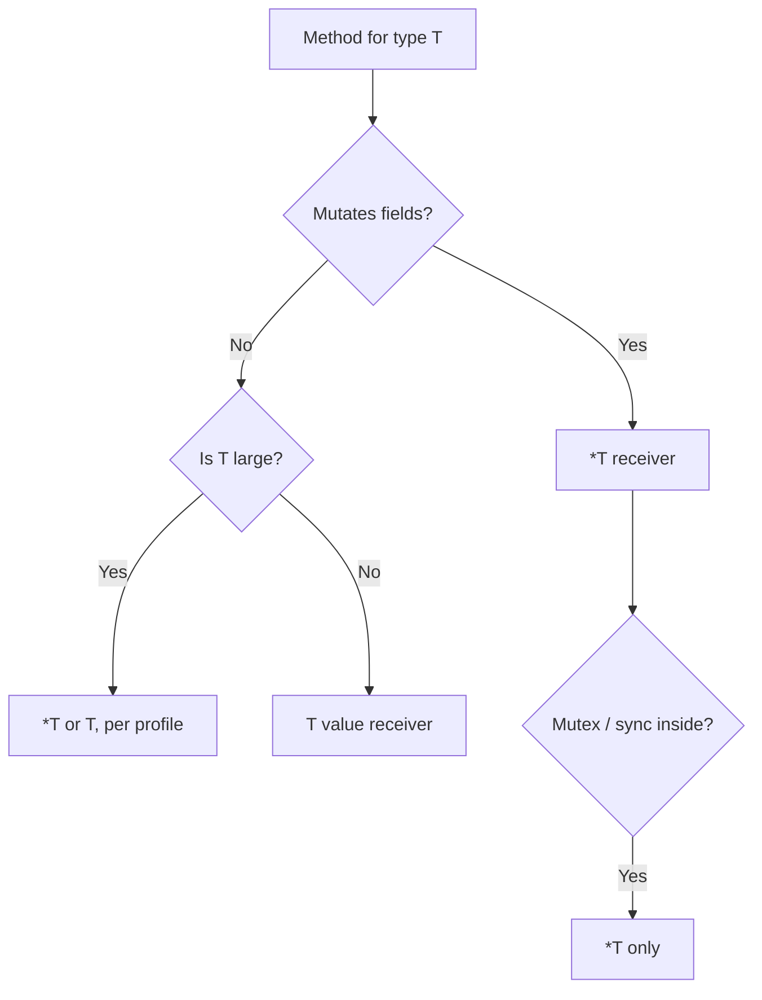

# 14. Methods: value vs pointer receivers, method sets

## What you'll learn

- **Method** syntax and how it differs from a plain function.
- **Value receiver** `(t T)` vs **pointer receiver** `(t *T)`.
- The rules for the **automatic** `&` on a call.
- **Method sets** — which methods are available for `T` and `*T`.
- When to use value vs pointer.
- The connection to interfaces and nil receivers.

## Method syntax

```go
type Rectangle struct {
	Width, Height float64
}

// value receiver
func (r Rectangle) Area() float64 {
	return r.Width * r.Height
}

// pointer receiver — can change r
func (r *Rectangle) Scale(factor float64) {
	r.Width *= factor
	r.Height *= factor
}

func main() {
	rect := Rectangle{Width: 10, Height: 5}
	fmt.Println(rect.Area()) // 50
	rect.Scale(2)
	fmt.Println(rect.Area()) // 200
}
```

A method is attached to a type **within the same package** (not to a runtime instance, as in OOP). There's no `class` keyword — only `type` plus functions.

**Method names:** unexported when they start with a lowercase letter — the same rule as fields.

## Value receiver: a copy on each call

```go
type Counter struct{ n int }

func (c Counter) Value() int {
	return c.n
}

func (c Counter) BrokenInc() {
	c.n++ // changes the copy
}

func main() {
	var c Counter
	c.BrokenInc()
	fmt.Println(c.Value()) // 0
}
```

**Why:** with a value receiver, `c` is a **copy** of `Counter` on the call stack. Changes don't reach the original — the same as passing a struct by value into a function.

### When a value receiver makes sense

- The method **doesn't mutate** the receiver.
- `T` is **small** (a few ints, `time.Time`).
- `T` is **immutable** by design (a value object).
- You need thread-safe reads without a pointer (rare, but it happens).

## Pointer receiver: a shared instance

```go
func (c *Counter) Inc() {
	c.n++
}

func main() {
	var c Counter
	c.Inc() // Go turns this into (&c).Inc()
	fmt.Println(c.Value()) // 1
}
```

**Automatic address-of:** for an addressable value variable `c`, calling `c.Inc()` with a pointer-receiver method is legal — the compiler substitutes `(&c).Inc()`.

**The reverse:** if you have `p *Counter` and a value-receiver method `Value()`, calling `p.Value()` becomes `(*p).Value()`.

### When a pointer receiver makes sense

- The method **changes** fields on the receiver.
- `T` is **large** — avoid copying it (measure first).
- **Consistency:** if one method is on `*T`, it's common to put all methods on `*T` for a readable API.
- `T` contains a `sync.Mutex` — **always** use a pointer receiver (copying a mutex is forbidden).

## Method sets

The set of methods on type `T` determines which interfaces `T` implements **implicitly**.

Go's rule (simplified):

| Type expression | Sees methods with receiver |
|----------------|--------------------------|
| `T` | only `(T)` |
| `*T` | both `(T)` and `(*T)` |

The precise rule:

- The method set of **`T`** includes all methods with receiver **`T`** (value).
- The method set of **`*T`** includes methods with receiver **`T`** and **`*T`**.

```go
type MyInt int

func (m MyInt) Val() int   { return int(m) }
func (m *MyInt) PtrOnly() {}

var i MyInt = 1
i.Val()    // ok
// i.PtrOnly() // compile error: PtrOnly on *MyInt

var p *MyInt = &i
p.Val()     // ok — value method through a pointer
p.PtrOnly() // ok
```

**Practical takeaway:** if a method exists only on `*T`, an interface variable holding a **value** `T` **won't** get that method — a common bug with `var w io.Writer = myBuf` vs `bytes.Buffer`.

## Comparison: function vs method

```go
func Area(r Rectangle) float64 {
	return r.Width * r.Height
}

func (r Rectangle) Area() float64 {
	return r.Width * r.Height
}
```

| | Function | Method |
|---|---------|--------|
| Call | `Area(r)` | `r.Area()` |
| Belongs to | the package | the type |
| Overloading | no | no (different receivers = different methods) |

Methods are convenient for **chaining** and interfaces (`r.Scale(2).Area()` if `Scale` returns the receiver — the builder idiom).

## Several methods on one type

```go
type Order struct {
	ID     string
	Total  int
	Paid   bool
}

func (o *Order) MarkPaid() {
	o.Paid = true
}

func (o Order) Display() string {
	status := "pending"
	if o.Paid {
		status = "paid"
	}
	return fmt.Sprintf("%s: %d (%s)", o.ID, o.Total, status)
}
```

`Display` on a value reads a copy, but for read-only fields the result is correct as long as you don't rely on side effects of the copy. `MarkPaid` on a pointer mutates the order in the service.

## Nil pointer receiver

```go
type List struct {
	head *Node
}

func (l *List) Len() int {
	if l == nil {
		return 0
	}
	// ...
	return 0
}
```

Calling `var l *List; l.Len()` is legal if the method handles `nil`. This stdlib pattern isn't universal — document the contract.

## Methods and embedding (preview)

```go
type Engine struct{ Power int }

func (e Engine) Roar() string {
	return fmt.Sprintf("%d hp", e.Power)
}

type Car struct {
	Engine // embedded
	Brand  string
}

func main() {
	c := Car{Engine: Engine{150}, Brand: "Go"}
	fmt.Println(c.Roar()) // promotion — details in structs [07](07-structs.md)
}
```

Method promotion isn't OOP inheritance; the compiler substitutes the field.

## Diagram: choosing a receiver



## Common mistakes

| Mistake | Root cause | Fix |
|--------|------------------|-------------|
| `Inc` on a value receiver | a copy | use `*T` |
| Interface not satisfied | method only on `*T`, value stored in the interface | `*T` or a value method |
| Mixing value/pointer without a reason | a confusing API | one consistent style per type |
| Copying a struct with a mutex | value receiver | pointer only |
| Method on nil without a guard | panic | `if t == nil` |
| Method outside the type's package | not allowed by Go's syntax | put the func in the same package |

## In production

- Service layer: `type ShopService struct { repo *Repo }` — methods on `*ShopService`, one shared state.
- Don't write `func (m map[string]T) Get` — wrap it in a struct that holds the map.
- The `revive` / `staticcheck` linters warn about huge value receivers.

## Summary

A **method** is `func (receiver) Name()`. A **value receiver** copies `T`; a **pointer receiver** mutates the original and is needed for large or sync-holding types. Go **automatically** takes `&` or `*` on a call. The **method set** of `T` vs `*T` determines which methods are visible and which **interfaces get implemented**. For a mutating shop/inventory API, it's almost always `*T`.

## Checklist

- Why doesn't `(c Counter) Inc()` increment the original?
- What does the compiler do for `c.Inc()` when `Inc` has a `*Counter` receiver?
- Which methods are in the method set of `*T` but not `T`?
- When is a value receiver preferable to a pointer one?
- Why can't you copy a `sync.Mutex`?
- Where do you declare methods for an exported type?

Next lesson: [15. Lab: methods](15-lab-methods.md).
