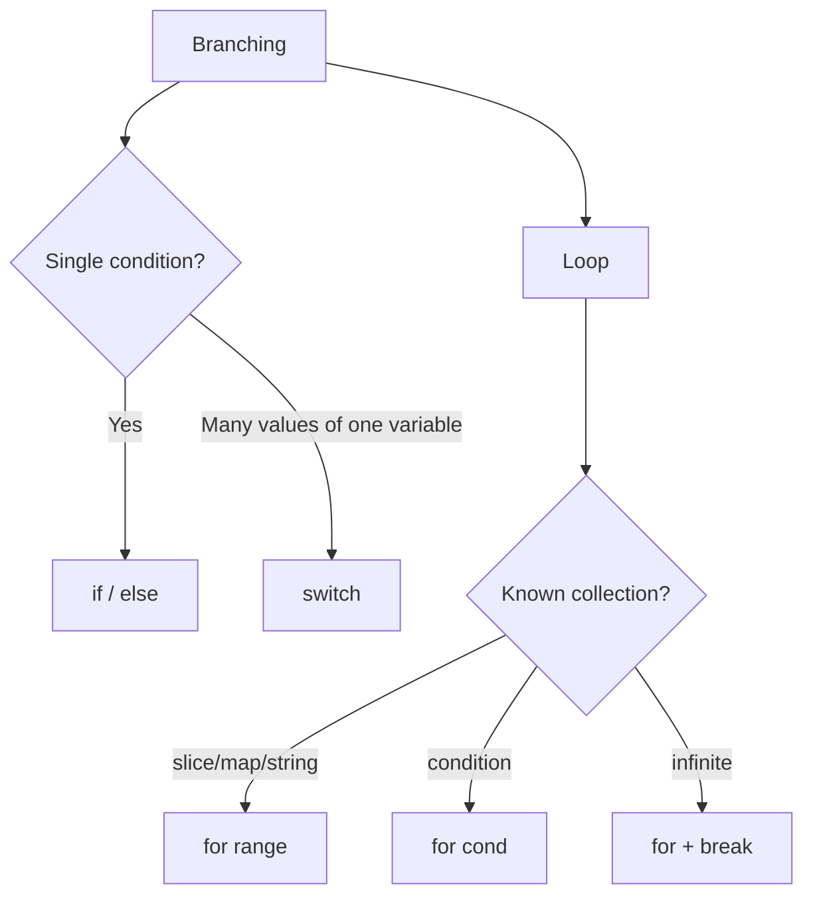

# 16. Control flow: `if`, `for`, `switch`, `range`

## What you'll learn

- `if` / `else`, **initialization** in `if`, guard clauses.
- The **`for`** loop — the only one; emulating `while`.
- **`switch`** on a value and without an expression; `fallthrough`.
- **`range`** over a slice, map, string, channel (preview).
- Go idioms: early return, `for { }` with break.

## `if`: the condition must be `bool`

```go
score := 85
if score >= 90 {
	fmt.Println("A")
} else if score >= 80 {
	fmt.Println("B")
} else {
	fmt.Println("C")
}
```

Go has **no** implicit conversion to bool:

```go
// COMPILE ERROR:
// if len(items) { }
// if name { }

if len(items) > 0 { }
if name != "" { }
```

### Initialization in `if`

```go
if err := save(order); err != nil {
	return err
}
// err is not accessible here — scope is limited to the if
```

The **error-check** idiom is the foundation of all Go code.

### Guard clauses

```go
func process(order *Order) error {
	if order == nil {
		return fmt.Errorf("nil order")
	}
	if order.Status == "cancelled" {
		return nil
	}
	if len(order.Items) == 0 {
		return fmt.Errorf("empty order")
	}
	// main logic without deep nesting
	return nil
}
```

## `for`: the only loop

### Classic counter

```go
for i := 0; i < len(items); i++ {
	fmt.Println(i, items[i])
}
```

### As a `while`

```go
for queue.Len() > 0 {
	job := queue.Pop()
	process(job)
}
```

```go
for {
	resp, err := poll()
	if err != nil {
		break
	}
	handle(resp)
}
```

`for { }` — an infinite loop; exit via `break`, `return`, `panic`.

**No** `do…while`, `for…in`.

## `range`: iterating over collections

### Slice and array

```go
nums := []int{10, 20, 30}
for i, v := range nums {
	fmt.Println(i, v)
}

for _, v := range nums {
	fmt.Println(v)
}

for i := range nums {
	fmt.Println(i)
}
```

**A copy of the value:** in `for _, v := range`, the variable `v` is a **copy** of the element. For structs with pointer fields, you often need the index instead:

```go
for i := range users {
	users[i].Active = true
}
```

With Go 1.22+, `for range` over a number creates a **separate** variable per iteration — the classic closure bug in goroutines is now simplified.

### Map

```go
for sku, qty := range inventory {
	fmt.Println(sku, qty)
}
```

Key order is **random**.

### String (preview)

```go
for i, r := range "Hello" {
	fmt.Println(i, r) // r is a rune (int32)
}
```

### Channel (preview)

```go
for msg := range ch {
	handle(msg)
}
```

Closing the channel ends the range.

## `switch`

### On a value

```go
func handleCommand(cmd string) {
	switch cmd {
	case "start":
		startWorker()
	case "stop":
		stopWorker()
	case "pause", "hold":
		pauseWorker()
	default:
		fmt.Println("unknown:", cmd)
	}
}
```

**Automatic break:** after a case, execution does **not** fall through to the next one (unlike C, where `break` is required explicitly).

### `fallthrough`

```go
switch n {
case 1:
	fmt.Println("one")
	fallthrough
case 2:
	fmt.Println("two") // also runs for n==1
}
```

Use it **rarely**, and with a `// fallthrough intentional` comment.

### Switch without an expression

```go
switch {
case score >= 90:
	grade = "A"
case score >= 80:
	grade = "B"
default:
	grade = "F"
}
```

Equivalent to an `if else if` chain — more readable with many branches.

### Type switch (preview)

```go
switch v := x.(type) {
case int:
	fmt.Println("int", v)
case string:
	fmt.Println("string", v)
default:
	fmt.Println("other")
}
```

## `break` and `continue`

```go
for _, id := range ids {
	if id == "" {
		continue
	}
	if id == "STOP" {
		break
	}
	process(id)
}
```

Labels (`break Outer`) — rare; prefer extracting a function with `return`.

## There is no ternary operator

```go
// Go has no: cond ? a : b
max := a
if b > a {
	max = b
}
```

Or a helper function / the `max` builtin for comparable types.

## Diagram: choosing a construct



## Common mistakes

| Mistake | Root cause | Fix |
|--------|------------------|-------------|
| `if len(s)` | not bool | `len(s) > 0` |
| Mutating `v` in `range` over a slice of structs | copy | index `i` |
| Expecting map range order | random | sort keys |
| `fallthrough` without need | copy-paste from C | remove |
| `switch` on float without epsilon | float `==` | rounding or int cents |
| Infinite `for {}` without an exit | forgot break | timeout / context later |

## In production

- **Switch** on enum-like order-status strings + `default` with an unknown-value metric.
- **Guard** at the start of every handler — nil, empty ID, cancelled context.
- Linters `gosimple`, `staticcheck` — simplification of if/switch.

## Summary

**`if`** accepts only **`bool`**; the short form `if err := …; err != nil` is standard. **`for`** is the only loop (`for`, `for cond`, `for range`, `for {}`). **`switch`** doesn't fall through between cases; **`fallthrough`** is the exception. **`range`** works over slices, maps, strings; for maps the order isn't guaranteed. No ternary operator and no truthy conditions — explicitness matters more than brevity.

## Checklist

- Why doesn't `if items { }` compile?
- How do you write a `while` loop in Go?
- Is `range` order over a map guaranteed?
- What does `fallthrough` do?
- Why might mutating `v` in `for _, v := range structs` not work?
- Why does `if err := f(); err != nil` declare `err` inside the `if`?

Next lesson: [17. Strings and runes](17-strings-runes.md).
