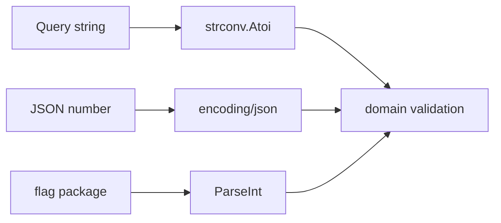

# 19. Type conversions: explicit conversion and `strconv`

## What you'll learn

- **Numeric conversions** between numeric types.
- **Converting string ↔ numbers** via **`strconv`**.
- The difference between **conversion** and **assertion**.
- Why there's no `+"5"` and no truthy coercion.
- Common bugs when parsing HTTP queries and JSON.

## Explicitness: no implicit conversion

```go
var i int = 42
var f float64 = float64(i) // ok — explicit conversion

// var f2 float64 = i     // compile error
```

```go
s := "42"
// n := s + 1            // error
n, err := strconv.Atoi(s)
if err != nil {
	// handle
}
_ = n + 1
```

## Numeric conversions

```go
var (
	a int32 = 100
	b int64 = int64(a)
	c int   = int(b)
	d float64 = float64(c)
	e uint  = uint(d) // careful: a negative value becomes a large positive one
)
```

**Rules:**

- Between **numeric** types — conversion `T(v)` works if both `T` and the type of `v` are numeric.
- **Truncation** on float → int: the fractional part is dropped (not rounded).
- **Overflow** with large values wraps silently modulo the type's size (for constants the compiler may warn).

```go
fmt.Println(int(3.99)) // 3
```

### Integer division

```go
fmt.Println(5 / 2)       // 2, not 2.5
fmt.Println(5.0 / 2)   // 2.5
fmt.Println(float64(5) / 2) // 2.5
```

Money in cents (`int`) vs dollars (`float64`) — keep **int cents** in your API.

## `strconv`: string ↔ numbers

Import: `import "strconv"`.

### Integers

```go
n, err := strconv.Atoi("42")        // int, base 10
n64, err := strconv.ParseInt("ff", 16, 64) // 255 in hex
u, err := strconv.ParseUint("42", 10, 32)

s := strconv.Itoa(42)
s2 := strconv.FormatInt(int64(n), 10)
```

| Function | Purpose |
|---------|------------|
| `Atoi` | string → int |
| `Itoa` | int → string |
| `ParseInt(s, base, bitSize)` | flexible parsing |
| `FormatInt` | int64 → string in a given base |

**Always check `err`:**

```go
qty, err := strconv.Atoi(input)
if err != nil {
	return fmt.Errorf("invalid qty: %w", err)
}
```

### Floating point

```go
f, err := strconv.ParseFloat("3.14", 64)
out := strconv.FormatFloat(f, 'f', 2, 64) // "3.14"
```

For JSON and APIs, prefer **string** or **integer** money values, not `float64` binary rounding.

### Bool

```go
b, err := strconv.ParseBool("true") // t, true, 1, 0, f, false
```

## String ↔ byte / rune

```go
b := []byte("hello")
s := string(b)

r := []rune("Привет")
s2 := string(r)
```

Converting `string` ↔ `[]byte` **copies** the data (unless the compiler optimizes for a const). For zero-copy in performance-critical code — `unsafe` (out of scope for this basic course).

Separately: **`string(rune)`** produces the UTF-8 encoding of a single character:

```go
fmt.Println(string('A'))  // "A"
fmt.Println(string(65))   // "A" — rune value
```

## Conversion vs type assertion

```go
var x any = 42
i := x.(int)        // panics if not int
i, ok := x.(int)    // comma ok

// not the same as:
var n int = int(x.(int)) // assertion + already-compatible conversion
```

**Conversion** `T(v)` — between compatible **concrete** types. **Assertion** — from the `any` interface to a concrete type.

## `fmt` for formatting

```go
s := fmt.Sprintf("%d", 42)
s2 := fmt.Sprintf("%.2f", 3.14159)
s3 := fmt.Sprintf("%q", "hi\n") // escaped string
```

`Sprintf` is **not** parsing — output only. Parsing is `strconv`'s job.

## Pipeline: query parameter → int

```go
func parsePage(q string) (int, error) {
	if q == "" {
		return 1, nil // default
	}
	page, err := strconv.Atoi(q)
	if err != nil {
		return 0, fmt.Errorf("page: %w", err)
	}
	if page < 1 {
		return 0, fmt.Errorf("page must be >= 1")
	}
	return page, nil
}
```

Two levels: **syntax** (Atoi) and **domain** (page >= 1).

## Unicode and strings

`strconv` doesn't parse "strings as numbers" in Unicode digit forms (`１２３`). Normalization is a separate concern. For IDs and SKUs — usually ASCII.

## Diagram: where a value came from



## Common mistakes

| Mistake | Root cause | Fix |
|--------|------------------|-------------|
| `qty, _ := strconv.Atoi(s)` | ignoring err | check err |
| `5 / 2 == 2.5` | integer division | `float64(5)/2` |
| `int(f)` expecting rounding | truncation | `math.Round` |
| `string(65)` expecting `"65"` | rune → character | `strconv.Itoa(65)` |
| Comparing `int` and `int64` without conversion | different types | explicit `int64(i)` |
| Parsing floats for money | rounding | int cents |

## In production

- HTTP handlers: parse query/path parameters **once**, validate the range, return 400 with a clear body.
- Don't use `float64` for money; currency conversion needs a decimal library.
- Linter: `errcheck` checking all `strconv.*` calls.

## Summary

Go requires **explicit** conversions `T(v)` between numeric types and a separate **`strconv`** for string ↔ number. **`if`** only accepts `bool` — no truthy values. Parsing errors **cannot** be ignored. Integer division is distinct from float division. Explicit conversions are a deliberate design choice for predictability in a backend shop/API.

## Checklist

- Why doesn't `var f float64 = 3` compile without `float64(3)` in a strict assignment?
- How does `strconv.Atoi` differ from `x.(int)`?
- What do `5 / 2` and `5.0 / 2` return?
- What happens with `qty, _ := strconv.Atoi("")`?
- How do you print the number 42 as a string without `fmt`?
- Why is it better to store money as `int` rather than parsing it into `float64`?

Next lesson: [20. Interfaces](20-interfaces.md).
