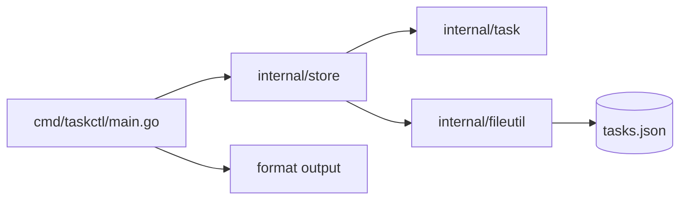

# 37. Capstone: Task Tracker CLI (4–6 hours)

## Introduction: why a capstone

Up to this chapter you've learned **fragments** of the language: structs in lesson 07, errors in 21, JSON in 32, files in 34. The capstone forces you to **assemble** them into one program you can show a colleague or put in a portfolio.

What matters here: **packages**, **the model**, **errors**, **JSON persistence**, **table-driven tests**, **`flag`** (cobra is not required).

If you get stuck — go back to the lessons in the "When to check the lessons" table, rather than copying a ready-made solution from the internet.

**Time estimate:** 4–6 hours of focused work (2–3 sessions of 2 hours).

---

## The task

A console **task-tracking** application that persists to a JSON file — **no HTTP**, just a file-based DB and a CLI.

---

## Functional requirements

### The `Task` model

| Field | Go type | JSON | Rules |
|------|--------|------|---------|
| `ID` | `string` | `id` | unique (uuid or incremental) |
| `Title` | `string` | `title` | 1–200 characters, not empty |
| `Status` | `string` | `status` | `"todo"` or `"done"`, defaults to `todo` |
| `CreatedAt` | `time.Time` | `created_at` | set on creation, UTC, RFC3339 |
| `Tags` | `[]string` | `tags,omitempty` | optional, defaults to an empty slice |
| `DueDate` | `*time.Time` | `due_date,omitempty` | optional (extension A) |

Status constants (recommended):

```go
const (
	StatusTodo = "todo"
	StatusDone = "done"
)
```

### `TaskStore`

| Method | Signature (sketch) | Behavior |
|-------|------------------|-----------|
| `NewTaskStore` | `func NewTaskStore(path string) *TaskStore` | path to the JSON file |
| `Load` | `func (s *TaskStore) Load() error` | no file → empty store |
| `Save` | `func (s *TaskStore) Save() error` | atomic write |
| `Add` | `func (s *TaskStore) Add(title string, opts AddOptions) (Task, error)` | validation, id, CreatedAt |
| `List` | `func (s *TaskStore) List(filter ListFilter) []Task` | status, tag, search filters |
| `MarkDone` | `func (s *TaskStore) MarkDone(id string) (Task, error)` | changes status |
| `Remove` | `func (s *TaskStore) Remove(id string) error` | removal by id |

- On CLI startup — `Load()`.
- After every mutation (`Add`, `MarkDone`, `Remove`) — `Save()` (or an explicit `Flush` — document it in the README).

`List` returns a **copy** of the data, not the internal slice.

### CLI interface (`flag`, not cobra)

At minimum, via subcommands as the **first positional argument** after the flags:

```bash
go run ./cmd/taskctl add "Buy milk" -tags home,food
go run ./cmd/taskctl list
go run ./cmd/taskctl list -status todo
go run ./cmd/taskctl done <id>
go run ./cmd/taskctl remove <id>
go run ./cmd/taskctl search milk
```

Global flags:

```bash
-data data/tasks.json   # path to the file (default: data/tasks.json)
```

**Alternative:** an interactive menu built on `bufio.Scanner` is acceptable, as long as arguments are also supported.

### Output and exit codes

- `list` / `search` — tabular output (shortened id, title, status, tags).
- Success — exit code `0`.
- Validation error, "task not found," corrupt JSON on load — `1`, message to **stderr**.

```go
fmt.Fprintln(os.Stderr, "error:", err)
os.Exit(1)
```

---

## Non-functional requirements

| Requirement | Why |
|------------|-----|
| Split into packages | [26-packages.md](26-packages.md) |
| Explicit `error`s, sentinel or typed errors | [21-errors.md](21-errors.md), [25-errors-is-as.md](25-errors-is-as.md) |
| `writeAtomic` for JSON | [34-files-io.md](34-files-io.md) |
| Table-driven tests for `task` and `store` | [28-testing.md](28-testing.md) |
| `go vet` / `go test ./...` pass without failures | [30-tooling.md](30-tooling.md) |
| README in `examples/capstone/` with example commands | for the reviewer |

**Not required:** cobra, viper, HTTP, goroutines.

---

## Target module layout

```text
courses/go-basic-en/examples/capstone/
├── README.md
├── go.mod                    # or a shared examples/go.mod with a replace directive
├── cmd/
│   └── taskctl/
│       └── main.go           # flag, arg parsing, os.Exit
├── data/
│   └── tasks.json            # created on first save
└── internal/
    ├── task/
    │   ├── task.go           # Task, Validate, NewTask
    │   └── task_test.go
    ├── store/
    │   ├── store.go          # TaskStore, Load/Save, CRUD
    │   └── store_test.go
    ├── errors/
    │   └── errors.go         # ErrNotFound, ErrValidation
    └── fileutil/
        ├── atomic.go         # writeAtomic
        └── atomic_test.go
```

Optionally a package `internal/cli/format.go` — table formatting.



**Import path:** if there's a single `go.mod` under `examples/`, the module path comes from [`go.mod`](examples/go.mod) plus `/capstone/internal/...` (i.e. `github.com/mock-exams/go-basic-en-labs/capstone/internal/...`).

---

## Step-by-step plan (recommended)

### Session 1 (~2 h): the model and an in-memory store

1. `internal/task/task.go`: `NewTask(title, opts)`, `Validate()`, id generation (`google/uuid` or `crypto/rand` hex — or an incremental int as a string).
2. `internal/store/store.go`: a slice or `map[string]Task` in memory, methods without file I/O yet.
3. In `main`, temporarily call `Add` + `List` — check the logic.
4. **Success criterion:** an empty title → `ErrValidation` (or a wrapped version of it).

**Lessons:** [07-structs.md](07-structs.md), [21-errors.md](21-errors.md), [12-maps.md](12-maps.md).

### Session 2 (~2 h): persistence and packages

1. `Load()`: `os.IsNotExist` → empty store; corrupt JSON → propagate the error.
2. `Save()`: `json.MarshalIndent` + `writeAtomic`.
3. A file wrapper:

```go
type fileData struct {
	SchemaVersion int   `json:"schema_version"`
	Tasks         []Task `json:"tasks"`
}
```

4. **Success criterion:** restarting `taskctl list` shows the same tasks.

**Lessons:** [32-json.md](32-json.md), [34-files-io.md](34-files-io.md), [35-lab-json-files.md](35-lab-json-files.md).

### Session 3 (~1–2 h): CLI, tests, polish

1. `flag` for `-data`; `flag.Parse()`; `flag.Args()` for subcommands.
2. Parse `-tags home,food` via `flag` or a manual split after `flag.Parse()`.
3. Table-driven tests: title validation, `MarkDone` not found, `List` filtering.
4. A README with examples and the behavior of a repeated `done`.

**Lessons:** [28-testing.md](28-testing.md), [16-control-flow.md](16-control-flow.md).

---

## Implementation hints

### Generating an id

```go
import "github.com/google/uuid"

func newID() string {
	return uuid.NewString()
}
```

Or without the dependency:

```go
import "crypto/rand"
import "encoding/hex"

func newID() string {
	var b [16]byte
	_, _ = rand.Read(b[:])
	return hex.EncodeToString(b[:])
}
```

### Parsing tags from `-tags home,food`

```go
func parseTags(raw string) []string {
	if raw == "" {
		return nil
	}
	parts := strings.Split(raw, ",")
	out := make([]string, 0, len(parts))
	for _, p := range parts {
		p = strings.TrimSpace(p)
		if p != "" {
			out = append(out, p)
		}
	}
	return out
}
```

### Search

```go
func matchesSearch(t task.Task, keyword string) bool {
	k := strings.ToLower(keyword)
	if strings.Contains(strings.ToLower(t.Title), k) {
		return true
	}
	for _, tag := range t.Tags {
		if strings.Contains(strings.ToLower(tag), k) {
			return true
		}
	}
	return false
}
```

### Atomic save

```go
func writeAtomic(path string, data []byte, perm os.FileMode) error {
	if err := os.MkdirAll(filepath.Dir(path), 0o755); err != nil {
		return err
	}
	tmp := path + ".tmp"
	if err := os.WriteFile(tmp, data, perm); err != nil {
		return err
	}
	return os.Rename(tmp, path)
}
```

### `main` skeleton with `flag`

```go
func main() {
	dataPath := flag.String("data", "data/tasks.json", "path to tasks JSON")
	flag.Parse()

	store := store.NewTaskStore(*dataPath)
	if err := store.Load(); err != nil {
		fmt.Fprintln(os.Stderr, err)
		os.Exit(1)
	}

	args := flag.Args()
	if len(args) == 0 {
		usage()
		os.Exit(1)
	}

	var err error
	switch args[0] {
	case "add":
		err = runAdd(store, args[1:])
	// ...
	default:
		usage()
		os.Exit(1)
	}
	if err != nil {
		fmt.Fprintln(os.Stderr, err)
		os.Exit(1)
	}
}
```

### Example table-driven test

```go
func TestValidateTask(t *testing.T) {
	tests := []struct {
		name    string
		title   string
		wantErr bool
	}{
		{name: "ok", title: "Buy milk", wantErr: false},
		{name: "empty", title: "", wantErr: true},
		{name: "too long", title: strings.Repeat("a", 201), wantErr: true},
	}
	for _, tc := range tests {
		t.Run(tc.name, func(t *testing.T) {
			err := task.ValidateTitle(tc.title)
			if (err != nil) != tc.wantErr {
				t.Fatalf("got err=%v wantErr=%v", err, tc.wantErr)
			}
		})
	}
}
```

---

## Extensions (optional)

| Level | Task | Hours |
|---------|--------|------|
| A | `DueDate` field, sort `list` by due date | +1 |
| B | `list -format csv` | +1 |
| C | `BenchmarkList` benchmark on 10k tasks | +0.5 |
| D | Integration test: temp dir + Load/Save roundtrip | +1 |

---

## Acceptance criteria (self-check)

- [ ] `add` → `list` → restart the binary → the task is still there
- [ ] `done <id>` changes status; a repeated `done` — either an error **or** idempotency (describe your choice in the README)
- [ ] `remove` of a nonexistent id — exit 1, stderr
- [ ] No single file over 400+ lines — packages split by responsibility
- [ ] `go test ./...` and `go vet ./...` pass
- [ ] There's a `capstone/README.md` in the repository
- [ ] The JSON in `data/tasks.json` is readable (`MarshalIndent`)

---

## Common mistakes

1. **The path to `tasks.json` is relative to cwd** — running from a different directory breaks the path. Document the `-data` flag or fix the cwd in the README.

2. **Mutating `List()`'s result from outside** — `store.List().Append` corrupts the store. Return a copy.

3. **Forgetting `Save()` after a mutation** — the data only lives in RAM.

4. **Ignoring the `json.Unmarshal` error** — a silently empty store when the file is corrupt.

5. **Unexported fields in JSON** — `title` instead of `Title` without a tag on the right field.

6. **Comparing ids by the full uuid in the UI** — show the first 8 characters in the table, accept the full id **or** a prefix in commands (an extension — document it).

7. **Tests writing to the real `data/tasks.json`** — use `t.TempDir()`.

---

## When to check the lessons

| Problem | Lesson |
|---------|------|
| struct tags / JSON | 32 |
| CreatedAt / DueDate | 33 |
| ReadFile / atomic write | 34 |
| shop lab pattern | 35 |
| table-driven tests | 28 |
| sentinel errors | 25 |
| package layout | 26 |

---

## Submission and demo

Minimal scenario for the reviewer:

```bash
cd courses/go-basic-en/examples/capstone
go test ./...
go run ./cmd/taskctl add "Learn Go interfaces" -tags study
go run ./cmd/taskctl list
go run ./cmd/taskctl list -status todo
go run ./cmd/taskctl done <id-from-list>
go run ./cmd/taskctl search interfaces
cat data/tasks.json
```

---

## After the capstone

1. Go through [interview-cheatsheet.md](interview-cheatsheet.md) again **without peeking** at the chapters.
2. Optional: a GitHub branch with `capstone/` — a portfolio artifact.

Congratulations — **go-basic** is complete.
