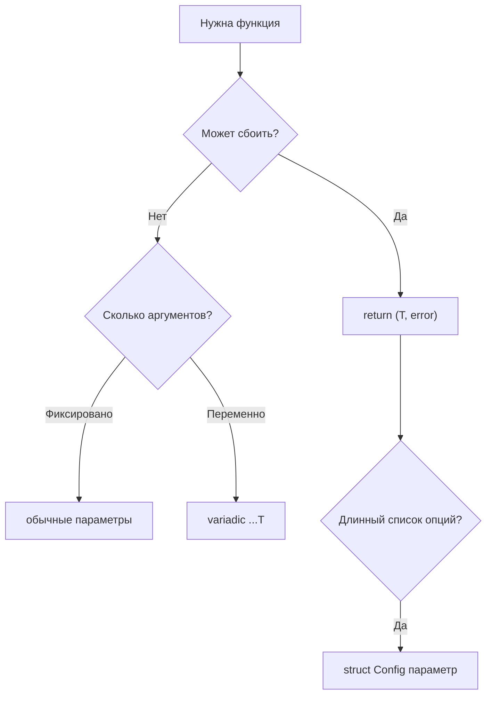

# 10. Функции: объявление, несколько возвратов, variadic

## Что вы узнаете

- Синтаксис объявления функции и вызова в Go.
- **Множественные возвращаемые значения** и идиома `(T, error)`.
- **Именованные результаты** (`named returns`) — когда помогают, когда мешают.
- **Variadic-функции** (`...T`) и распаковка срезов при вызове.
- **Функции как значения**: переменные типа `func`, колбэки, передача поведения.
- Типичные production-баги и их корневые причины.

## Функция — именованный блок с типизированной сигнатурой

В Go функция объявляется ключевым словом `func`. Имя, параметры и возвращаемые типы **обязательны** (кроме `main` в пакете `main`):

```go
package main

import "fmt"

func greet(name string) string {
	return "Hello, " + name
}

func main() {
	fmt.Println(greet("World"))
}
```

**Почему нет hoisting:** в Go нельзя вызвать `greet()` до строки объявления в том же файле — компилятор выдаст `undefined: greet`. Порядок чтения файла сверху вниз предсказуем; вся проверка типов — на этапе компиляции ([01](01-landscape.md)).

### Параметры одного типа — краткая запись

```go
func minMax(a, b int) (int, int) {
	if a < b {
		return a, b
	}
	return b, a
}
```

Если несколько параметров подряд имеют один тип, тип пишется один раз после последнего имени.

## Множественные возвращаемые значения

Главная идиома Go — вернуть **результат и ошибку**:

```go
func divide(a, b float64) (float64, error) {
	if b == 0 {
		return 0, fmt.Errorf("divide by zero")
	}
	return a / b, nil
}

func main() {
	result, err := divide(10, 2)
	if err != nil {
		fmt.Println("ошибка:", err)
		return
	}
	fmt.Println(result) // 5
}
```

**Почему не исключения:** явный `error` в сигнатуре заставляет вызывающего **обработать** сбой. Компилятор не заставит проверить `err` (в отличие от Rust `Result`), но `go vet` и code review в команде — да. Подробнее об `error` — в [21](21-errors.md).

### Игнорирование значения: `_`

```go
_, err := divide(1, 0) // результат не нужен
min, _ := minMax(3, 7) // ошибки нет — но осознанно отбрасываем max
```

Blank identifier `_` говорит компилятору: «значение намеренно не используется».

## Именованные результаты (named returns)

Имена можно дать возвращаемым значениям в сигнатуре:

```go
func splitHostPort(addr string) (host string, port int, err error) {
	host, portStr, err := parseAddr(addr)
	if err != nil {
		return // zero values: "", 0, err
	}
	port, err = strconv.Atoi(portStr)
	return // host, port, err
}
```

**Что происходит:**

1. В начале функции `host`, `port`, `err` — локальные переменные с zero values.
2. «Голый» `return` возвращает их **текущие** значения.

**Когда уместно:** короткие функции с одним exit-point и понятными именами (парсеры, конструкторы DTO).

**Когда избегать:** длинные функции — `return` без явных значений читается хуже; легко случайно вернуть не то поле. В production-коде чаще пишут `return host, port, nil` явно.

### Предупреждение: named returns и defer

```go
func counter() (n int) {
	defer func() { n++ }() // меняет именованный результат!
	return 0               // фактически вернёт 1
}
```

`defer` видит именованные результаты — это мощно для обёрток ошибок, но опасно без комментария.

## Variadic-функции: `...T`

Функция может принимать произвольное число аргументов одного типа:

```go
func sum(nums ...int) int {
	total := 0
	for _, n := range nums {
		total += n
	}
	return total
}

func main() {
	fmt.Println(sum(1, 2, 3))       // 6
	fmt.Println(sum())              // 0
	slice := []int{4, 5, 6}
	fmt.Println(sum(slice...))      // распаковка среза
}
```

Внутри `nums` имеет тип `[]int` — обычный slice ([08](08-slices-arrays.md)).

**Правила:**

- Variadic-параметр **только последний** в списке.
- `sum(slice...)` — единственный способ передать slice как список аргументов.
- `sum(slice)` — ошибка компиляции: ожидается `...int`, передан `[]int`.

В Go variadic-параметр **типизирован** (`...int`, не «любые аргументы»).

## Функции как значения

Тип функции — такой же тип, как `int` или `string`. Функцию можно присвоить переменной, передать аргументом, вернуть из функции:

```go
type Op func(a, b int) int

func apply(a, b int, op Op) int {
	return op(a, b)
}

func main() {
	add := func(a, b int) int { return a + b }
	fmt.Println(apply(3, 4, add)) // 7
	fmt.Println(apply(3, 4, func(a, b int) int { return a * b })) // 12
}
```

**Анонимные функции** (`func(a, b int) int { ... }`) — функциональные литералы; лексического `this` в Go нет.

### Колбэки и функции высшего порядка

```go
func filter(nums []int, pred func(int) bool) []int {
	var out []int
	for _, n := range nums {
		if pred(n) {
			out = append(out, n)
		}
	}
	return out
}

evens := filter([]int{1, 2, 3, 4}, func(n int) bool { return n%2 == 0 })
```

Паттерн «передать поведение» — основа `http.HandlerFunc`, middleware в Chi/Gin.

### Замыкания (closures)

Внутренняя функция захватывает переменные внешней:

```go
func makeCounter() func() int {
	n := 0
	return func() int {
		n++
		return n
	}
}

func main() {
	next := makeCounter()
	fmt.Println(next(), next(), next()) // 1 2 3
}
```

Замыкание захватывает переменные **по ссылке**: если переменная нужна после возврата функции, компилятор размещает её в heap (escape analysis).

## Диаграмма: выбор сигнатуры



## Типичные ошибки

| Ошибка | Корневая причина | Исправление |
|--------|------------------|-------------|
| Проверяют только `result`, не `err` | Забыли второе значение | Всегда `if err != nil` после вызова |
| `return err` без нулевого result | Неполный return | `return zero, err` |
| `sum(slice)` вместо `sum(slice...)` | Slice ≠ variadic list | `sum(slice...)` |
| Named return + длинная функция | Неявный `return` | Явные значения в `return` |
| Захват loop variable в goroutine | Классика до Go 1.22 | Go 1.22+: per-iteration `range`; иначе копия в параметр |
| «Перегрузка» через разные имена | В Go нет overload | `ParseInt` / `ParseInt64` или options struct |
| Variadic не последний параметр | Синтаксис языка | `...T` только в конце |

## В продакшене

- **Именуйте** возвращаемый `error` последним — конвенция всей stdlib.
- Для трёх и более «опциональных» параметров — **struct** конфигурации, не 8 аргументов.
- Публичные API пакетов: документируйте, может ли функция вернуть `nil` error при частичном результате.
- Не логируйте ошибку **внутри** библиотечной функции и не глотайте её — возвращайте вызывающему ([21](21-errors.md)).

## Резюме

Функции Go — **типизированные** блоки без hoisting и `this`. **Множественный return** — норма; пара `(T, error)` — стандарт обработки сбоев. **Variadic** (`...int`) принимает список или распакованный slice. **Функции — значения**: тип `func(...) ...`, колбэки, замыкания. Именованные результаты — инструмент для коротких парсеров, не для «магии» в длинных методах. Явность важнее краткости — компилятор не приведёт типы за вас ([19](19-type-conversions.md)).

## Чек-лист

- Почему в Go нет function hoisting?
- Напишите сигнатуру функции, возвращающей `([]string, error)`.
- Чем `sum(1, 2, 3)` отличается от `sum([]int{1,2,3}...)`?
- Когда именованные результаты ухудшают читаемость?
- Что вернёт `_, err := divide(1, 0)` для `result` при `return 0, err`?
- Можно ли объявить `func f(...int, string)`?

Следующий урок: [11. Указатели](11-pointers.md).
