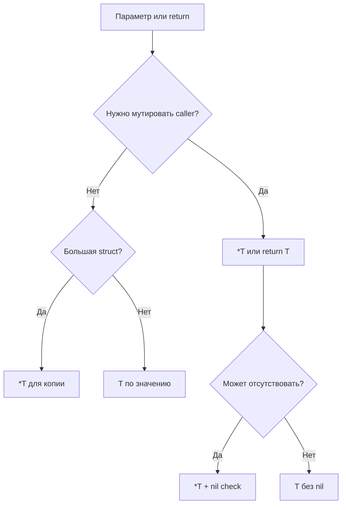

# 11. Указатели: `&`, `*`, nil и preview receivers

## Что вы узнаете

- Операторы **`&`** (взять адрес) и **`*`** (разыменование).
- Разницу передачи **по значению** и **по указателю**.
- Zero value указателя — **`nil`** и что с ним можно делать.
- Когда возвращать `*T`, а когда `T`.
- **Preview pointer receivers** — зачем methods пишут на `*T`.

## Память: значение vs адрес

Переменная хранит **значение** типа. Указатель хранит **адрес** другой переменной:

```go
package main

import "fmt"

func main() {
	x := 42
	p := &x   // p имеет тип *int — указатель на int

	fmt.Println(x)   // 42
	fmt.Println(p)   // 0xc0000140a8 (адрес, пример)
	fmt.Println(*p)  // 42 — разыменование

	*p = 100
	fmt.Println(x)   // 100 — изменили через указатель
}
```

| Оператор | Читается как | Действие |
|----------|--------------|----------|
| `&x` | «адрес x» | Получить `*T` |
| `*p` | «значение по p» | Прочитать/записать по адресу |
| `*int` в объявлении | «указатель на int» | Тип |

**Почему не арифметика указателей:** в Go нельзя `p++` как в C — меньше классов багов buffer overflow, проще GC.

## Передача в функцию: копия vs общая память

```go
func incrementVal(n int) {
	n++
}

func incrementPtr(n *int) {
	*n++
}

func main() {
	x := 10
	incrementVal(x)
	fmt.Println(x) // 10 — копия

	incrementPtr(&x)
	fmt.Println(x) // 11 — изменили оригинал
}
```

То же для structs:

```go
type Product struct {
	SKU      string
	Quantity int
}

func addStockVal(p Product, delta int) {
	p.Quantity += delta
}

func addStockPtr(p *Product, delta int) {
	p.Quantity += delta
}

func main() {
	p := Product{SKU: "A1", Quantity: 5}
	addStockVal(p, 3)
	fmt.Println(p.Quantity) // 5

	addStockPtr(&p, 3)
	fmt.Println(p.Quantity) // 8
}
```

**Правило:** нужно изменить caller'а — передавайте `*T` или возвращайте новое значение (иммутабельный стиль).

Slice, map, channel — **reference types** (внутри descriptor с указателем на массив/хеш), но это не «указатель в синтаксисе».

## `new` и литералы с `&`

```go
p1 := new(int)    // *int, значение *p1 == 0
*p1 = 7

p2 := &Product{SKU: "B2", Quantity: 1} // указатель на struct literal
```

`new(T)` выделяет память, возвращает `*T` с zero value. Часто пишут `&T{...}` — идиоматичнее для structs с полями.

## Nil-указатели

Zero value для `*T` — **`nil`** (нет адреса):

```go
var p *Product
fmt.Println(p == nil) // true

// ОПАСНО:
// fmt.Println(p.SKU)     // panic: nil pointer dereference
// p.Quantity = 1         // panic
```

**Безопасные паттерны:**

```go
if p != nil {
	fmt.Println(p.SKU)
}

func describe(p *Product) string {
	if p == nil {
		return "<nil product>"
	}
	return p.SKU
}
```

| Тип | Zero value | «Пусто» |
|-----|------------|---------|
| `*T` | `nil` | нет объекта |
| `map[K]V` | `nil` | нельзя писать без `make` |
| `slice` | `nil` | `len==0`, можно `append` |
| `string` | `""` | не `nil` |
| `int` | `0` | не указатель |

## Возврат указателя из функции

```go
func newProduct(sku string) *Product {
	return &Product{SKU: sku, Quantity: 0}
}
```

Go **разрешает** возвращать указатель на локальную переменную: компилятор **escape analysis** переносит значение в heap — не нужно вручную `malloc`/`free` как в C.

**Когда `*T` в API:**

- Большая struct — избежать копирования при передаче (профилируйте, не оптимизируйте вслепую).
- Нужно явно выразить «отсутствие объекта» — `nil` vs zero struct.
- Methods должны мутировать receiver.

**Когда `T`:**

- Маленькая immutable struct (`time.Time`, координаты).
- Значение всегда валидно — не хотите `nil` checks.

## Preview: pointer receivers

Methods — функции с получателем (receiver). Receiver может быть **по значению** или **по указателю**:

```go
type Counter struct{ n int }

func (c Counter) Value() int { return c.n }      // value — не меняет оригинал

func (c *Counter) Inc() { c.n++ }                // pointer — меняет оригинал

func main() {
	var c Counter
	c.Inc()
	fmt.Println(c.Value()) // 1
}
```

Go автоматически берёт адрес: `c.Inc()` эквивалентно `(&c).Inc()` для value-переменной.

**Важно:** если method set типа `T` включает только value-receivers, указатель `*T` тоже их видит; но methods только на `*T` **не** доступны для value `T`.

### Nil receiver

Некоторые типы в stdlib обрабатывают `nil` receiver осознанно (`bytes.Buffer` — нет; `sync.Mutex` — нельзя). В своём коде **по умолчанию** проверяйте `nil` в method, если receiver — указатель:

```go
func (p *Product) String() string {
	if p == nil {
		return "Product(nil)"
	}
	return p.SKU
}
```

## Указатели и интерфейсы (намёк)

Позже: `*bytes.Buffer` реализует `io.Writer`, а иногда передают `interface{}` / `any` с `nil` внутри — отдельный класс багов. Пока запомните: **`var p *Product = nil`** и **`var i any = (*Product)(nil)`** ведут себя по-разному при type assertion.

## Диаграмма: нужен ли указатель?



## Типичные ошибки

| Ошибка | Корневая причина | Исправление |
|--------|------------------|-------------|
| Мутация struct-параметра не видна снаружи | Передача по значению | `*Product` или return новый struct |
| Panic на `p.Field` | `p == nil` | Guard `if p != nil` |
| `&literal[0]` вне scope | Указатель на stack после return | Вернуть slice или heap через return |
| Путать `*T` и `T` в сигнатуре | Разные типы для компилятора | Явно в объявлении |
| `new` везде вместо `&T{}` | Работает, но менее читаемо | `&Product{...}` для structs |
| Двойной указатель `**T` без нужды | Over-engineering | Один уровень достаточно почти всегда |

## В продакшене

- API слоя repository: `GetByID(id) (*Order, error)` — `nil, ErrNotFound` vs пустой struct — договоритесь в команде.
- Не возвращайте указатель на **внутренний** slice/map без копии, если caller может мутировать ваше состояние.
- `go vet` и staticcheck ловят часть nil dereference.

## Резюме

**`&`** берёт адрес, **`*`** разыменовывает. Struct **копируется** при передаче по значению — для мутации нужен **`*T`**. **`nil`** — zero value указателя; разыменование `nil` — panic. Возврат `&local` безопасен благодаря escape analysis. **Pointer receivers** меняют оригинал и расширяют method set.

## Чек-лист

- Что напечатает `incrementVal(x)` после `x := 10`?
- Чем `nil` указатель отличается от zero value struct?
- Зачем `addStockPtr(&p, 3)` нужен `&`?
- Можно ли вызвать method с pointer receiver на value-переменной?
- Почему `var p *Product; p.SKU` паникует?
- Когда предпочтительнее вернуть `T`, а не `*T`?

Следующий урок: [12. Maps](12-maps.md).
