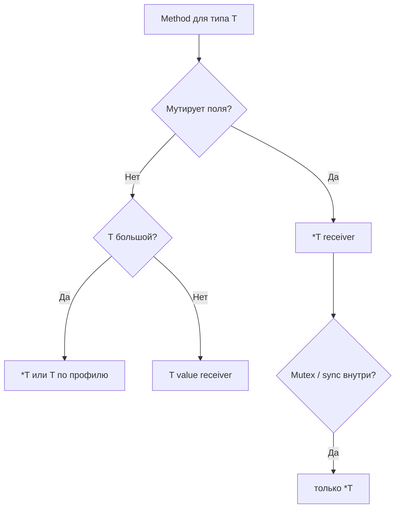

# 14. Methods: value vs pointer receivers, method sets

## Что вы узнаете

- Синтаксис **method** и отличие от обычной функции.
- **Value receiver** `(t T)` vs **pointer receiver** `(t *T)`.
- Правила **автоматического** `&` при вызове.
- **Method sets** — какие methods доступны для `T` и `*T`.
- Когда использовать value, когда pointer.
- Связь с interfaces и nil receivers.

## Синтаксис method

```go
type Rectangle struct {
	Width, Height float64
}

// value receiver
func (r Rectangle) Area() float64 {
	return r.Width * r.Height
}

// pointer receiver — может менять r
func (r *Rectangle) Scale(factor float64) {
	r.Width *= factor
	r.Height *= factor
}

func main() {
	rect := Rectangle{Width: 10, Height: 5}
	fmt.Println(rect.Area()) // 50
	rect.Scale(2)
	fmt.Println(rect.Area()) // 200
}
```

Method привязан к типу в **том же пакете** (не к экземпляру в runtime как в OOP). Нет ключевого слова `class` — только `type` + functions.

**Имя method:** не экспортируется, если начинается с маленькой буквы — как поля.

## Value receiver: копия при вызове

```go
type Counter struct{ n int }

func (c Counter) Value() int {
	return c.n
}

func (c Counter) BrokenInc() {
	c.n++ // меняет копию
}

func main() {
	var c Counter
	c.BrokenInc()
	fmt.Println(c.Value()) // 0
}
```

**Почему:** при value receiver `c` — **копия** `Counter` на стеке вызова. Изменения не попадают в оригинал — аналог передачи struct по значению в функцию.

### Когда value receiver уместен

- Method **не мутирует** receiver.
- `T` **маленький** (несколько int, `time.Time`).
- `T` **immutable** по дизайну (value object).
- Нужна потокобезопасность чтения без указателя (редко, но бывает).

## Pointer receiver: общий экземпляр

```go
func (c *Counter) Inc() {
	c.n++
}

func main() {
	var c Counter
	c.Inc() // Go превращает в (&c).Inc()
	fmt.Println(c.Value()) // 1
}
```

**Автоматическое взятие адреса:** для value-переменной `c` вызов `c.Inc()` с pointer receiver legal — компилятор подставляет `(&c).Inc()`.

**Обратное:** если есть `p *Counter` и value-receiver method `Value()`, вызов `p.Value()` → `(*p).Value()`.

### Когда pointer receiver уместен

- Method **меняет** поля receiver.
- `T` **большой** — избежать копирования (измеряйте).
- **Единообразие:** если один method на `*T`, часто все methods на `*T` для читаемости API.
- `T` содержит `sync.Mutex` — **всегда** pointer receiver (копировать mutex запрещено).

## Method sets

Набор methods типа `T` определяет, какие интерфейсы `T` реализует **неявно**.

Правило Go (упрощённо):

| Выражение типа | Видит methods с receiver |
|----------------|--------------------------|
| `T` | только `(T)` |
| `*T` | и `(T)`, и `(*T)` |

Точная формулировка:

- Method set **`T`** включает все methods с receiver **`T`** (value).
- Method set **`*T`** включает methods с receiver **`T`** и **`*T`**.

```go
type MyInt int

func (m MyInt) Val() int   { return int(m) }
func (m *MyInt) PtrOnly() {}

var i MyInt = 1
i.Val()    // ok
// i.PtrOnly() // ошибка компиляции: PtrOnly on *MyInt

var p *MyInt = &i
p.Val()     // ok — value method через pointer
p.PtrOnly() // ok
```

**Практический вывод:** если нужен method только на `*T`, переменная интерфейса с **value** `T` **не** получит этот method — типичный баг при `var w io.Writer = myBuf` vs `bytes.Buffer`.

## Сравнение: функция vs method

```go
func Area(r Rectangle) float64 {
	return r.Width * r.Height
}

func (r Rectangle) Area() float64 {
	return r.Width * r.Height
}
```

| | Функция | Method |
|---|---------|--------|
| Вызов | `Area(r)` | `r.Area()` |
| Принадлежность | пакет | тип |
| Перегрузка | нет | нет (разные receivers — разные methods) |

Methods удобны для **цепочек** и интерфейсов (`r.Scale(2).Area()` если Scale возвращает receiver — идиома builder).

## Несколько methods на одном типе

```go
type Order struct {
	ID     string
	Total  int
	Paid   bool
}

func (o *Order) MarkPaid() {
	o.Paid = true
}

func (o Order) Display() string {
	status := "pending"
	if o.Paid {
		status = "paid"
	}
	return fmt.Sprintf("%s: %d (%s)", o.ID, o.Total, status)
}
```

`Display` на value — читает копию, но для read-only полей результат корректен если не полагаетесь на побочные эффекты копии. `MarkPaid` на pointer — мутирует заказ в сервисе.

## Nil pointer receiver

```go
type List struct {
	head *Node
}

func (l *List) Len() int {
	if l == nil {
		return 0
	}
	// ...
	return 0
}
```

Вызов `var l *List; l.Len()` — legal, если method обрабатывает `nil`. Паттерн stdlib не универсален — документируйте контракт.

## Methods и встраивание (preview)

```go
type Engine struct{ Power int }

func (e Engine) Roar() string {
	return fmt.Sprintf("%d hp", e.Power)
}

type Car struct {
	Engine // embedded
	Brand  string
}

func main() {
	c := Car{Engine: Engine{150}, Brand: "Go"}
	fmt.Println(c.Roar()) // promotion — детали в structs [07](07-structs.md)
}
```

Promotion methods — не наследование OOP; компилятор подставляет field.

## Диаграмма: выбор receiver



## Типичные ошибки

| Ошибка | Корневая причина | Исправление |
|--------|------------------|-------------|
| Inc на value receiver | копия | `*T` |
| Interface не satisfied | method только на `*T`, value в интерфейсе | `*T` или value method |
| Смешать value/pointer без причины | путаница в API | единый стиль на типе |
| Копировать struct с mutex | value receiver | pointer only |
| Method на nil без guard | panic | `if t == nil` |
| Method вне пакета типа | синтаксис Go | func в том же package |

## В продакшене

- Service layer: `type ShopService struct { repo *Repo }` — methods на `*ShopService`, один shared state.
- Не делайте `func (m map[string]T) Get` — оборачивайте в struct с map внутри.
- Линтер `revive` / `staticcheck` — предупреждения о huge value receivers.

## Резюме

**Method** — `func (receiver) Name()`. **Value receiver** копирует `T`; **pointer receiver** мутирует оригинал и нужен для больших/sync типов. Go **автоматически** берёт `&` или `*` при вызове. **Method set** `T` vs `*T` определяет видимость methods и **реализацию interfaces**. Для мутирующего shop/inventory API — почти всегда `*T`.

## Чек-лист

- Почему `(c Counter) Inc()` не увеличивает оригинал?
- Что делает компилятор для `c.Inc()` при `*Counter` method?
- Какие methods входят в method set `*T`, но не `T`?
- Когда value receiver предпочтительнее pointer?
- Почему нельзя копировать `sync.Mutex`?
- Где объявлять methods для экспортируемого типа?

Следующий урок: [15. Лаба: methods](15-lab-methods.md).
